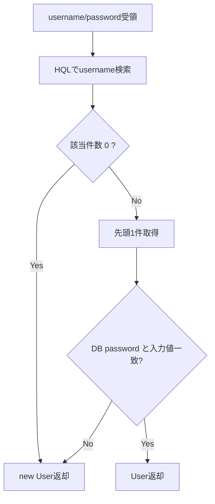

# UserDao 詳細設計書

## 1. 文書情報

| 項目 | 内容 |
|---|---|
| 文書名 | UserDao 詳細設計書 |
| 対象クラス | `UserDao` / `UserDaoImpl` |
| パッケージ | `dao` / `dao.impl` |
| 作成日 | 2026-03-15 |
| 作成者 | Codex |

## 2. クラス概要

| 項目 | 内容 |
|---|---|
| 役割 | `CUSTOMER` テーブルに対する一覧取得、保存、認証、重複判定を担当する |
| アクセス技術 | Hibernate `SessionFactory` |
| 対象テーブル | `CUSTOMER` |
| 主な呼出元 | `UserServiceImpl` |

## 3. メソッド一覧

| No | メソッド名 | 役割 |
|---|---|---|
| 1 | `getAllUser()` | 顧客全件取得 |
| 2 | `saveUser(user)` | 顧客保存 / 更新 |
| 3 | `getUser(username, password)` | ユーザー名検索 + パスワード照合 |
| 4 | `getUserByUsername(username)` | ユーザー名取得 |
| 5 | `getUserById(id)` | ID 取得 |
| 6 | `userExists(username)` | 重複チェック |

## 4. メソッド詳細

### 4.1 `getAllUser()`

処理手順:

1. `SessionFactory.getCurrentSession()` で Session を取得する。
2. HQL `from User` を実行する。
3. 取得した `List<User>` を返却する。

### 4.2 `saveUser(user)`

処理手順:

1. Hibernate `saveOrUpdate(user)` を実行する。
2. ID 未設定時は INSERT、ID あり時は UPDATE として扱う。
3. 保存後の `User` を返却する。

### 4.3 `getUser(username, password)`

処理手順:

1. HQL `from User where username = :username` を実行する。
2. 該当なしの場合は `new User()` を返却する。
3. 取得結果が複数ある場合は先頭 1 件を採用する。
4. 取得した `User.password` と入力パスワードを Java 側で比較する。
5. 一致時は `User` を返却する。
6. 不一致時は `new User()` を返却する。

業務ルール:

- DB レベルではパスワード条件を検索条件に含めていない。
- パスワード不一致とユーザー未存在は同じ「空 `User`」で返す。

処理フロー図:

[Mermaid source: 15c-01_UserDao詳細設計書-mermaid-1.mmd](assets/15c-01_UserDao詳細設計書-mermaid-1.mmd)

Mermaid source (editable)

### 4.4 `getUserByUsername(username)`

処理手順:

1. ユーザー名条件で HQL を実行する。
2. 該当なしの場合は `null` を返却する。
3. 該当ありの場合は先頭 1 件を返却する。

### 4.5 `getUserById(id)`

処理手順:

1. Hibernate `get(User.class, id)` を実行する。
2. 取得結果を返却する。

### 4.6 `userExists(username)`

処理手順:

1. HQL `SELECT COUNT(u) FROM User u WHERE u.username = :username` を実行する。
2. 件数が 1 以上なら `true`、0 なら `false` を返却する。

## 5. 設計上の注意

- `getUser()` は `null` ではなく空 `User` を返すため、上位層は `id > 0` 判定前提となる。
- パスワード平文比較であり、本番向けの設計ではない。
- 同一ユーザー名複数件を想定していないが、結果複数時は先頭採用となる。

## 6. 関連資料

- [15c_DAO詳細設計書.md](15c_DAO詳細設計書.md)
- [16_テーブル定義書.md](../03_database/16_テーブル定義書.md)
- [27_DDL一覧.md](../03_database/27_DDL一覧.md)

