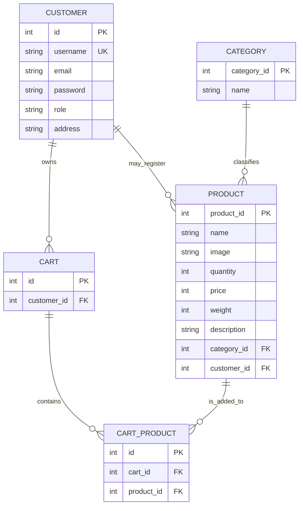

# ER図

## 1. 目的

本書は `JtProject` のデータ構造を日本案件向け資料形式で整理し、主要テーブル間の関係を明示することを目的とする。

## 2. 対象テーブル

- `CUSTOMER`: 顧客情報管理、ログイン認証、権限判定に使用
- `CATEGORY`: 商品カテゴリ管理に使用
- `PRODUCT`: 商品情報管理、商品一覧表示、商品管理に使用
- `CART`: 顧客ごとのカートヘッダ管理に使用
- `CART_PRODUCT`: カート内商品明細管理に使用

## 3. ER 図

## 4. 関係概要

| 親テーブル | 子テーブル | 関係 | 説明 |
|---|---|---|---|
| CUSTOMER | CART | 1:N | 1 ユーザーが複数カートを持ちうる設計 |
| CUSTOMER | PRODUCT | 1:N | 商品に `customer_id` があるため、登録者管理を想定 |
| CATEGORY | PRODUCT | 1:N | 商品は 1 つのカテゴリに属する |
| CART | CART_PRODUCT | 1:N | カート内の商品明細 |
| PRODUCT | CART_PRODUCT | 1:N | 同一商品が複数カートに入りうる |

## 5. 補足事項

- `Product` の Java 実装では `Category` が `@OneToOne` で表現されているが、DB 設計上はカテゴリに対し複数商品が紐づくため、業務意味としては `CATEGORY 1 : N PRODUCT` と解釈する。
- `PRODUCT.customer_id` は画面上の主要導線では強く使われていないが、エンティティ定義上は保持されている。
- `CART_PRODUCT` は多対多を解消する中間テーブルである。
