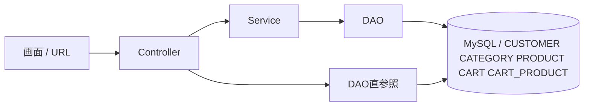

# CRUD一覧

## 1. 目的

本書は `JtProject-Next` における主要テーブルの CRUD 実装を、画面 URL、Controller、Service、DAO、DB 操作の観点で整理するための資料である。

## 2. 対象テーブル

- `CUSTOMER`
- `CATEGORY`
- `PRODUCT`
- `CART`
- `CART_PRODUCT`

## 3. CRUD 全体図



補足:

- 基本構成は `Controller -> Service -> DAO -> DB`
- ただしカート明細は `UserController -> CartProductDao -> DB` の直接参照がある

## 4. テーブル別 CRUD 一覧

### 4.1 CUSTOMER

| CRUD | 用途 | URL / 契機 | Controller | Service | DAO | 主な DB 操作 |
|---|---|---|---|---|---|---|
| Create | 一般ユーザー新規登録 | `POST /newuserregister` | `UserController.newUseRegister()` | `UserService.addUser()` | `UserDao.saveUser()` | `saveOrUpdate(user)` により INSERT |
| Read | ログイン認証 | `POST /userloginvalidate`, `POST /admin/loginvalidate` | `UserController.userloginAlias()`, `AdminController.adminlogin()` | `UserService.checkLogin()` | `UserDao.getUser()` | `from User where username = :username` |
| Read | 顧客一覧表示 | `GET /admin/customers` | `AdminController.getCustomerDetail()` | `UserService.getUsers()` | `UserDao.getAllUser()` | `from User` |
| Read | ユーザー名で利用者取得 | カート処理、プロフィール表示 | `UserController`, `AdminController` | `UserService.getUserByUsername()` | `UserDao.getUserByUsername()` | `from User where username = :username` |
| Read | ID で利用者取得 | `POST /admin/updateuser` | `AdminController.updateUserProfile()` | `UserService.getUserById()` | `UserDao.getUserById()` | `session.get(User.class, id)` |
| Update | 管理者プロフィール更新 | `POST /admin/updateuser` | `AdminController.updateUserProfile()` | `UserService.addUser()` | `UserDao.saveUser()` | `saveOrUpdate(user)` により UPDATE |
| Delete | なし | 実装なし | なし | なし | なし | `CUSTOMER` の削除画面機能は未実装 |

### 4.2 CATEGORY

| CRUD | 用途 | URL / 契機 | Controller | Service | DAO | 主な DB 操作 |
|---|---|---|---|---|---|---|
| Create | カテゴリ追加 | `POST /admin/categories` | `AdminController.addCategory()` | `CategoryService.addCategory()` | `CategoryDao.addCategory()` | `entityManager.persist(category)` |
| Read | カテゴリ一覧表示 | `GET /admin/categories` | `AdminController.getcategory()` | `CategoryService.getCategories()` | `CategoryDao.getCategories()` | `from Category` |
| Read | 商品登録 / 更新時カテゴリ取得 | `GET /admin/products/add`, `GET /admin/products/update/{id}` | `AdminController.addProduct()`, `updateProductGet()` | `CategoryService.getCategories()` / `getCategory()` | `CategoryDao.getCategories()` / `getCategory()` | `from Category`, `find(Category.class, id)` |
| Update | カテゴリ更新 | `GET /admin/categories/update` | `AdminController.updateCategory()` | `CategoryService.updateCategory()` | `CategoryDao.updateCategory()` | `find + merge` |
| Delete | カテゴリ削除 | `GET /admin/categories/delete` | `AdminController.removeCategoryDb()` | `CategoryService.deleteCategory()` | `CategoryDao.deletCategory()` | `find + remove` |

### 4.3 PRODUCT

| CRUD | 用途 | URL / 契機 | Controller | Service | DAO | 主な DB 操作 |
|---|---|---|---|---|---|---|
| Create | 商品追加 | `POST /admin/products/add` | `AdminController.addProduct()` | `ProductService.addProduct()` | `ProductDao.addProduct()` | `session.save(product)` |
| Read | 利用者トップ商品表示 | `GET /`, `GET /index` | `UserController.userloginPage()`, `indexPage()` | `ProductService.getProducts()` | `ProductDao.getProducts()` | `from Product` |
| Read | 利用者商品一覧 | `GET /user/products` | `UserController.getproduct()` | `ProductService.getProducts()` | `ProductDao.getProducts()` | `from Product` |
| Read | 管理者商品一覧 | `GET /admin/products` | `AdminController.getproduct()` | `ProductService.getProducts()` | `ProductDao.getProducts()` | `from Product` |
| Read | 商品詳細取得 | カート追加、商品更新画面 | `UserController.addToCart()`, `AdminController.updateProductGet()` | `ProductService.getProduct()` | `ProductDao.getProduct()` | `session.get(Product.class, id)` |
| Update | 商品更新 | `POST /admin/products/update/{id}` | `AdminController.updateProduct()` | `ProductService.updateProduct()` | `ProductDao.updateProduct()` | `session.update(product)` |
| Delete | 商品削除 | `GET /admin/products/delete` | `AdminController.removeProduct()` | `ProductService.deleteProduct()` | `ProductDao.deletProduct()` | `session.delete(product)` |

### 4.4 CART

| CRUD | 用途 | URL / 契機 | Controller | Service | DAO | 主な DB 操作 |
|---|---|---|---|---|---|---|
| Create | ユーザー初回カート生成 | `GET/POST /products/addtocart` 内 | `UserController.addToCart()` | `CartService.addCart()` | `CartDao.addCart()` | `session.save(cart)` |
| Read | 既存カート探索 | カート追加、表示、削除時 | `UserController.addToCart()`, `showCart()`, `deleteFromCart()` | `CartService.getCarts()` | `CartDao.getCarts()` | `from Cart` |
| Update | なし | 実装は DAO / Service に存在 | 画面導線なし | `CartService.updateCart()` | `CartDao.updateCart()` | 更新用メソッドはあるが現行画面では未使用 |
| Delete | なし | 実装は DAO / Service に存在 | 画面導線なし | `CartService.deleteCart()` | `CartDao.deleteCart()` | 削除用メソッドはあるが現行画面では未使用 |

### 4.5 CART_PRODUCT

| CRUD | 用途 | URL / 契機 | Controller | Service | DAO | 主な DB 操作 |
|---|---|---|---|---|---|---|
| Create | 商品をカートへ追加 | `GET/POST /products/addtocart` | `UserController.addToCart()` | なし | `CartProductDao.addCartProduct()` | `session.save(cartProduct)` |
| Read | カート内商品一覧表示 | `GET /user/cart` | `UserController.showCart()` | なし | `CartProductDao.getProductByCartID()` | `from CartProduct cp where cp.cart.id = :cart_id` |
| Read | カート内商品存在確認 | `GET /user/cart/delete` | `UserController.deleteFromCart()` | なし | `CartProductDao.getCartProductsByCartAndProductId()` | `FROM CartProduct cp WHERE cp.cart.id = :cartId AND cp.product.id = :productId` |
| Update | なし | 実装は DAO に存在 | 画面導線なし | なし | `CartProductDao.updateCartProduct()` | 更新メソッドはあるが現行画面では未使用 |
| Delete | カートから商品削除 | `GET /user/cart/delete` | `UserController.deleteFromCart()` | なし | `CartProductDao.deleteCartProduct()` | `session.delete(cartProduct)` |

## 5. CRUDマトリクス一覧

### 5.1 機能別 CRUD マトリクス

見方:

- `1` = その機能で該当 CRUD を実施
- `0` = その機能では未実施
- 1 行 1 機能で整理しているため、Excel 的に見比べやすい

| No | 功能分类 | 機能名 | 画面名/JSP | Controller | Service | 主テーブル | URL | C | R | U | D | 備考 |
|---|---|---|---|---|---|---|---|---|---|---|---|---|
| 1 | 用户 | 一般ユーザー登録 | `register.jsp` | `UserController.newUseRegister()` | `UserService.addUser()` | `CUSTOMER` | `POST /newuserregister` | 1 | 0 | 0 | 0 | 新規顧客作成 |
| 2 | 用户 | ユーザーログイン認証 | `userLogin.jsp` | `UserController.userloginAlias()` | `UserService.checkLogin()` | `CUSTOMER` | `POST /userloginvalidate` | 0 | 1 | 0 | 0 | ユーザー照合 |
| 3 | 管理员 | 管理者ログイン認証 | `adminlogin.jsp` | `AdminController.adminlogin()` | `UserService.checkLogin()` | `CUSTOMER` | `POST /admin/loginvalidate` | 0 | 1 | 0 | 0 | 管理者ロール判定込み |
| 4 | 管理员 | 顧客一覧表示 | `displayCustomers.jsp` | `AdminController.getCustomerDetail()` | `UserService.getUsers()` | `CUSTOMER` | `GET /admin/customers` | 0 | 1 | 0 | 0 | 全顧客参照 |
| 5 | 管理员 | 管理者プロフィール表示 | `updateProfile.jsp` | `AdminController.profileDisplay()` | `UserService.getUserByUsername()` | `CUSTOMER` | `GET /admin/profileDisplay` | 0 | 1 | 0 | 0 | ログイン中管理者参照 |
| 6 | 管理员 | 管理者プロフィール更新 | `updateProfile.jsp` | `AdminController.updateUserProfile()` | `UserService.getUserById()` / `addUser()` | `CUSTOMER` | `POST /admin/updateuser` | 0 | 1 | 1 | 0 | 既存顧客更新 |
| 7 | 分类 | カテゴリ一覧表示 | `categories.jsp` | `AdminController.getcategory()` | `CategoryService.getCategories()` | `CATEGORY` | `GET /admin/categories` | 0 | 1 | 0 | 0 | 一覧参照 |
| 8 | 分类 | カテゴリ追加 | `categories.jsp` | `AdminController.addCategory()` | `CategoryService.addCategory()` | `CATEGORY` | `POST /admin/categories` | 1 | 0 | 0 | 0 | 新規カテゴリ作成 |
| 9 | 分类 | カテゴリ更新 | `categories.jsp` | `AdminController.updateCategory()` | `CategoryService.updateCategory()` | `CATEGORY` | `GET /admin/categories/update` | 0 | 1 | 1 | 0 | 更新前提で対象カテゴリ参照あり |
| 10 | 分类 | カテゴリ削除 | `categories.jsp` | `AdminController.removeCategoryDb()` | `CategoryService.deleteCategory()` | `CATEGORY` | `GET /admin/categories/delete` | 0 | 1 | 0 | 1 | 削除前に対象カテゴリ取得 |
| 11 | 商品 | 商品トップ表示 | `index.jsp` | `UserController.userloginPage()` / `indexPage()` | `ProductService.getProducts()` | `PRODUCT` | `GET /`, `GET /index` | 0 | 1 | 0 | 0 | 利用者向け商品参照 |
| 12 | 商品 | 利用者商品一覧表示 | `uproduct.jsp` | `UserController.getproduct()` | `ProductService.getProducts()` | `PRODUCT` | `GET /user/products` | 0 | 1 | 0 | 0 | 一覧参照 |
| 13 | 商品 | 管理者商品一覧表示 | `products.jsp` | `AdminController.getproduct()` | `ProductService.getProducts()` | `PRODUCT` | `GET /admin/products` | 0 | 1 | 0 | 0 | 一覧参照 |
| 14 | 商品 | 商品追加 | `productsAdd.jsp` | `AdminController.addProduct()` | `CategoryService.getCategory()` / `ProductService.addProduct()` | `PRODUCT` | `POST /admin/products/add` | 1 | 1 | 0 | 0 | カテゴリ参照後に商品作成 |
| 15 | 商品 | 商品更新画面表示 | `productsUpdate.jsp` | `AdminController.updateproduct()` | `ProductService.getProduct()` / `CategoryService.getCategories()` | `PRODUCT` | `GET /admin/products/update/{id}` | 0 | 1 | 0 | 0 | 更新前の単票参照 |
| 16 | 商品 | 商品更新 | `productsUpdate.jsp` | `AdminController.updateProduct()` | `CategoryService.getCategory()` / `ProductService.getProduct()` / `updateProduct()` | `PRODUCT` | `POST /admin/products/update/{id}` | 0 | 1 | 1 | 0 | 既存商品参照後に更新 |
| 17 | 商品 | 商品削除 | `products.jsp` | `AdminController.removeProduct()` | `ProductService.deleteProduct()` | `PRODUCT` | `GET /admin/products/delete` | 0 | 1 | 0 | 1 | 削除対象商品を扱う |
| 18 | 购物车 | カート生成付き商品追加 | `index.jsp` / `uproduct.jsp` | `UserController.addToCart()` | `UserService.getUserByUsername()` / `CartService.getCarts()` / `addCart()` / `ProductService.getProduct()` | `CART`, `CART_PRODUCT`, `PRODUCT`, `CUSTOMER` | `GET/POST /products/addtocart` | 1 | 1 | 0 | 0 | 必要時は `CART` 作成、商品は参照、明細作成 |
| 19 | 购物车 | カート表示 | `cart.jsp` | `UserController.showCart()` | `UserService.getUserByUsername()` / `CartService.getCarts()` | `CART`, `CART_PRODUCT`, `PRODUCT`, `CUSTOMER` | `GET /user/cart` | 0 | 1 | 0 | 0 | カート、商品、利用者参照 |
| 20 | 购物车 | カート内商品削除 | `cart.jsp` | `UserController.deleteFromCart()` | `UserService.getUserByUsername()` / `CartService.getCarts()` | `CART_PRODUCT`, `CART`, `CUSTOMER` | `GET /user/cart/delete` | 0 | 1 | 0 | 1 | 明細存在確認後に削除 |

### 5.2 CRUD 種別別の機能一覧

#### Create がある機能

- 一般ユーザー登録
- カテゴリ追加
- 商品追加
- カート生成付き商品追加

#### Read がある機能

- ユーザーログイン認証
- 管理者ログイン認証
- 顧客一覧表示
- 管理者プロフィール表示
- 管理者プロフィール更新
- カテゴリ一覧表示
- カテゴリ更新
- カテゴリ削除
- 商品トップ表示
- 利用者商品一覧表示
- 管理者商品一覧表示
- 商品追加
- 商品更新画面表示
- 商品更新
- 商品削除
- カート生成付き商品追加
- カート表示
- カート内商品削除

#### Update がある機能

- 管理者プロフィール更新
- カテゴリ更新
- 商品更新

#### Delete がある機能

- カテゴリ削除
- 商品削除
- カート内商品削除

### 5.3 Excel での確認方法

- CSV 版は [72_CRUD一覧.csv](72_CRUD一覧.csv) を参照
- Excel で開いて `功能分类`、`Controller`、`Service`、`画面名/JSP`、`C`、`R`、`U`、`D` 列をフィルタすれば、`Update = 1 の機能のみ`、`商品関連のみ` のように絞り込み可能

## 6. 実装フロー例

### 5.1 商品追加

```text
/admin/products/add
  -> AdminController.addProduct()
  -> ProductService.addProduct()
  -> ProductDao.addProduct()
  -> PRODUCT へ INSERT
```

### 5.2 カート追加

```text
/products/addtocart
  -> UserController.addToCart()
  -> UserService.getUserByUsername()
  -> CartService.getCarts()
  -> 必要なら CartService.addCart()
  -> ProductService.getProduct()
  -> CartProductDao.addCartProduct()
  -> CART_PRODUCT へ INSERT
```

### 5.3 商品更新

```text
/admin/products/update/{id}
  -> AdminController.updateProduct()
  -> CategoryService.getCategory()
  -> ProductService.getProduct() で既存値確認
  -> ProductService.updateProduct()
  -> ProductDao.updateProduct()
  -> PRODUCT へ UPDATE
```

## 7. CRUD 観点での注意点

- `CUSTOMER` は作成・参照・更新はあるが、削除機能は未実装である。
- `CART` と `CART_PRODUCT` は DAO 上は CRUD メソッドを持つが、画面上は一部のみ利用されている。
- `CartProductDao` は Service を介さず `UserController` から直接呼ばれている。
- `ProductDao.deletProduct()`、`CategoryDao.deletCategory()` はメソッド名のスペルが `delete` ではなく `delet` になっている。
- 本資料の CRUD は Entity / Hibernate ベースであり、実行 SQL は DB 方言や Hibernate の生成内容に依存する。

## 8. 関連資料

- [12_データベース一覧表.md](12_データベース一覧表.md)
- [16_テーブル定義書.md](16_テーブル定義書.md)
- [17_URL一覧.md](17_URL一覧.md)
- [53_インターフェース一覧.md](53_インターフェース一覧.md)
