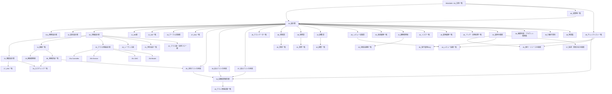

# ドキュメント相関図

## 1. 文書情報

| 項目 | 内容 |
|---|---|
| 文書名 | ドキュメント相関図 |
| 対象システム | JtProject |
| 作成日 | 2026-03-15 |
| 作成者 | Codex |
| 関連資料 | `README.md`、`00_文档一覧.md`、`01_設計書.md` |

## 2. 目的

本書は、`jp-docs` 配下の主要文書がどのような関係で参照されるかを整理し、利用者が必要な文書へ素早く到達できるようにするための資料である。

## 3. 文書利用の基本順序

1. 全体像把握
2. 設計理解
3. DB / 画面 / クラス設計確認
4. 試験確認
5. 管理台帳確認
6. 運用 / リリース / 引継ぎ確認

## 4. 全体相関図

## 5. 領域別の参照関係

### 5.1 設計領域

| 起点文書 | 主な参照先 | 用途 |
|---|---|---|
| `01_設計書.md` | `01a`、`02`、`03`、`13`、`14`、`15` 系 | 全体設計入口 |
| `03_詳細設計書.md` | `15` 系、`20`、`21`、`22`、`80` | 実装直前の詳細理解 |
| `15_クラス詳細設計書.md` | `15a`、`15b`、`15c`、`15d` | クラス設計総覧 |

### 5.2 DB 領域

| 起点文書 | 主な参照先 | 用途 |
|---|---|---|
| `11_ER図.md` | `12`、`16`、`27` | 関係把握 |
| `16_テーブル定義書.md` | `27_DDL一覧.md` | 論理定義確認 |
| `25_テストデータ一覧.md` | `34`、`43` | 試験前提データ確認 |

### 5.3 試験領域

| 起点文書 | 主な参照先 | 用途 |
|---|---|---|
| `05`、`06`、`07` | `18`、`25`、`34`、`43`、`80` | 試験仕様、結果、実績管理 |
| `34_試験結果報告書.md` | `43_テスト実施記録一覧.md` | 結果報告と進捗把握 |

### 5.4 管理台帳領域

| 起点文書 | 主な参照先 | 用途 |
|---|---|---|
| `40_障害一覧.md` | `08_障害票.md` | 障害全体管理 |
| `41_改修一覧.md` | `09_改修票.md` | 改修全体管理 |
| `42_調査一覧.md` | `10_調査票.md` | 調査全体管理 |
| `44_レビュー指摘一覧.md` | `29_レビュー記録票.md` | レビュー指摘管理 |
| `45_未解決課題一覧.md` | `31_課題管理表.md`、`32_リスク一覧.md` | 重点課題管理 |

### 5.5 運用・保守領域

| 起点文書 | 主な参照先 | 用途 |
|---|---|---|
| `33_運用手順書.md` | `35`、`36`、`37`、`38`、`39` | 運用保守入口 |
| `39_引継ぎ資料.md` | `33`、`31`、`32`、`46` | 後任向け初回把握 |
| `46_用語集.md` | 全文書 | 用語統一 |

### 5.6 成果物・チェック領域

| 起点文書 | 主な参照先 | 用途 |
|---|---|---|
| `48_成果物一覧.md` | 全領域文書 | 成果物全体の把握 |
| `49_チェックリスト一覧.md` | `34`、`35`、`44`、`48` | 工程別確認項目の総覧 |

## 6. 利用者別おすすめ参照順

### 6.1 新規参画者

1. `README.md`
2. `01_設計書.md`
3. `39_引継ぎ資料.md`
4. `46_用語集.md`

### 6.2 開発者

1. `13_機能設計書.md`
2. `03_詳細設計書.md`
3. `15` 系文書
4. `17_URL一覧.md`
5. `20_シーケンス図.md`

### 6.3 テスト担当

1. `25_テストデータ一覧.md`
2. `05`、`06`、`07`
3. `34_試験結果報告書.md`
4. `43_テスト実施記録一覧.md`

### 6.4 保守担当

1. `33_運用手順書.md`
2. `36_保守運用FAQ.md`
3. `37_監視・障害対応手順書.md`
4. `40`、`41`、`42`

## 7. 備考

- 文書数が増えたため、今後は領域別サブディレクトリ化も検討余地がある。
- 本書は「どこから読むべきか」を示す案内資料として使う。

## 関連文書

- [26_バッチ・定期処理一覧.md](../03_database/26_バッチ・定期処理一覧.md)
- [83_模擬バッチ設計書.md](../03_database/83_模擬バッチ設計書.md)
- [85_Quartz定期実行サンプル.md](../03_database/85_Quartz定期実行サンプル.md)
- [86_商品_分類マスタ整合チェック詳細設計書.md](../03_database/86_商品_分類マスタ整合チェック詳細設計書.md)
- [60_ジョブネット一覧.md](60_ジョブネット一覧.md)
- [84_模擬ジョブネット一覧.md](84_模擬ジョブネット一覧.md)
- [33_運用手順書.md](33_運用手順書.md)
- [37_監視・障害対応手順書.md](37_監視・障害対応手順書.md)

