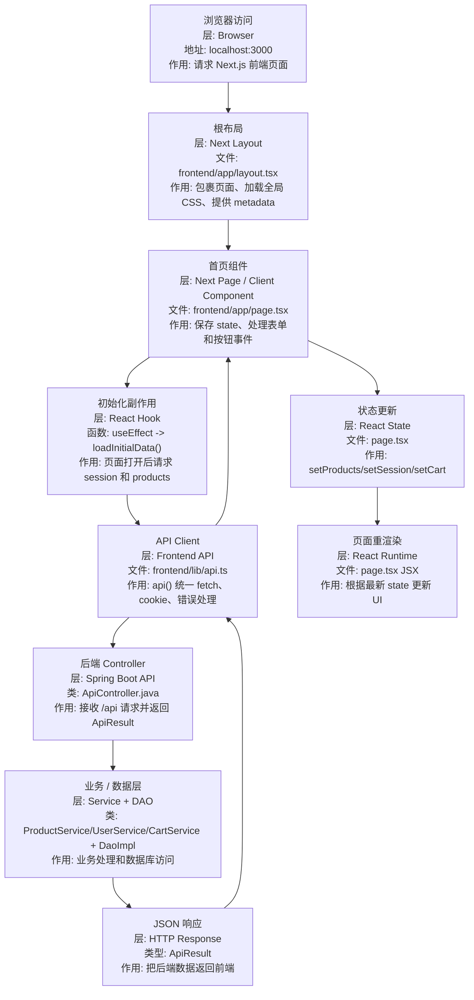

# Next.js 框架系统学习指南

这份文档用于系统理解 `JtProject-Next` 中的 Next.js 框架。重点是：

> Next.js 在 React 基础上增加了什么？App Router、layout、page、Client Component 如何组织一个应用？

## 1. Next.js 是什么

Next.js 是 React 应用框架。

React 主要负责 UI 组件，而 Next.js 进一步提供：

- 文件路由
- layout 机制
- metadata
- 服务端渲染能力
- 静态生成能力
- API/Server 功能
- 构建和部署约定

本项目把 Next.js 用作前端应用框架，后端仍然是 Spring Boot JSON API。

## 2. 在本项目中的位置

```text
Browser
  -> Next dev server localhost:3000
  -> app/layout.tsx
  -> app/page.tsx
  -> lib/api.ts
  -> Spring Boot localhost:8086/api
```

对应目录：

| 目录 | 作用 |
| --- | --- |
| `frontend/app/layout.tsx` | 根布局 |
| `frontend/app/page.tsx` | 首页路由 `/` |
| `frontend/app/globals.css` | 全局样式 |
| `frontend/lib/api.ts` | API 请求封装 |
| `frontend/lib/types.ts` | TypeScript 类型 |
| `frontend/next.config.mjs` | Next.js 配置 |

## 3. App Router 文件约定

Next.js App Router 通过文件结构定义路由：

| 文件 | 作用 |
| --- | --- |
| `app/layout.tsx` | 当前路由段的布局 |
| `app/page.tsx` | 当前路由段的页面 |
| `app/loading.tsx` | 加载 UI |
| `app/error.tsx` | 错误 UI |
| `app/not-found.tsx` | 404 UI |

当前项目：

```text
frontend/app/page.tsx -> http://localhost:3000/
```

## 4. Server Component 和 Client Component

App Router 默认组件是 Server Component。

如果组件需要浏览器能力，就要写：

```tsx
'use client'
```

需要 Client Component 的场景：

- `useState`
- `useEffect`
- 表单输入
- `onClick`
- 读取浏览器事件

本项目的 `app/page.tsx` 需要登录表单、按钮点击和 API 状态，所以它是 Client Component。

## 5. layout.tsx 的作用

`layout.tsx` 负责包裹页面：

```text
RootLayout
  -> html
  -> body
  -> children
```

它适合放：

- 全局 HTML 结构
- 全局 CSS import
- metadata
- 导航栏
- 根级 provider

## 6. metadata 的作用

Next.js 支持在 layout/page 中导出 metadata：

```ts
export const metadata = {
  title: 'JtProject Next'
}
```

Next 会自动生成页面 `<title>`、description 等 head 信息。

## 7. Next.js 数据流

本项目采用 Client Component 从 Spring Boot API 获取数据：



### 数据流节点追记

| 顺序 | 分层 | 文件/类名 | 做什么 |
| --- | --- | --- | --- |
| 1 | Browser | `http://localhost:3000` | 用户打开 Next.js 前端 |
| 2 | Next Layout 层 | `frontend/app/layout.tsx` | 定义 `<html>`、`<body>`、全局样式和 metadata |
| 3 | Next Page 层 | `frontend/app/page.tsx` | 首页路由 `/`，因为有 `'use client'`，所以可使用 state 和事件 |
| 4 | React Hook 层 | `page.tsx` 的 `useEffect`、`loadInitialData` | 页面加载后调用 API |
| 5 | API Client 层 | `frontend/lib/api.ts` | `api<T>()` 封装 fetch，携带 cookie，返回类型化的 `ApiResult<T>` |
| 6 | 后端 Controller 层 | `ApiController.java` | 接收 `/api/session`、`/api/products`、`/api/cart` 等请求 |
| 7 | 后端业务层 | `ProductService`、`UserService`、`CartService` | 执行业务逻辑 |
| 8 | 后端数据层 | `ProductDaoImpl`、`UserDaoImpl`、`CartProductDaoImpl` | 访问 H2 数据库 |
| 9 | React State 层 | `page.tsx` 的 `setProducts`、`setSession`、`setCart` | 保存后端返回结果 |
| 10 | JSX 渲染层 | `page.tsx` 的 return JSX | 根据 state 重新显示商品、登录状态、购物车 |

典型例子：

```text
打开首页
-> layout.tsx 包裹 page.tsx
-> page.tsx 的 useEffect 执行 loadInitialData()
-> lib/api.ts 调用 GET /api/products
-> ApiController.java 接收请求
-> ProductService/ProductDao 查询商品
-> 返回 ApiResult<Product[]>
-> page.tsx 执行 setProducts(result.data)
-> JSX 中 products.map(...) 渲染商品卡片
```

## 8. Next.js 和普通 React + Vite 的区别

| 对比点 | React + Vite | Next.js |
| --- | --- | --- |
| 路由 | 通常手动配置 React Router | 文件路由 |
| 根布局 | 自己写 App/Layout | `app/layout.tsx` |
| 页面入口 | `main.tsx` 挂载 App | `app/page.tsx` |
| SSR/SSG | 默认没有 | 框架内置 |
| metadata | 手动管理 | 框架约定 |
| 部署约定 | 更自由 | Next 约定更强 |

## 9. 本项目学习重点

建议按这个顺序读：

1. `frontend/next.config.mjs`
2. `frontend/app/layout.tsx`
3. `frontend/app/page.tsx`
4. `frontend/lib/types.ts`
5. `frontend/lib/api.ts`
6. `doc/reference/nextjs-typescript-flow.md`

## 10. 后续扩展方向

当前项目为了贴近原始 JtProject，只用 Next.js 做前端。后续可以继续练：

- 新增 `app/products/page.tsx`
- 新增 `app/cart/page.tsx`
- 把首页拆成多个组件
- 尝试 Server Component 加载公开商品数据
- 加入 `loading.tsx` 和 `error.tsx`
- 用 route segment 组织后台页面
