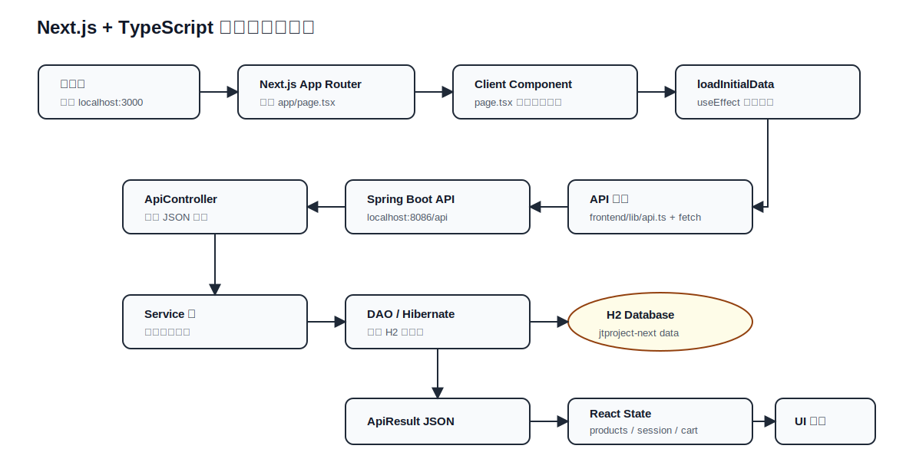
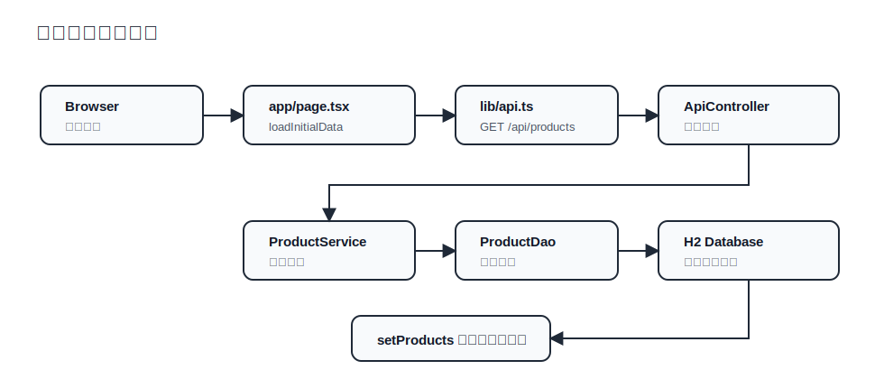
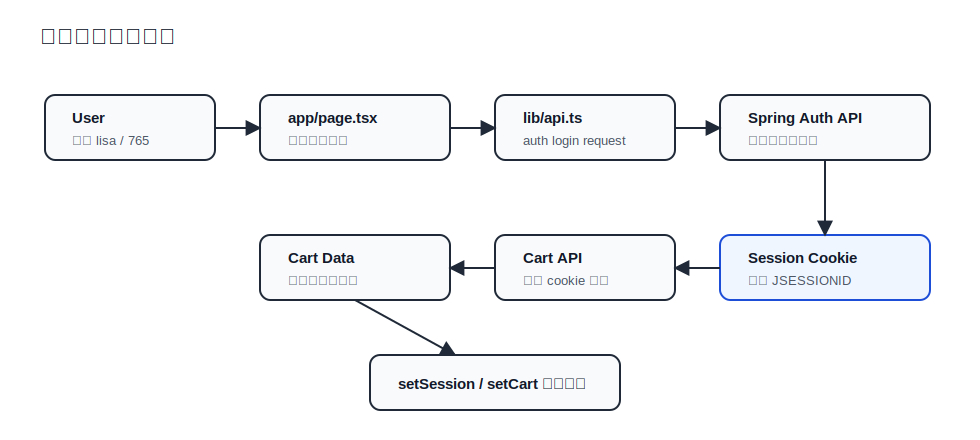

# Next.js + TypeScript 前后端处理流程图

这份文档用于学习 `JtProject-Next` 的前后端处理链路。重点不是后端业务细节，而是理解 Next.js + TypeScript 前端如何组织页面、类型、请求和状态。

## 关键文件

| 文件 | 作用 | 学习点 |
| --- | --- | --- |
| `frontend/app/layout.tsx` | Next.js 根布局 | App Router、`metadata`、`children` |
| `frontend/app/page.tsx` | 首页页面组件 | Client Component、React state、表单事件、页面渲染 |
| `frontend/lib/api.ts` | 统一请求封装 | 泛型 `api<T>()`、`fetch`、cookie session、错误处理 |
| `frontend/lib/types.ts` | 前端类型定义 | `ApiResult<T>`、接口返回类型、页面状态类型 |
| `src/main/java/.../controller/ApiController.java` | 后端 JSON API | `/api/products`、`/api/session`、登录、购物车、后台概览 |

## 整体处理流程

## 商品列表加载流程

## 登录和购物车流程

## TypeScript 在这里解决什么问题

- `ApiResult<T>`：让同一个 API 封装适配不同接口返回。
- `Product[]`：商品列表只能当数组使用，商品字段有自动提示。
- `SessionInfo`：登录状态字段固定，少写字段或写错字段会被编译器发现。
- `AdminOverview | null`：明确表示后台概览可能还没加载，页面必须处理空值。
- `FormEvent<HTMLFormElement>`：表单事件拥有正确类型，可以安全调用 `preventDefault()`。

## Next.js 在这里解决什么问题

- `app/page.tsx` 自动成为 `/` 路由，不需要手写路由表。
- `app/layout.tsx` 统一包裹页面，适合放全局 HTML 结构和元数据。
- `'use client'` 清楚标记需要浏览器能力的组件。
- `NEXT_PUBLIC_API_BASE_URL` 让前端 API 地址可配置。
- `next build` 同时检查页面构建和 TypeScript 类型。

## 请求路径速查

| 页面动作 | 前端函数 | 后端接口 | 返回类型 |
| --- | --- | --- | --- |
| 首页加载 | `loadInitialData()` | `GET /api/session` | `SessionInfo` |
| 首页加载 | `loadInitialData()` | `GET /api/products` | `Product[]` |
| 普通用户登录 | `submitUserLogin()` | `POST /api/auth/login` | `SessionInfo` |
| 管理员登录 | `submitAdminLogin()` | `POST /api/admin/login` | `SessionInfo` |
| 加入购物车 | `addToCart(productId)` | `POST /api/cart/items/{productId}` | `Product[]` |
| 删除购物车 | `removeFromCart(productId)` | `DELETE /api/cart/items/{productId}` | `Product[]` |
| 后台概览 | `loadOverview()` | `GET /api/admin/overview` | `AdminOverview` |
