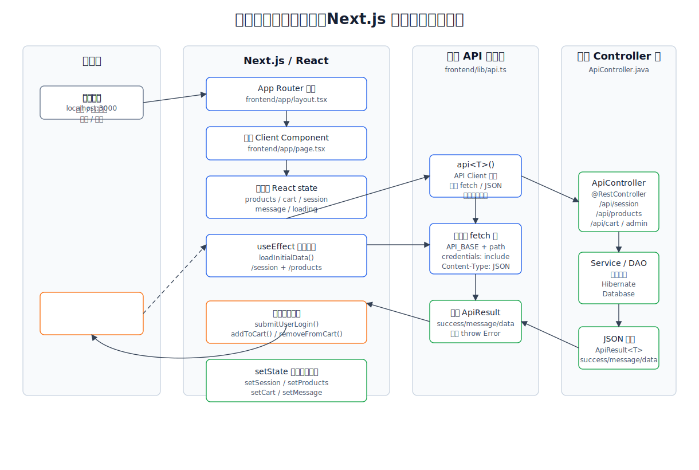
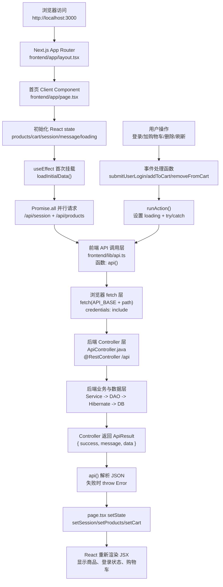
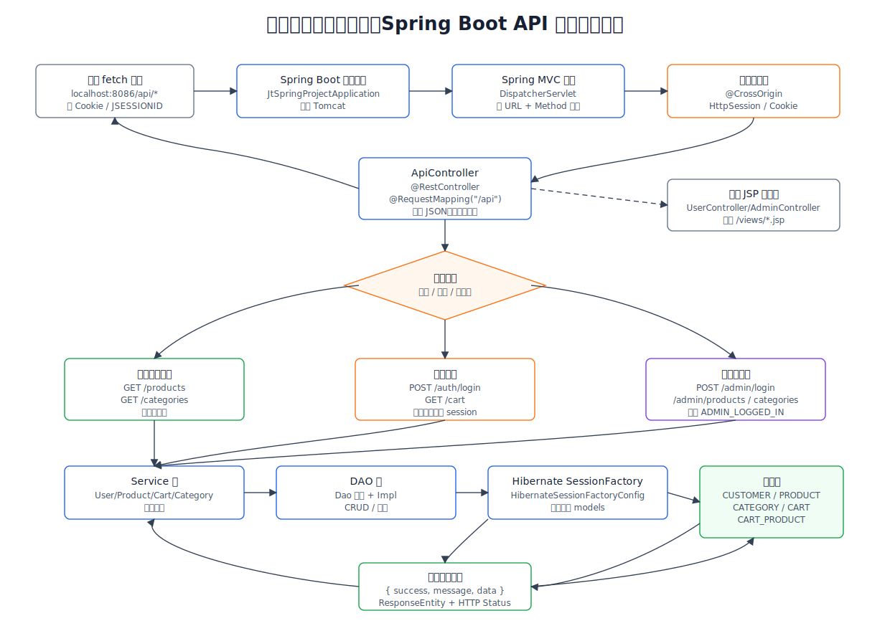
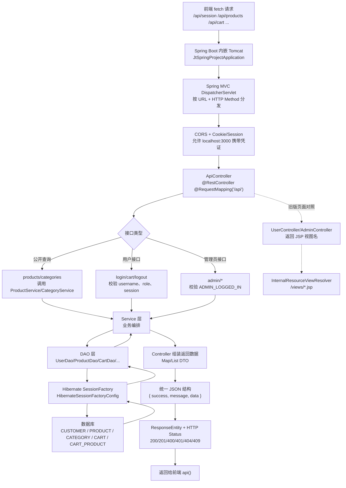

# 全局前后端处理流程图

本文用于学习 `JtProject-Next` 的主框架调用链。当前推荐优先看 **Next.js 前端 + Spring Boot API 后端** 这条流程；`src/main/webapp/views/*.jsp` 是旧版 Spring MVC 页面，对照学习时再看。

## 1. 前端处理流程图

Mermaid source

### 前端图分层对照

| 图中节点 | 实际文件/类 | 属于哪一层 | 作用 |
| --- | --- | --- | --- |
| 首页 Client Component | `frontend/app/page.tsx` | 前端页面层 / React UI 层 | 保存页面 state，处理按钮和表单事件 |
| 前端 API 调用层 | `frontend/lib/api.ts` | 前端数据访问层 / API Client 层 | 统一封装 `fetch`、cookie、JSON 解析和错误处理 |
| 浏览器 fetch 层 | 浏览器内置 `fetch()` | HTTP 通信层 | 真正向 `http://localhost:8086/api/*` 发请求 |
| 后端 Controller 层 | `src/main/java/.../controller/ApiController.java` | Spring MVC Controller 层 | 接收 `/api/*` 请求，校验参数/session，调用 Service |
| 后端业务与数据层 | `services/*`、`dao/*`、`models/*` | Service / DAO / Model 层 | 执行业务逻辑、数据库访问和实体映射 |

## 2. 后端处理流程图

Mermaid source

## 3. 学习顺序

1. 先看 `frontend/app/page.tsx`：理解页面状态、事件处理、`useEffect` 初始化。
2. 再看 `frontend/lib/api.ts`：理解前端如何统一调用后端。
3. 再看 `src/main/java/.../controller/ApiController.java`：理解每个 `/api/*` 请求怎么进入后端。
4. 最后顺着 `Service -> DAO -> models -> database` 看数据怎么被读取和修改。
