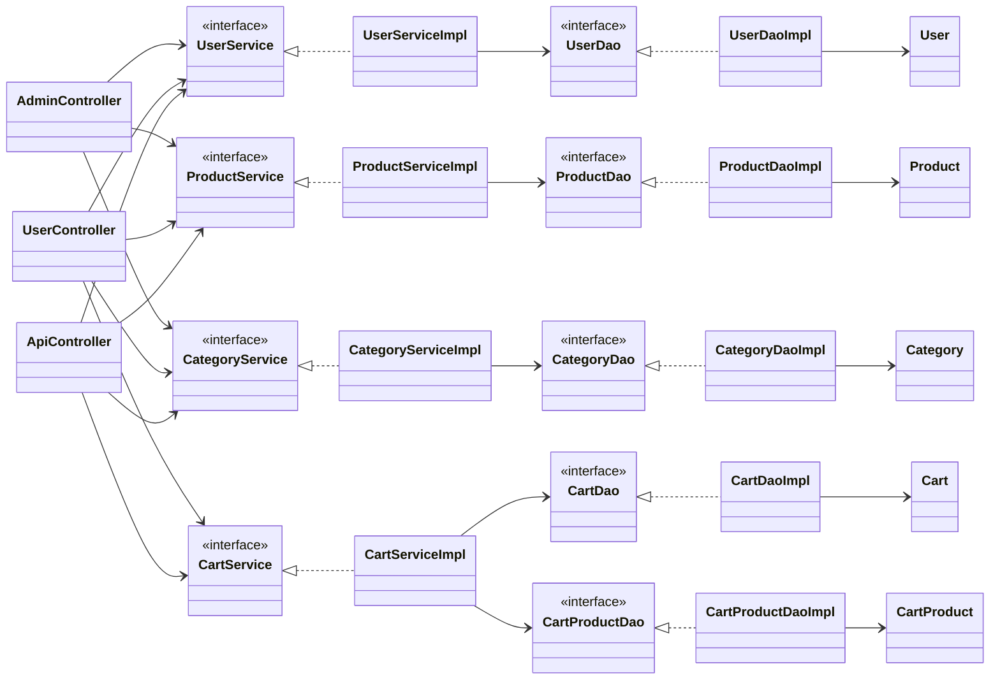
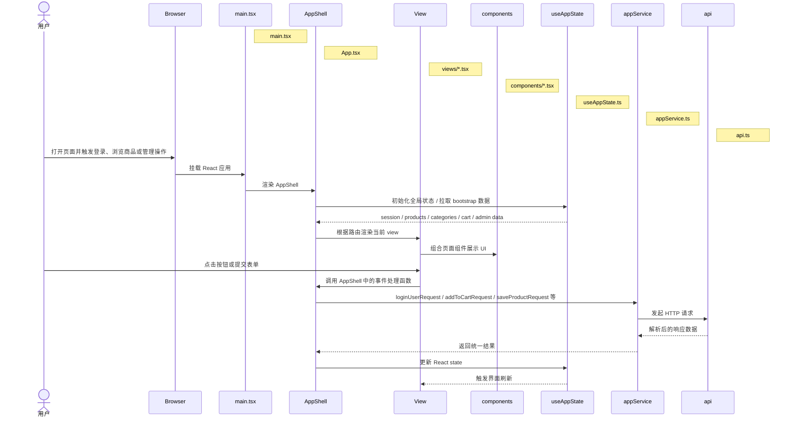
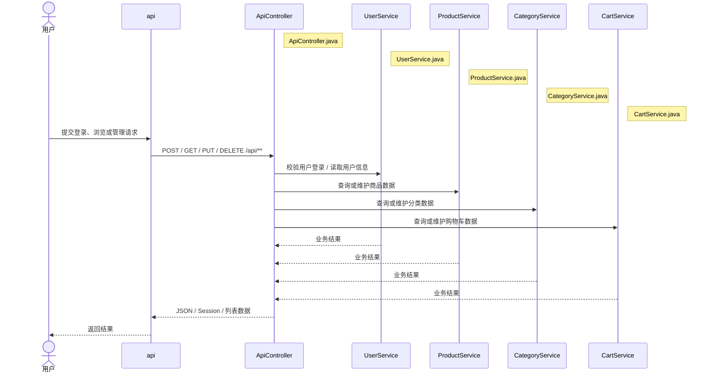
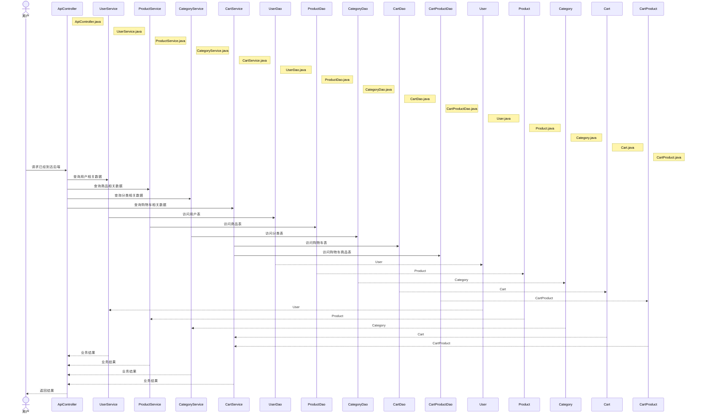
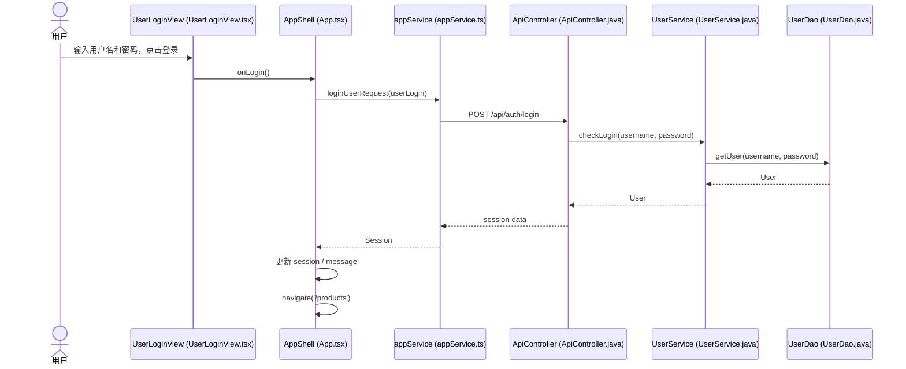
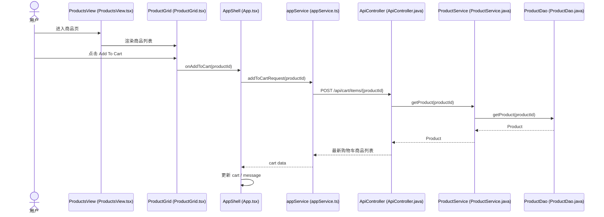
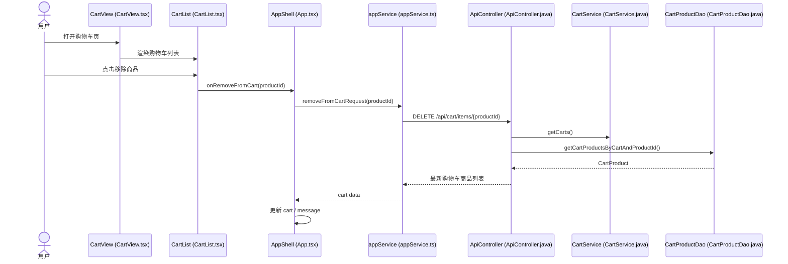
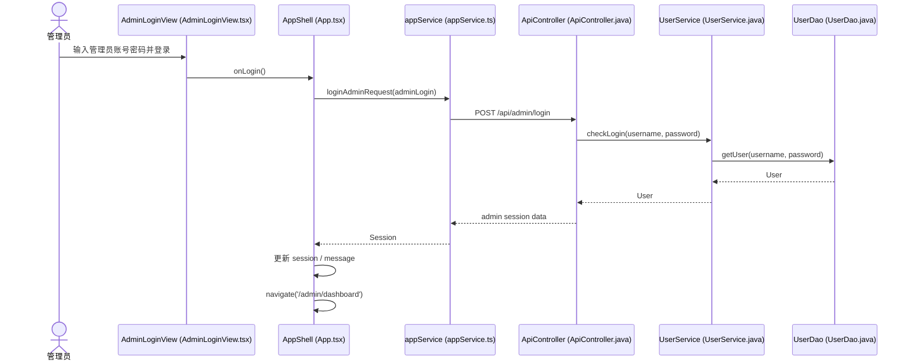
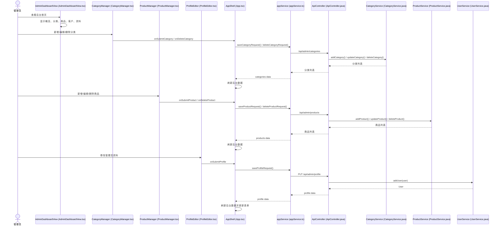

# JtProject-React 文档总索引

这个目录是 `JtProject-React` 的项目级文档入口，重点服务于：

- React 页面学习
- 前后端分离结构理解
- 组件、页面、Hooks 和 Service 拆分学习
- 页面与后端 API 联动关系梳理

相关入口：

- 项目根入口：[README.md](../README.md)
- Java 项目总导航：[Java项目总启动导航.md](../../Java项目总启动导航.md)
- Java 项目文档入口：[doc/README.md](../../doc/README.md)

## 建议先看

如果你是第一次看这个项目，推荐顺序：

1. [README.md](../README.md)
2. [react-learning-path.md](./react-learning-path.md)
3. [react-framework-notes.md](./react-framework-notes.md)
4. [project-code-map.md](./project-code-map.md)
5. [hooks-learning-guide.md](./hooks-learning-guide.md)

## 文档分区

### 学习路线

- [react-learning-path.md](./react-learning-path.md)

适合按顺序学习 React 页面、状态和项目演进路线。

### 框架与概念

- [react-framework-notes.md](./react-framework-notes.md)
- [hooks-learning-guide.md](./hooks-learning-guide.md)

适合理解 React 关键概念、状态管理和 Hook 用法。

### 项目结构与页面组织

- [project-code-map.md](./project-code-map.md)
- [page-structure-guide.md](./page-structure-guide.md)

适合理解目录结构、页面拆分、组件边界和服务层组织。

## 前端源码入口

如果你想边读文档边看 React 代码，可以从这里开始：

- 前端入口：[main.tsx](../frontend/src/main.tsx)
- 前端主页面：[App.tsx](../frontend/src/App.tsx)
- 全局样式：[styles.css](../frontend/src/styles.css)
- 状态 Hook：[useAppState.ts](../frontend/src/hooks/useAppState.ts)
- 业务 Service：[appService.ts](../frontend/src/services/appService.ts)

## 后端源码入口


class AppShell["AppShell (App.tsx)"] {
	+useAppState()
	+handleUserLogin()
	+handleAdminLogin()
	+submitProduct()
	+submitCategory()
}

class AppLayout["AppLayout"]
class ProductsView["ProductsView (ProductsView.tsx)"]
class CartView["CartView (CartView.tsx)"]
class UserLoginView["UserLoginView (UserLoginView.tsx)"]
class AdminLoginView["AdminLoginView (AdminLoginView.tsx)"]
class AdminDashboardView["AdminDashboardView (AdminDashboardView.tsx)"]

class PageHeader["PageHeader (PageHeader.tsx)"]
class ProductGrid["ProductGrid (ProductGrid.tsx)"]
class CategoryManager["CategoryManager (CategoryManager.tsx)"]
class ProductManager["ProductManager (ProductManager.tsx)"]
class CustomerList["CustomerList (CustomerList.tsx)"]
class ProfileEditor["ProfileEditor (ProfileEditor.tsx)"]
class UserAuthForms["UserAuthForms (UserAuthForms.tsx)"]
class AdminAuthForm["AdminAuthForm (AdminAuthForm.tsx)"]
class CartList["CartList (CartList.tsx)"]

class appService["appService (appService.ts)"] {
	+loadBootstrapData()
	+loadCart()
	+loadAdminData()
	+loginUserRequest()
	+loginAdminRequest()
	+saveProductRequest()
}

class api["api (api.ts)"] {
	+fetch wrapper
}

class ApiController["ApiController (ApiController.java)"] {
	+/api/session
	+/api/auth/login
	+/api/products
	+/api/admin/*
}

class UserService["UserService (UserService.java)"]
class ProductService["ProductService (ProductService.java)"]
class CategoryService["CategoryService (CategoryService.java)"]
class CartService["CartService (CartService.java)"]
class UserDao["UserDao (UserDao.java)"]
class ProductDao["ProductDao (ProductDao.java)"]
class CategoryDao["CategoryDao (CategoryDao.java)"]
class CartDao["CartDao (CartDao.java)"]
	+addCategory()
	+getCategories()
	+getCategory()
	+updateCategory()
	+deletCategory()
class CartProduct["CartProduct (CartProduct.java)"]

App --> AppShell
AppShell --> AppLayout
AppShell --> ProductsView
AppShell --> CartView
AppShell --> UserLoginView
AppShell --> AdminLoginView
AppShell --> AdminDashboardView

ProductsView --> PageHeader
ProductsView --> ProductGrid
AdminDashboardView --> PageHeader
AdminDashboardView --> CategoryManager
AdminDashboardView --> ProductManager
AdminDashboardView --> CustomerList
AdminDashboardView --> ProfileEditor
UserLoginView --> UserAuthForms
AdminLoginView --> AdminAuthForm
CartView --> CartList

AppShell --> appService
appService --> api
api --> ApiController
ApiController --> UserService
ApiController --> ProductService
ApiController --> CategoryService
ApiController --> CartService
UserService --> UserDao
ProductService --> ProductDao
CategoryService --> CategoryDao
CartService --> CartDao
CartService --> CartProductDao
UserDao --> User
ProductDao --> Product
CategoryDao --> Category
CartDao --> Cart
CartProductDao --> CartProduct
```

## 处理流程图

这张图展示的是一次典型的前端到后端请求链路：页面加载、用户操作、调用 API、后端处理、再把结果写回状态。

```mermaid
flowchart TD
		A[浏览器打开应用] --> B[main.tsx 挂载 App]
		B --> C[App.tsx / AppShell 初始化全局状态]
		C --> D[useAppState 加载 session / products / categories]
		D --> E[路由切换到某个 view]
		E --> F[view 组合 components 展示页面]
		F --> G[用户点击按钮或提交表单]
		G --> H[AppShell 中的事件处理函数]
		H --> I[appService 调用 api]
		I --> J[/api/** 进入 ApiController]
		J --> K[Service 层执行业务逻辑]
		K --> L[DAO 访问数据库]
		L --> M[(MySQL / 数据库)]
		M --> L --> K --> J --> I --> H
		H --> N[更新 React state]
		N --> F
```

## React 视图层 + Spring Boot 后端时序图

这一节拆成两张小图：前端只看 React 视图层，后端只看 Spring Boot 请求链路。这样在页面里更容易完整看清。

### 1. React 视图层时序图



小结：这张图只看前端页面、状态和请求封装的关系。源码索引：前端入口 [main.tsx](java-projects/JtProject-React/frontend/src/main.tsx#L1)、应用壳 [App.tsx](java-projects/JtProject-React/frontend/src/App.tsx#L1)、全局 Hook [useAppState.ts](java-projects/JtProject-React/frontend/src/hooks/useAppState.ts#L1)、服务层 [appService.ts](java-projects/JtProject-React/frontend/src/services/appService.ts#L1)、请求封装 [api.ts](java-projects/JtProject-React/frontend/src/api.ts#L1)。

### 2. Spring Boot 后端时序图

这一部分再拆成两张小图：第一张看 Controller / Service，第二张看 DAO / Entity。

#### 2.1 Controller / Service



> 注意：UserController.java 和 AdminController.java 为遗留 JSP 控制器（返回 JSP 视图）。React 前端并不直接通过它们交互，前端使用 [ApiController.java](java-projects/JtProject-React/src/main/java/com/jtspringproject/JtSpringProject/controller/ApiController.java#L1) 暴露的 /api/** 接口。

小结：这张图只看控制器和 Service 的调用链。源码索引：后端控制器 [ApiController.java](java-projects/JtProject-React/src/main/java/com/jtspringproject/JtSpringProject/controller/ApiController.java#L1)、示例 Service [ProductService.java](java-projects/JtProject-React/src/main/java/com/jtspringproject/JtSpringProject/services/ProductService.java#L1)。

#### 2.2 DAO / Entity



> 注意：UserController.java 和 AdminController.java 为遗留 JSP 控制器（返回 JSP 视图）。React 前端并不直接通过它们交互，前端使用 [ApiController.java](java-projects/JtProject-React/src/main/java/com/jtspringproject/JtSpringProject/controller/ApiController.java#L1) 暴露的 /api/** 接口。

小结：这张图只看 DAO 和实体层的调用链。源码索引：示例 DAO [ProductDao.java](java-projects/JtProject-React/src/main/java/com/jtspringproject/JtSpringProject/dao/ProductDao.java#L1)、实体示例 [Product.java](java-projects/JtProject-React/src/main/java/com/jtspringproject/JtSpringProject/models/Product.java#L1)。

## 后端分层细化类图

如果只看控制器、service、dao 和 model，可以用这张更细的图来看层级关系和依赖方向。

小结：聚焦后端分层（Controller → Service → DAO → Model）的依赖关系，便于定位实现文件。源码索引：控制器 [ApiController.java](java-projects/JtProject-React/src/main/java/com/jtspringproject/JtSpringProject/controller/ApiController.java#L1)、示例 Service [ProductService.java](java-projects/JtProject-React/src/main/java/com/jtspringproject/JtSpringProject/services/ProductService.java#L1)、示例 DAO [ProductDao.java](java-projects/JtProject-React/src/main/java/com/jtspringproject/JtSpringProject/dao/ProductDao.java#L1)、实体示例 [Product.java](java-projects/JtProject-React/src/main/java/com/jtspringproject/JtSpringProject/models/Product.java#L1)。

```mermaid
classDiagram
direction LR

	class ApiController["ApiController.java"] {
		+health()
		+session()
		+auth() 
		+products()
		+categories()
		+cart()
		+adminOverview()
		+adminCategories()
		+adminProducts()
		+adminProfile()
	}

	class UserController["UserController.java (legacy JSP controller)"]
	class AdminController["AdminController.java (legacy JSP controller)"]

	class UserService["UserService.java"] {
		<<interface>>
		+checkLogin()
		+getUsers()
		+addUser()
	}
	class ProductService["ProductService.java"] {
		<<interface>>
		+getProducts()
		+getProduct()
		+saveOrDelete()
	}
	class CategoryService["CategoryService.java"] {
		<<interface>>
		+addCategory()
		+getCategories()
		+updateCategory()
		+deleteCategory()
	}
	class CartService["CartService.java"] {
		<<interface>>
		+addCart()
		+getCarts()
		+updateCart()
	}

	class UserServiceImpl["UserServiceImpl.java"]
	class ProductServiceImpl["ProductServiceImpl.java"]
	class CategoryServiceImpl["CategoryServiceImpl.java"]
	class CartServiceImpl["CartServiceImpl.java"]

	class UserDao["UserDao.java"] {
		<<interface>>
		+getUser()
		+saveUser()
		+userExists()
	}
	class ProductDao["ProductDao.java"] {
		<<interface>>
		+getProducts()
		+getProduct()
		+saveProduct()
	}
	class CategoryDao["CategoryDao.java"] {
		<<interface>>
		+addCategory()
		+getCategories()
		+updateCategory()
		+deleteCategory()
	}
	class CartDao["CartDao.java"] {
		<<interface>>
		+getCarts()
		+addCart()
		+updateCart()
	}
	class CartProductDao["CartProductDao.java"] {
		<<interface>>
		+addCartProduct()
		+getCartProducts()
		+updateCartProduct()
		+deleteCartProduct()
	}

	class User["User.java"]
	class Product["Product.java"]
	class Category["Category.java"]
	class Cart["Cart.java"]
	class CartProduct["CartProduct.java"]

	ApiController --> UserService
	ApiController --> ProductService
	ApiController --> CategoryService
	ApiController --> CartService

	UserController --> UserService
	UserController --> ProductService
	UserController --> CategoryService
	UserController --> CartService

	AdminController --> UserService
	AdminController --> ProductService
	AdminController --> CategoryService

	UserService <|.. UserServiceImpl
	ProductService <|.. ProductServiceImpl
	CategoryService <|.. CategoryServiceImpl
	CartService <|.. CartServiceImpl

	UserServiceImpl --> UserDao
	ProductServiceImpl --> ProductDao
	CategoryServiceImpl --> CategoryDao
	CartServiceImpl --> CartDao
	CartServiceImpl --> CartProductDao

	UserDao <|.. UserDaoImpl
	ProductDao <|.. ProductDaoImpl
	CategoryDao <|.. CategoryDaoImpl
	CartDao <|.. CartDaoImpl
	CartProductDao <|.. CartProductDaoImpl

	UserDaoImpl --> User
	ProductDaoImpl --> Product
	CategoryDaoImpl --> Category
	CartDaoImpl --> Cart
	CartProductDaoImpl --> CartProduct

	Cart --> User
	CartProduct --> Cart
	CartProduct --> Product
	Product --> Category
	```

## 旧后端总体类图（保留历史版本）

下面是仓库中原有的后端总体类图（历史版本），为保持与早期文档的一致性，作为参考保留在此处：

小结：历史版本的总体类图，结构更概览化，保留以便与上面的细化类图对比。主要实现可参见 [ApiController.java](java-projects/JtProject-React/src/main/java/com/jtspringproject/JtSpringProject/controller/ApiController.java#L1) 与服务/DAO/实体目录。

```mermaid
classDiagram
direction LR

class ApiController {
	+health()
	+session()
	+userLogin()
	+register()
	+userLogout()
	+products()
	+categories()
	+cart()
	+addCartItem()
	+deleteCartItem()
	+adminLogin()
	+adminLogout()
	+adminOverview()
	+adminCategories()
	+createCategory()
	+updateCategory()
	+deleteCategory()
	+adminProducts()
	+createProduct()
	+updateProduct()
	+deleteProduct()
	+customers()
	+adminProfile()
	+updateAdminProfile()
}

class UserController["UserController (legacy JSP controller)"]
class AdminController["AdminController (legacy JSP controller)"]

class UserService
class ProductService
class CategoryService
class CartService


class UserServiceImpl["UserServiceImpl (services/impl/UserServiceImpl.java)"]
class ProductServiceImpl["ProductServiceImpl (services/impl/ProductServiceImpl.java)"]
class CategoryServiceImpl["CategoryServiceImpl (services/impl/CategoryServiceImpl.java)"]
class CartServiceImpl["CartServiceImpl (services/impl/CartServiceImpl.java)"]

class UserDao["UserDao (dao/UserDao.java)"]
class ProductDao["ProductDao (dao/ProductDao.java)"]
class CategoryDao["CategoryDao (dao/CategoryDao.java)"]
class CartDao["CartDao (dao/CartDao.java)"]
class CartProductDao["CartProductDao (dao/CartProductDao.java)"]

class UserDaoImpl["UserDaoImpl (dao/impl/UserDaoImpl.java)"]
class ProductDaoImpl["ProductDaoImpl (dao/impl/ProductDaoImpl.java)"]
class CategoryDaoImpl["CategoryDaoImpl (dao/impl/CategoryDaoImpl.java)"]
class CartDaoImpl["CartDaoImpl (dao/impl/CartDaoImpl.java)"]
class CartProductDaoImpl["CartProductDaoImpl (dao/impl/CartProductDaoImpl.java)"]

class User
class Product
class Category
class Cart
class CartProduct

ApiController --> UserService
ApiController --> ProductService
ApiController --> CategoryService
ApiController --> CartService

UserController --> UserService
UserController --> ProductService
UserController --> CategoryService
UserController --> CartService

AdminController --> UserService
AdminController --> ProductService
AdminController --> CategoryService

UserService <|.. UserServiceImpl
ProductService <|.. ProductServiceImpl
CategoryService <|.. CategoryServiceImpl
CartService <|.. CartServiceImpl

UserServiceImpl --> UserDao
ProductServiceImpl --> ProductDao
CategoryServiceImpl --> CategoryDao
CartServiceImpl --> CartDao
CartServiceImpl --> CartProductDao

UserDao <|.. UserDaoImpl
ProductDao <|.. ProductDaoImpl
CategoryDao <|.. CategoryDaoImpl
CartDao <|.. CartDaoImpl
CartProductDao <|.. CartProductDaoImpl

UserDaoImpl --> User
ProductDaoImpl --> Product
CategoryDaoImpl --> Category
CartDaoImpl --> Cart
CartProductDaoImpl --> CartProduct

Cart --> User
CartProduct --> Cart
CartProduct --> Product
Product --> Category
```

## 页面和组件的对照理解

- 商品页：ProductsView (ProductsView.tsx) 是页面，ProductGrid (ProductGrid.tsx) 是商品展示组件。
- 购物车页：CartView (CartView.tsx) 是页面，CartList (CartList.tsx) 是购物车展示组件。
- 用户登录页：UserLoginView (UserLoginView.tsx) 是页面，UserAuthForms (UserAuthForms.tsx) 是表单组件。
- 管理后台页：AdminDashboardView (AdminDashboardView.tsx) 是页面，CategoryManager (CategoryManager.tsx)、ProductManager (ProductManager.tsx)、CustomerList (CustomerList.tsx)、ProfileEditor (ProfileEditor.tsx) 是局部组件。

## View 时序图

下面把各个 view 的核心流程拆开看，会更接近你在代码里真正看到的调用链。

### AppShell

- 源码位置：[`frontend/src/App.tsx`](../frontend/src/App.tsx)
- 类职责：React 应用壳组件，负责路由入口、全局状态分发、登录/注册/购物车/后台管理等提交动作的集中处理。
- 读图提示：下面几个 View 的时序图里，`AppShell` 都指向这个文件中的 `AppShell()`。

### UserLoginView



### ProductsView



### CartView



### AdminLoginView



### AdminDashboardView



如果你愿意，我还可以继续把这份文档补成“React 视图层 + Spring Boot 后端”的完整时序图版本，或者再画一张更细的“控制器 / service / dao / model”类图。

## 目录结构（包含代表性文件，便于快速定位）

项目整体目录（重点列出当前存在的文件/文件夹类型）：

- frontend/ — React + TypeScript 前端源码（可单独运行）
	- package.json（项目依赖与启动脚本）
	- vite.config.ts（Vite 配置）
	- src/
		- main.tsx （应用入口，挂载 React）
		- App.tsx （路由分发与应用壳）
		- api.ts （基础 fetch 封装）
		- types.ts （TypeScript 类型定义）
		- styles.css （全局样式）
		- vite-env.d.ts
		- hooks/
			- useAppState.ts （集中状态 Hook，实现 bootstrap、refreshCart、refreshAdmin）
		- views/
			- AdminDashboardView.tsx （管理后台主页视图）
			- AdminLoginView.tsx （管理员登录视图）
			- CartView.tsx （购物车视图）
			- ProductsView.tsx （商品列表视图）
			- UserLoginView.tsx （用户登录视图）
		- components/
			- PageHeader.tsx （页面头部）
			- ProductGrid.tsx （商品网格）
			- ProductManager.tsx （商品管理表单）
			- CategoryManager.tsx （分类管理表单）
			- ProfileEditor.tsx （个人资料编辑）
			- UserAuthForms.tsx （用户认证表单）
			- AdminAuthForm.tsx （管理员认证表单）
			- CartList.tsx （购物车列表）
			- CustomerList.tsx （客户列表）
		- services/
			- appService.ts （对后端 /api/* 的函数封装，如 loginUserRequest、saveProductRequest 等）

- src/main/java/... — 后端 Spring Boot 项目（提供 API 与历史 MVC）
	- controller/
		- ApiController.java （REST API，前端通过 /api/* 调用）
		- UserController.java （历史的 MVC 控制器，返回 JSP 视图）
		- AdminController.java （历史的 MVC 控制器，返回 JSP 视图）
	- services/ （业务逻辑实现）
		- ProductService.java, UserService.java, CategoryService.java, CartService.java
		- impl/* （实现类，如 ProductServiceImpl、UserServiceImpl 等）
	- dao/ （数据访问接口与实现）
		- ProductDao.java, UserDao.java, CartDao.java, CartProductDao.java
		- impl/* （DAO 实现）
	- models/ （实体类）
		- Product.java, User.java, Category.java, Cart.java, CartProduct.java
	- common/
		- constants/ （RoleConstants.java, SessionConstants.java）
		- util/ （InputCheckUtil.java, TypeConversionUtil.java）
	- config/（配置类）
		- HibernateConfiguration.java
		- WebMvcConfig.java （包含 viewResolver，JSP 解析配置）
		- TransactionConfig.java
	- batch/ （可选的批处理/Quartz 定时任务）
		- ProductInventoryCheckQuartzJob.java 等

- src/main/webapp/views/ — 传统 JSP 页面（历史视图，React 已替代这些页面；保留供对照学习）
	- adminlogin.jsp
	- register.jsp
	- cart.jsp
	- adminHome.jsp
	- uproduct.jsp
	- index.jsp
	- products.jsp
	- productsAdd.jsp
	- productsUpdate.jsp
	- categories.jsp
	- displayCustomers.jsp
	- updateProfile.jsp
	- cartproduct.jsp
	- test.jsp / test2.jsp

其他重要文件：
- README.md（仓库根文档）
- docs/jsp-react-mapping.md（JSP ↔ React 对照表，已创建）

说明：以上列出的文件为当前仓库中存在的代表性文件（非穷举），可作为学习与快速跳转的目录索引。如果你希望我把该清单导出为单独的 markdown 或 CSV（便于离线查阅），我可以马上生成并提交。
