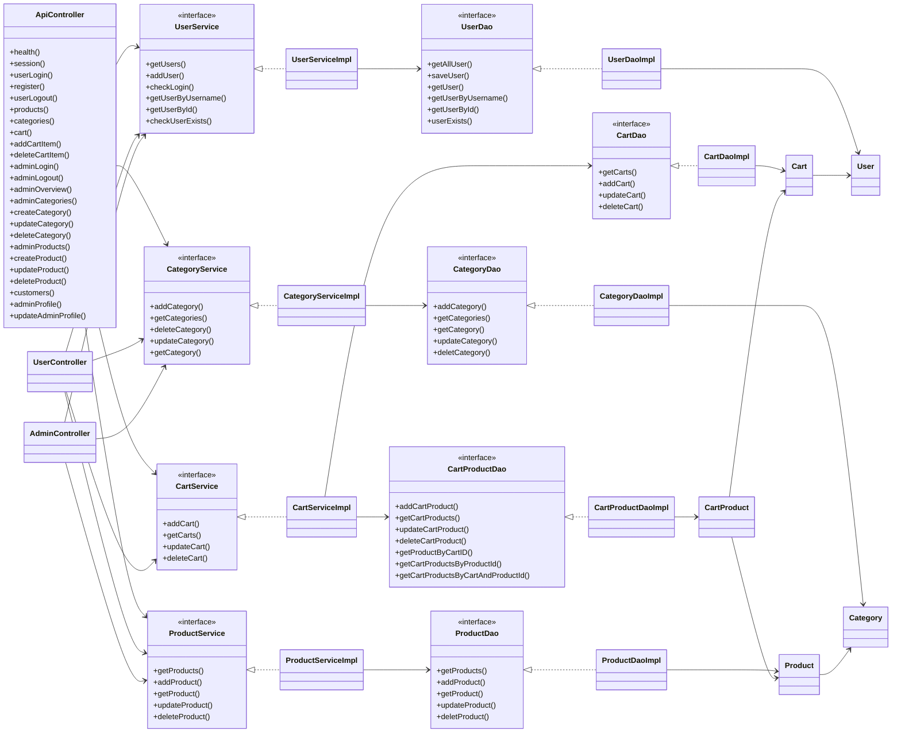
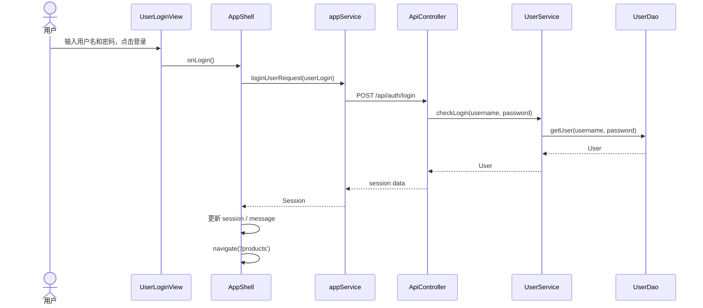
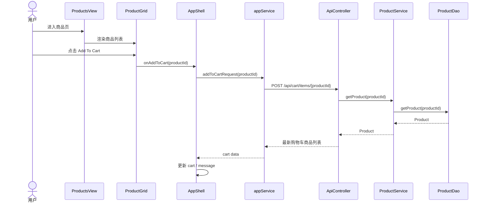
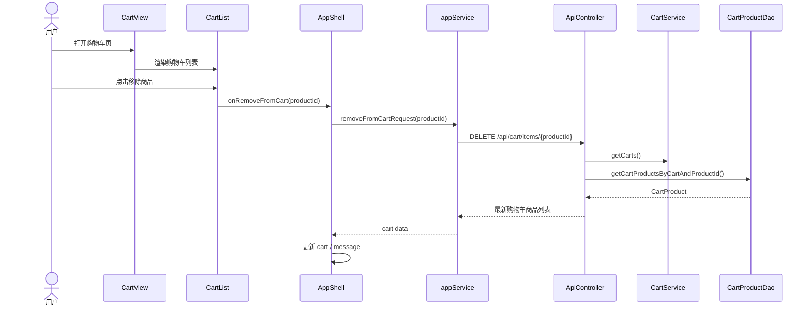
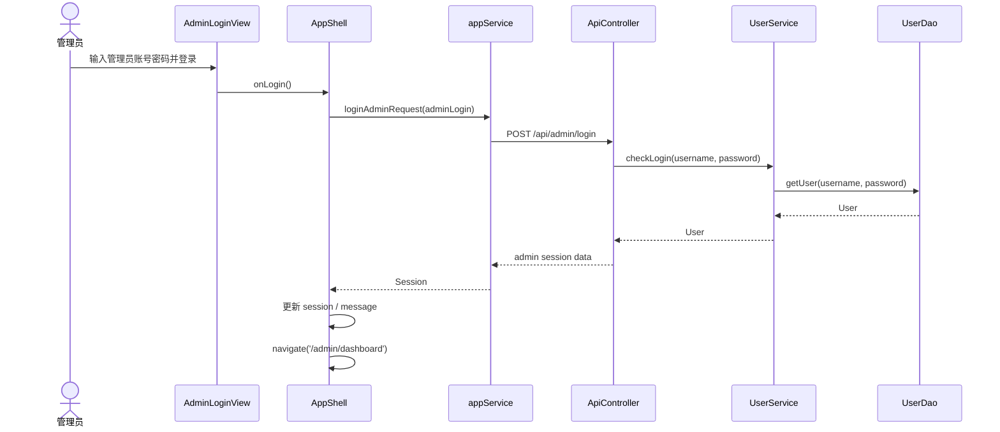
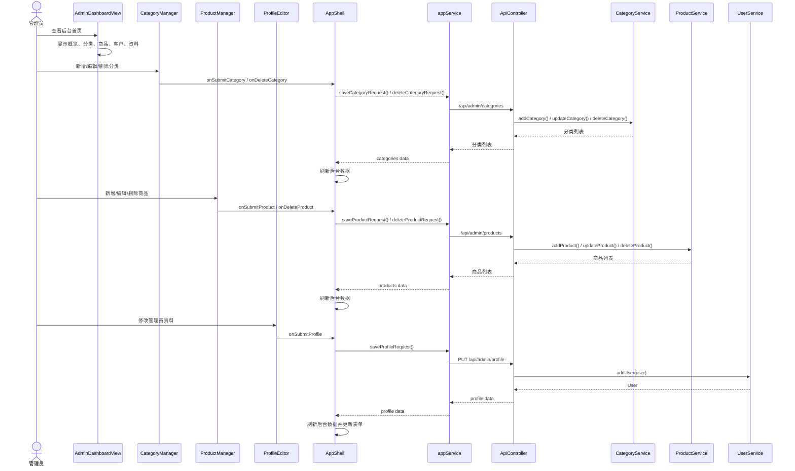

# JtProject-React 文档总索引

这个目录是 `JtProject-React` 的项目级文档入口，重点服务于：

- React 页面学习
- 前后端分离结构理解
- 组件、页面、Hooks 和 Service 拆分学习
- 页面与后端 API 联动关系梳理

相关入口：

- 项目根入口：[README.md](../README.md)
- Java 项目总导航：[Java项目总启动导航.md](../../Java项目总启动导航.md)
- Java 项目文档入口：[doc/README.md](../../doc/README.md)

## 建议先看

如果你是第一次看这个项目，推荐顺序：

1. [README.md](../README.md)
2. [react-learning-path.md](./react-learning-path.md)
3. [react-framework-notes.md](./react-framework-notes.md)
4. [project-code-map.md](./project-code-map.md)
5. [hooks-learning-guide.md](./hooks-learning-guide.md)

## 文档分区

### 学习路线

- [react-learning-path.md](./react-learning-path.md)

适合按顺序学习 React 页面、状态和项目演进路线。

### 框架与概念

- [react-framework-notes.md](./react-framework-notes.md)
- [hooks-learning-guide.md](./hooks-learning-guide.md)

适合理解 React 关键概念、状态管理和 Hook 用法。

### 项目结构与页面组织

- [project-code-map.md](./project-code-map.md)
- [page-structure-guide.md](./page-structure-guide.md)

适合理解目录结构、页面拆分、组件边界和服务层组织。

## 前端源码入口

如果你想边读文档边看 React 代码，可以从这里开始：

- 前端入口：[main.tsx](../frontend/src/main.tsx)
- 前端主页面：[App.tsx](../frontend/src/App.tsx)
- 全局样式：[styles.css](../frontend/src/styles.css)
- 状态 Hook：[useAppState.ts](../frontend/src/hooks/useAppState.ts)
- 业务 Service：[appService.ts](../frontend/src/services/appService.ts)

## 后端源码入口

虽然这是 React 学习版，但后端仍然是 Spring Boot，可以从这里往下看：

- API 控制器：[ApiController.java](../src/main/java/com/jtspringproject/JtSpringProject/controller/ApiController.java)
- 用户控制器：[UserController.java](../src/main/java/com/jtspringproject/JtSpringProject/controller/UserController.java)
- 管理员控制器：[AdminController.java](../src/main/java/com/jtspringproject/JtSpringProject/controller/AdminController.java)

说明：

- 当前项目包含两套后端实现风格：
	1. REST API（位于 `ApiController.java`，路径前缀 `/api`），此部分已被 React 前端直接调用。
	2. 传统的 Spring MVC 服务端渲染（通过 `UserController`、`AdminController` 等返回 JSP 视图），这些 JSP 位于 `src/main/webapp/views/` 下。

- 如果你希望把后端仅保留为 API（React 前端负责所有页面渲染），可以删除 MVC 控制器和 JSP 文件。保留的 Java 文件应至少包括：
	- `ApiController.java`（REST 接口，React 直接调用）
	- 所有 `services/`、`dao/`、`models/`（业务逻辑与数据访问层）
	- 项目启动类（`JtSpringProjectApplication.java`）与必要的配置（数据库/事务/Session 配置等）

建议的“候选删除”清单（请确认后再删除）：

JSP 视图（位于 `src/main/webapp/views/`，可删除）:
 - adminlogin.jsp
 - register.jsp
 - cart.jsp
 - adminHome.jsp
 - test.jsp
 - uproduct.jsp
 - index.jsp
 - products.jsp
 - updateProfile.jsp
 - productsUpdate.jsp
 - productsAdd.jsp
 - categories.jsp
 - cartproduct.jsp
 - test2.jsp
 - displayCustomers.jsp
 - userLogin.jsp

Java 控制器（用于服务端渲染，候选删除）:
 - src/main/java/com/jtspringproject/JtSpringProject/controller/AdminController.java
 - src/main/java/com/jtspringproject/JtSpringProject/controller/UserController.java

可选/待审查（可能是后台任务或示例代码，确认是否需要再删除）:
 - batch/Quartz 相关类（如果不需要计划任务可删除）:
	 - src/main/java/com/jtspringproject/JtSpringProject/batch/**
 - LazyTestComponent.java、AnotherComponent.java、测试或示例用的类

重要注意事项与步骤：

1. 先不要直接删除——建议先把候选文件移到备份目录（例如 `archive/removed-by-me/`）或创建一个 Git 分支备份。
2. 删除 JSP 与 MVC 控制器后，需要：
	 - 检查 `WebMvcConfig.java` 中的 `viewResolver()`（若不再使用 JSP，可移除或调整配置）。
	 - 确认 `pom.xml`/Gradle 配置中是否还包含 JSP 相关依赖（如 `tomcat-embed-jasper`、JSTL），可一并清理。
3. 保留 `ApiController` 与 `services`/`dao`/`models`，因为它们提供后端业务逻辑与数据接口。

我可以：
 - 先为你在仓库中列出所有候选删除文件（已完成扫描，见下方清单），并在 docs 中保存此建议（本文件已更新）。
 - 如果你确认，我可以把这些文件移动到 `archive/`（非破坏性）或直接删除（破坏性）。

TypeScript / 前端部分说明：

- 前端基于 Vite + React + TypeScript：
	- 入口： `frontend/src/main.tsx`（挂载 React 根组件）
	- 路由与页面： `frontend/src/App.tsx`（路由分发），`frontend/src/views/`（页面视图）
	- 组件： `frontend/src/components/`（可复用 UI 组件）
	- 状态 Hook： `frontend/src/hooks/useAppState.ts`（集中管理应用级状态）
	- 类型定义： `frontend/src/types.ts`（所有前端使用的类型定义）
	- 网络请求封装： `frontend/src/api.ts`（基础 fetch 封装），`frontend/src/services/appService.ts`（具体 API 调用）
	- Vite 配置： `frontend/vite.config.ts`

 - TypeScript 主要用于前端代码（`.ts` / `.tsx`），后端仍然是 Java。前端的 `package.json` 提供了启动命令：

```bash
cd frontend
npm install
npm run dev
```

项目整体框架与目录逻辑（JtProject-React 仅针对当前项目）：

- frontend/  — React + TypeScript 前端源码（可单独运行）
	- src/
		- main.tsx（入口，挂载 React）
		- App.tsx（路由与应用壳）
		- api.ts（基础 fetch 封装，带凭证支持）
		- types.ts（TypeScript 类型定义）
		- hooks/
			- useAppState.ts（集中状态 Hook，bootstrap、refreshCart、refreshAdmin）
		- services/
			- appService.ts（对后端 /api/* 的调用封装，如 loginUserRequest、saveProductRequest）
		- views/（按路由拆分的页面视图，代表文件）
			- UserLoginView.tsx
			- ProductsView.tsx
			- CartView.tsx
			- AdminLoginView.tsx
			- AdminDashboardView.tsx
		- components/（可复用组件，代表文件）
			- UserAuthForms.tsx
			- AdminAuthForm.tsx
			- ProductGrid.tsx
			- ProductManager.tsx
			- CategoryManager.tsx
			- CartList.tsx
			- CustomerList.tsx
			- ProfileEditor.tsx

- src/main/java/...  — 后端 Spring Boot 项目（提供 API 或 MVC）
	- controller/ 包含 REST API（ApiController）以及历史 MVC 控制器（AdminController、UserController）
	- services/ 业务逻辑（应保留）
	- dao/ 数据访问（应保留）
	- models/ 实体类（应保留）
	- config/（例如 Hibernate、WebMvcConfig、事务配置）

- src/main/webapp/views/ — 传统 JSP 页面（如果前端替换为 React，可删除）

如果你确认要我执行“删除候选文件”的操作，请回复“删除并备份”或“直接删除”，并指明是否希望把文件先移动到 `archive/removed-by-me/`（我推荐先备份）。我会在执行前创建一个清晰的变更列表并应用不可逆操作前再次确认。


## 使用建议

- 想先把项目跑起来：先看 [README.md](../README.md)
- 想按路线学习 React：先看 [react-learning-path.md](./react-learning-path.md)
- 想先理解项目结构：先看 [project-code-map.md](./project-code-map.md)
- 想重点学 Hooks：先看 [hooks-learning-guide.md](./hooks-learning-guide.md)

## 文档模板

React 和 Vue 的文档现在尽量使用同一套阅读模板，后续新增内容也建议按这个顺序组织：

1. 先看入口和推荐阅读。
2. 再看 views、components、layouts 的页面组织。
3. 接着看类图，理解页面层和后端层的对象关系。
4. 然后看流程图和时序图，理解一次请求怎么走完整条链路。
5. 最后看源码入口和学习文档，继续往细节里追。

## views 和 components 的关系

在这个 React 版本里，views 和 components 的关系可以理解成“页面”和“积木块”：

- views 是路由级页面，负责承载一个完整场景，例如商品页、购物车页、管理后台页。
- components 是可复用的小组件，负责完成局部 UI，例如商品卡片网格、页面头部、分类管理表单。
- App.tsx 负责把状态、事件处理和路由分发串起来，再把数据和回调传给 views。
- views 再把更细的 UI 拆给 components，保持页面组件只做组装，不直接处理网络请求。

简单说就是：App.tsx 负责调度，views 负责页面编排，components 负责局部展示与交互。

## 类图

下面这张图把前端和后端的主要对象关系放在一起，方便你看整体结构。

```mermaid
classDiagram
direction LR

class App {
	+BrowserRouter
	+AppShell()
}

class AppShell {
	+useAppState()
	+handleUserLogin()
	+handleAdminLogin()
	+submitProduct()
	+submitCategory()
}

class AppLayout
class ProductsView
class CartView
class UserLoginView
class AdminLoginView
class AdminDashboardView

class PageHeader
class ProductGrid
class CategoryManager
class ProductManager
class CustomerList
class ProfileEditor
class UserAuthForms
class AdminAuthForm
class CartList

class appService {
	+loadBootstrapData()
	+loadCart()
	+loadAdminData()
	+loginUserRequest()
	+loginAdminRequest()
	+saveProductRequest()
}

class api {
	+fetch wrapper
}

class ApiController {
	+/api/session
	+/api/auth/login
	+/api/products
	+/api/admin/*
}

class UserService
class ProductService
class CategoryService
class CartService
class UserDao
class ProductDao
class CategoryDao
class CartDao
	+addCategory()
	+getCategories()
	+getCategory()
	+updateCategory()
	+deletCategory()
class CartProduct

App --> AppShell
AppShell --> AppLayout
AppShell --> ProductsView
AppShell --> CartView
AppShell --> UserLoginView
AppShell --> AdminLoginView
AppShell --> AdminDashboardView

ProductsView --> PageHeader
ProductsView --> ProductGrid
AdminDashboardView --> PageHeader
AdminDashboardView --> CategoryManager
AdminDashboardView --> ProductManager
AdminDashboardView --> CustomerList
AdminDashboardView --> ProfileEditor
UserLoginView --> UserAuthForms
AdminLoginView --> AdminAuthForm
CartView --> CartList

AppShell --> appService
appService --> api
api --> ApiController
ApiController --> UserService
ApiController --> ProductService
ApiController --> CategoryService
ApiController --> CartService
UserService --> UserDao
ProductService --> ProductDao
CategoryService --> CategoryDao
CartService --> CartDao
CartService --> CartProductDao
UserDao --> User
ProductDao --> Product
CategoryDao --> Category
CartDao --> Cart
CartProductDao --> CartProduct
```

## 处理流程图

这张图展示的是一次典型的前端到后端请求链路：页面加载、用户操作、调用 API、后端处理、再把结果写回状态。

```mermaid
flowchart TD
		A[浏览器打开应用] --> B[main.tsx 挂载 App]
		B --> C[App.tsx / AppShell 初始化全局状态]
		C --> D[useAppState 加载 session / products / categories]
		D --> E[路由切换到某个 view]
		E --> F[view 组合 components 展示页面]
		F --> G[用户点击按钮或提交表单]
		G --> H[AppShell 中的事件处理函数]
		H --> I[appService 调用 api]
		I --> J[/api/** 进入 ApiController]
		J --> K[Service 层执行业务逻辑]
		K --> L[DAO 访问数据库]
		L --> M[(MySQL / 数据库)]
		M --> L --> K --> J --> I --> H
		H --> N[更新 React state]
		N --> F
```

## 后端细化类图

如果只看 Spring Boot 后端，这条链路可以再拆成 controller、service、dao、model 四层。这里把 REST API 和历史 MVC 控制器都放进来，方便你对照当前项目的混合结构。



## 页面和组件的对照理解

- 商品页：ProductsView 是页面，ProductGrid 是商品展示组件。
- 购物车页：CartView 是页面，CartList 是购物车展示组件。
- 用户登录页：UserLoginView 是页面，UserAuthForms 是表单组件。
- 管理后台页：AdminDashboardView 是页面，CategoryManager、ProductManager、CustomerList、ProfileEditor 是局部组件。

## View 时序图

下面把各个 view 的核心流程拆开看，会更接近你在代码里真正看到的调用链。

### UserLoginView



### ProductsView



### CartView



### AdminLoginView



### AdminDashboardView



如果你愿意，我还可以继续把这份文档补成“React 视图层 + Spring Boot 后端”的完整时序图版本，或者再画一张更细的“控制器 / service / dao / model”类图。

## 目录结构（包含代表性文件，便于快速定位）

项目整体目录（重点列出当前存在的文件/文件夹类型）：

- frontend/ — React + TypeScript 前端源码（可单独运行）
	- package.json（项目依赖与启动脚本）
	- vite.config.ts（Vite 配置）
	- src/
		- main.tsx （应用入口，挂载 React）
		- App.tsx （路由分发与应用壳）
		- api.ts （基础 fetch 封装）
		- types.ts （TypeScript 类型定义）
		- styles.css （全局样式）
		- vite-env.d.ts
		- hooks/
			- useAppState.ts （集中状态 Hook，实现 bootstrap、refreshCart、refreshAdmin）
		- views/
			- AdminDashboardView.tsx
			- AdminLoginView.tsx
			- CartView.tsx
			- ProductsView.tsx
			- UserLoginView.tsx
		- components/
			- PageHeader.tsx
			- ProductGrid.tsx
			- ProductManager.tsx
			- CategoryManager.tsx
			- ProfileEditor.tsx
			- UserAuthForms.tsx
			- AdminAuthForm.tsx
			- CartList.tsx
			- CustomerList.tsx
		- services/
			- appService.ts （对后端 /api/* 的函数封装，如 loginUserRequest、saveProductRequest 等）

- src/main/java/... — 后端 Spring Boot 项目（提供 API 与历史 MVC）
	- controller/
		- ApiController.java （REST API，前端通过 /api/* 调用）
		- UserController.java （历史的 MVC 控制器，返回 JSP 视图）
		- AdminController.java （历史的 MVC 控制器，返回 JSP 视图）
	- services/ （业务逻辑实现）
		- ProductService.java, UserService.java, CategoryService.java, CartService.java
		- impl/* （实现类，如 ProductServiceImpl、UserServiceImpl 等）
	- dao/ （数据访问接口与实现）
		- ProductDao.java, UserDao.java, CartDao.java, CartProductDao.java
		- impl/* （DAO 实现）
	- models/ （实体类）
		- Product.java, User.java, Category.java, Cart.java, CartProduct.java
	- common/
		- constants/ （RoleConstants.java, SessionConstants.java）
		- util/ （InputCheckUtil.java, TypeConversionUtil.java）
	- config/（配置类）
		- HibernateConfiguration.java
		- WebMvcConfig.java （包含 viewResolver，JSP 解析配置）
		- TransactionConfig.java
	- batch/ （可选的批处理/Quartz 定时任务）
		- ProductInventoryCheckQuartzJob.java 等

- src/main/webapp/views/ — 传统 JSP 页面（历史视图，React 已替代这些页面；保留供对照学习）
	- adminlogin.jsp
	- register.jsp
	- cart.jsp
	- adminHome.jsp
	- uproduct.jsp
	- index.jsp
	- products.jsp
	- productsAdd.jsp
	- productsUpdate.jsp
	- categories.jsp
	- displayCustomers.jsp
	- updateProfile.jsp
	- cartproduct.jsp
	- test.jsp / test2.jsp

其他重要文件：
- README.md（仓库根文档）
- docs/jsp-react-mapping.md（JSP ↔ React 对照表，已创建）

说明：以上列出的文件为当前仓库中存在的代表性文件（非穷举），可作为学习与快速跳转的目录索引。如果你希望我把该清单导出为单独的 markdown 或 CSV（便于离线查阅），我可以马上生成并提交。
