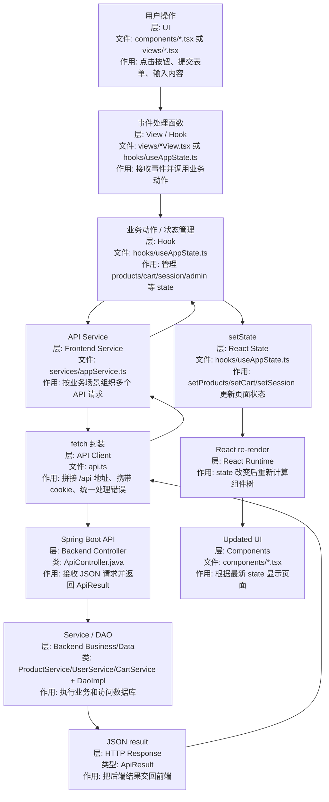

# React 框架系统学习指南

这份文档用于系统理解 `JtProject-React` 中的 React 框架。重点是：

> React 如何把后端 API 数据变成组件树、状态和用户交互？

## 1. React 是什么

React 是前端 UI 框架。它负责把数据渲染成页面，并在数据变化时重新渲染相关 UI。

核心公式：

```text
UI = f(state)
```

意思是：页面不是手动一点点改 DOM，而是由 state 推导出来。

## 2. 在本项目中的位置

```text
Browser
  -> Vite dev server
  -> React main.tsx
  -> App.tsx
  -> hooks / services / components
  -> Spring Boot /api
```

对应目录：

| 目录 | 作用 |
| --- | --- |
| `frontend/src/main.tsx` | React 应用入口 |
| `frontend/src/App.tsx` | 页面主组件 |
| `frontend/src/api.ts` | fetch 请求封装 |
| `frontend/src/types.ts` | TypeScript 类型 |
| `src/main/java/.../controller/ApiController.java` | Spring Boot JSON API |

## 3. React 核心概念

| 概念 | 项目中的表现 | 作用 |
| --- | --- | --- |
| Component | `App.tsx` | 把页面拆成可组合的 UI 单元 |
| Props | 组件参数 | 父组件向子组件传数据 |
| State | `useState(...)` | 保存页面内部会变化的数据 |
| Effect | `useEffect(...)` | 页面加载后请求 API |
| Event | `onClick`、`onSubmit` | 响应用户操作 |
| JSX | `<button>Login</button>` | 用类似 HTML 的语法写 UI |

## 4. React 数据流



### 数据流节点追记

| 顺序 | 分层 | 文件/类名 | 做什么 |
| --- | --- | --- | --- |
| 1 | UI 组件层 | `frontend/src/components/ProductGrid.tsx`、`UserAuthForms.tsx`、`CartList.tsx` | 显示按钮、表单、商品和购物车；用户在这里触发事件 |
| 2 | 页面 View 层 | `frontend/src/views/ProductsView.tsx`、`UserLoginView.tsx`、`CartView.tsx` | 把 UI 组件组合成页面，并把事件回调传给组件 |
| 3 | 状态 Hook 层 | `frontend/src/hooks/useAppState.ts` | 保存全局页面状态，定义登录、购物车、后台管理等动作 |
| 4 | 业务 Service 层 | `frontend/src/services/appService.ts` | 把“加载首页数据”“登录用户”“保存商品”等业务请求组合起来 |
| 5 | API Client 层 | `frontend/src/api.ts` | 统一 `fetch`，补 API base url、JSON header、cookie 和错误处理 |
| 6 | 后端 Controller 层 | `src/main/java/.../controller/ApiController.java` | 接收 `/api/*` 请求，校验参数和登录状态，返回 JSON |
| 7 | 后端业务层 | `UserService`、`ProductService`、`CategoryService`、`CartService` | 执行业务逻辑，例如登录校验、商品查询、购物车处理 |
| 8 | 后端数据层 | `UserDaoImpl`、`ProductDaoImpl`、`CartDaoImpl`、`CartProductDaoImpl` | 访问 H2 数据库，返回 Java model |
| 9 | React 状态更新 | `useAppState.ts` 中的 `setProducts`、`setCart`、`setSession` | 把后端 JSON 转成前端 state |
| 10 | UI 重渲染 | `components/*.tsx` | React 根据最新 state 自动更新页面 |

典型例子：

```text
点击 Add to Cart
-> ProductGrid.tsx 触发 onAddToCart(product.id)
-> ProductsView.tsx 把事件传回 useAppState
-> useAppState.ts 调用 addCartItem 动作
-> appService.ts 调用 addCartItemRequest
-> api.ts 发送 POST /api/cart/items/{id}
-> ApiController.java 接收请求
-> CartService / CartProductDao 更新购物车
-> 后端返回 ApiResult<Product[]>
-> useAppState.ts 执行 setCart(result.data)
-> CartList.tsx 根据 cart state 重新渲染
```

## 5. Hooks 怎么理解

React Hook 是函数组件使用 React 能力的方式。

常见 Hook：

| Hook | 作用 |
| --- | --- |
| `useState` | 保存组件状态 |
| `useEffect` | 处理副作用，例如请求后端 |
| `useMemo` | 缓存派生计算 |
| 自定义 Hook | 把页面逻辑封装成可复用函数 |

本项目学习重点：

- 登录状态如何存在 state 中
- 商品列表如何从 API 加载后进入 state
- 购物车如何由 state 驱动渲染
- 表单如何用受控组件管理输入

## 6. React 和 Spring Boot 的分工

| 层 | React 负责 | Spring Boot 负责 |
| --- | --- | --- |
| 页面显示 | 商品卡片、表单、购物车 | 不渲染页面 |
| 交互 | 点击、输入、状态切换 | 接收 HTTP 请求 |
| 数据 | 保存当前页面 state | 查询数据库、执行业务 |
| 登录 | 发起请求、保存显示状态 | 校验账号、维护 session |

## 7. 和 Thymeleaf 的区别

```text
Thymeleaf: Controller -> Model -> HTML
React: API -> JSON -> State -> Component
```

React 版更适合学习：

- 前后端分离
- API 设计
- 浏览器端状态管理
- 组件化 UI
- TypeScript 类型建模

## 8. 推荐学习顺序

1. `frontend/src/main.tsx`
2. `frontend/src/App.tsx`
3. `frontend/src/types.ts`
4. `frontend/src/api.ts`
5. `docs/hooks-learning-guide.md`
6. `docs/jsp-react-mapping.md`
