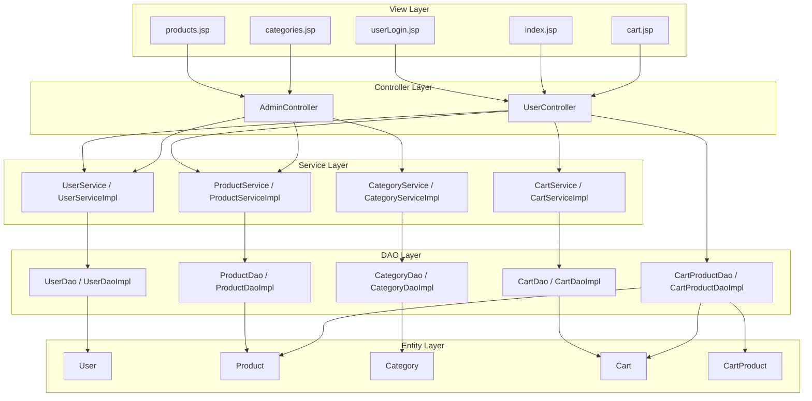
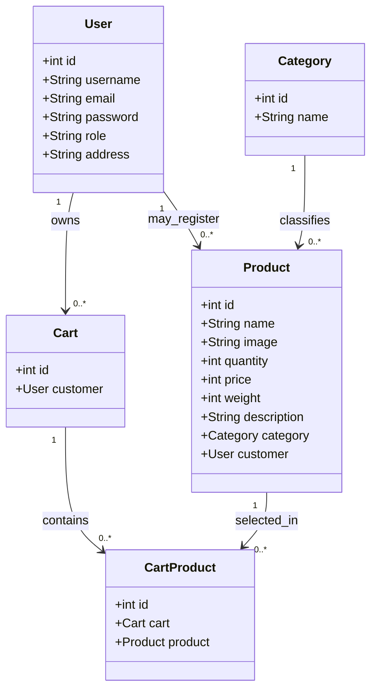
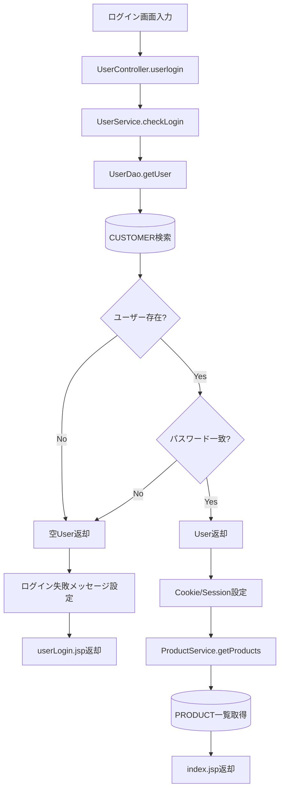

# クラス図・処理フロー図

## 1. 目的

本書は `JtProject` の Java クラス構成と、主要業務処理のクラス間呼出フローを図として整理する。

## 1.1 本書の位置付け

本書の `処理フロー図` は、総覧資料として扱う。

役割:

- 主要機能の代表フローを一覧で把握する
- 各レイヤ間の呼出関係を俯瞰する
- 詳細文書へ入る前の全体把握に使う

住み分け:

- 業務処理の本文説明は [03_詳細設計書.md](D:/dev/source_code/vscode_study/java-projects/JtProject/doc/jp-docs/01_design/03_%E8%A9%B3%E7%B4%B0%E8%A8%AD%E8%A8%88%E6%9B%B8.md)
- 機能単位の設計は [13_機能設計書.md](D:/dev/source_code/vscode_study/java-projects/JtProject/doc/jp-docs/01_design/13_%E6%A9%9F%E8%83%BD%E8%A8%AD%E8%A8%88%E6%9B%B8.md)
- クラス、メソッド単位の流れは [15_クラス詳細設計書.md](D:/dev/source_code/vscode_study/java-projects/JtProject/doc/jp-docs/02_class-design/15_%E3%82%AF%E3%83%A9%E3%82%B9%E8%A9%B3%E7%B4%B0%E8%A8%AD%E8%A8%88%E6%9B%B8.md)

## 2. クラス層構造図



## 3. エンティティ関係クラス図



## 4. ユーザーログイン処理フロー図



## 5. カート追加処理フロー図

```mermaid
flowchart TD
    A[商品追加操作] --> B[UserController.addToCart]
    B --> C[ログインユーザー取得]
    C --> D{ログイン済?}
    D -- No --> E[メッセージ設定して終了]
    D -- Yes --> F[UserService.getUserByUsername]
    F --> G{ユーザー存在?}
    G -- No --> H[再ログイン要求]
    G -- Yes --> I{ROLE_ADMIN?}
    I -- Yes --> J[管理画面へ誘導]
    I -- No --> K[CartService.getCarts]
    K --> L{既存カート有?}
    L -- No --> M[CartService.addCart]
    L -- Yes --> N[既存カート使用]
    M --> O[ProductService.getProduct]
    N --> O
    O --> P{商品存在?}
    P -- No --> Q[商品不存在メッセージ]
    P -- Yes --> R[CartProductDao.addCartProduct]
    R --> S[(CART_PRODUCT登録)]
    S --> T[/user/cartへ遷移]
```

## 6. 管理者商品更新処理フロー図

```mermaid
flowchart TD
    A[商品更新画面入力] --> B[AdminController.updateProduct]
    B --> C[CategoryService.getCategory]
    C --> D[カテゴリ取得]
    B --> E[ProductService.getProduct]
    E --> F[既存商品取得]
    F --> G{画像入力有?}
    G -- No --> H[既存画像を引継ぐ]
    G -- Yes --> I[入力画像を採用]
    H --> J[更新用Product作成]
    I --> J
    J --> K[ProductService.updateProduct]
    K --> L[ProductDao.updateProduct]
    L --> M[(PRODUCT更新)]
    M --> N[/admin/productsへ遷移]
```

## 7. 備考

- 日本案件では本資料を `クラス図` と `処理フロー図` に分割する場合もある
- 本資料は学習用のため 1 文書に集約している
- より現場寄りにする場合は、Controller 単位、機能単位で個別図を追加する
- 分割版のクラス設計資料は `15a_Controller詳細設計書.md`、`15b_Service詳細設計書.md`、`15c_DAO詳細設計書.md`、`15d_Model詳細設計書.md` を参照する
