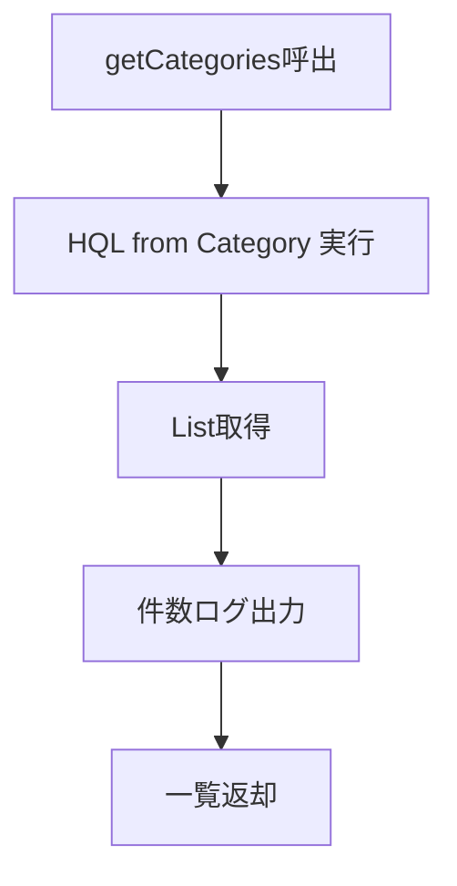

# CategoryDao 詳細設計書

## 1. 文書情報

| 項目 | 内容 |
|---|---|
| 文書名 | CategoryDao 詳細設計書 |
| 対象クラス | `CategoryDao` / `CategoryDaoImpl` |
| パッケージ | `dao` / `dao.impl` |
| 作成日 | 2026-03-15 |
| 作成者 | Codex |

## 2. クラス概要

| 項目 | 内容 |
|---|---|
| 役割 | `CATEGORY` テーブルの一覧取得、詳細取得、追加、更新、削除を担当する |
| アクセス技術 | JPA `EntityManager` |
| 対象テーブル | `CATEGORY` |
| 主な呼出元 | `CategoryServiceImpl` |

## 3. メソッド一覧

| No | メソッド名 | 役割 |
|---|---|---|
| 1 | `addCategory(name)` | カテゴリ追加 |
| 2 | `getCategories()` | カテゴリ全件取得 |
| 3 | `deletCategory(id)` | カテゴリ削除 |
| 4 | `updateCategory(id, name)` | カテゴリ更新 |
| 5 | `getCategory(id)` | カテゴリ詳細取得 |

## 4. メソッド詳細

### 4.1 `addCategory(name)`

処理手順:

1. 新規 `Category` オブジェクトを生成する。
2. `name` を設定する。
3. `EntityManager.persist(category)` を実行する。
4. 自動採番された ID を保持した `Category` を返却する。

処理フロー図:

```mermaid
flowchart TD
    A[name受領] --> B[new Category()]
    B --> C[category.setName(name)]
    C --> D[persist(category)]
    D --> E[Category返却]
```

### 4.2 `getCategories()`

処理手順:

1. HQL `from Category` を実行する。
2. `List<Category>` を取得する。
3. 取得件数をログ出力する。
4. 一覧を返却する。

処理フロー図:



### 4.3 `deletCategory(id)`

処理手順:

1. `EntityManager.find(Category.class, id)` で対象を取得する。
2. 対象が存在する場合は `remove(category)` を実行する。
3. 削除成功時は `true` を返却する。
4. 対象が存在しない場合は `false` を返却する。

業務ルール:

- 存在しないカテゴリ削除は例外ではなく `false` 返却で扱う。
- 商品参照中カテゴリの削除制御は DAO で持たない。

処理フロー図:

```mermaid
flowchart TD
    A[id受領] --> B[EntityManager.find(Category, id)]
    B --> C{対象存在?}
    C -- No --> D[false返却]
    C -- Yes --> E[remove(category)]
    E --> F[true返却]
```

### 4.4 `updateCategory(id, name)`

処理手順:

1. `EntityManager.find(Category.class, id)` で対象カテゴリを取得する。
2. 対象が `null` の場合は `RuntimeException` を送出する。
3. `category.setName(name)` を実行する。
4. `EntityManager.merge(category)` を実行する。
5. 更新済み `Category` を返却する。

処理フロー図:

```mermaid
flowchart TD
    A[id と name 受領] --> B[EntityManager.find(Category, id)]
    B --> C{対象存在?}
    C -- No --> D[RuntimeException送出]
    C -- Yes --> E[category.setName(name)]
    E --> F[merge(category)]
    F --> G[Category返却]
```

### 4.5 `getCategory(id)`

処理手順:

1. `EntityManager.find(Category.class, id)` を実行する。
2. 該当カテゴリがあれば返却する。
3. 該当なしの場合は `null` を返却する。

## 5. 設計上の注意

- メソッド名が `deletCategory` となっており、スペルに表記揺れがある。
- DAO 層で `EntityManager` を採用しており、他 DAO の `SessionFactory` 実装と混在している。
- 実案件ではカテゴリ名の一意制約チェック、削除制約、論理削除を追加する可能性が高い。

## 6. 関連資料

- [15c_DAO詳細設計書.md](D:/dev/source_code/vscode_study/java-projects/JtProject/doc/jp-docs/02_class-design/15c_DAO%E8%A9%B3%E7%B4%B0%E8%A8%AD%E8%A8%88%E6%9B%B8.md)
- [16_テーブル定義書.md](D:/dev/source_code/vscode_study/java-projects/JtProject/doc/jp-docs/03_database/16_%E3%83%86%E3%83%BC%E3%83%96%E3%83%AB%E5%AE%9A%E7%BE%A9%E6%9B%B8.md)
- [27_DDL一覧.md](D:/dev/source_code/vscode_study/java-projects/JtProject/doc/jp-docs/03_database/27_DDL%E4%B8%80%E8%A6%A7.md)

