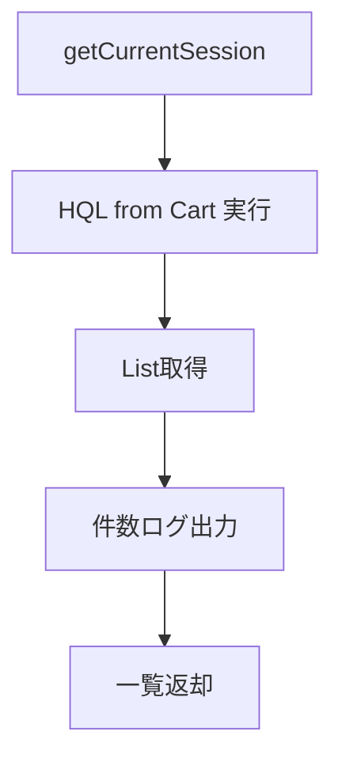

# CartDao 詳細設計書

## 1. 文書情報

| 項目 | 内容 |
|---|---|
| 文書名 | CartDao 詳細設計書 |
| 対象クラス | `CartDao` / `CartDaoImpl` |
| パッケージ | `dao` / `dao.impl` |
| 作成日 | 2026-03-15 |
| 作成者 | Codex |

## 2. クラス概要

| 項目 | 内容 |
|---|---|
| 役割 | `CART` テーブルの追加、全件取得、更新、削除を担当する |
| アクセス技術 | Hibernate `SessionFactory` |
| 対象テーブル | `CART` |
| 主な呼出元 | `CartServiceImpl` |

## 3. メソッド一覧

| No | メソッド名 | 役割 |
|---|---|---|
| 1 | `addCart(cart)` | カート追加 |
| 2 | `getCarts()` | カート全件取得 |
| 3 | `updateCart(cart)` | カート更新 |
| 4 | `deleteCart(cart)` | カート削除 |

## 4. メソッド詳細

### 4.1 `addCart(cart)`

処理手順:

1. 受領した `Cart` を `Session.save(cart)` で登録する。
2. 自動採番された ID を持つ `Cart` を返却する。
3. ログへ顧客 ID とカート ID を出力する。

業務ルール:

- `customer` が設定済みであることを前提とする。
- 顧客ごとの一意制約判定は DAO では実施しない。

### 4.2 `getCarts()`

処理手順:

1. HQL `from Cart` を実行する。
2. `List<Cart>` を取得する。
3. 取得件数をログ出力する。
4. 全件一覧を返却する。

処理フロー図:

### 4.3 `updateCart(cart)`

処理手順:

1. 更新対象 `Cart` を受領する。
2. `Session.update(cart)` を実行する。
3. 更新完了後、戻り値なしで終了する。

### 4.4 `deleteCart(cart)`

処理手順:

1. 削除対象 `Cart` を受領する。
2. `Session.delete(cart)` を実行する。
3. 削除完了後、戻り値なしで終了する。

業務ルール:

- 明細 `CART_PRODUCT` の存在確認や削除順序は DAO 外で制御する前提である。

## 5. 設計上の注意

- 顧客 ID 指定で単一カートを取得する専用メソッドがなく、上位層で全件検索後に絞り込む設計となっている。
- 実案件では `findByCustomerId` の追加により性能と責務を改善すべきである。
- `update` / `delete` は受領オブジェクトの状態に依存するため、detach 状態では扱いに注意が必要である。

## 6. 関連資料

- [15c_DAO詳細設計書.md](../../../../JtProject/doc/jp-docs/02_class-design/15c_DAO詳細設計書.md)
- [16_テーブル定義書.md](../../../../JtProject/doc/jp-docs/03_database/16_テーブル定義書.md)
- [27_DDL一覧.md](../../../../JtProject/doc/jp-docs/03_database/27_DDL一覧.md)

