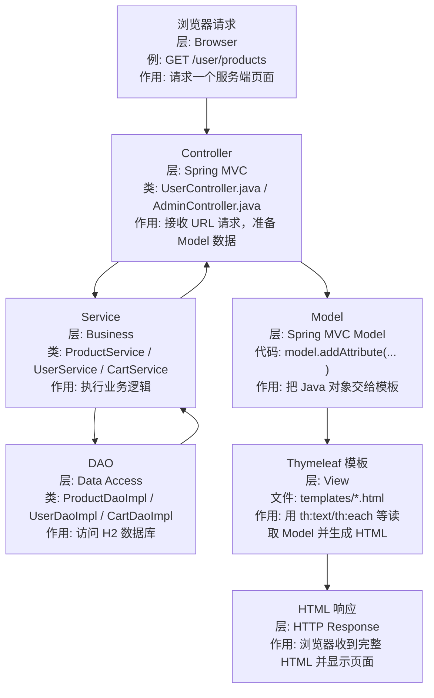

# Thymeleaf 框架系统学习指南

这份文档用于系统理解 `JtProject-Thymeleaf` 中的 Thymeleaf 框架。重点不是某个标签怎么写，而是理解：

> Spring Boot 如何把 Controller 数据交给 Thymeleaf，Thymeleaf 又如何把 HTML 模板渲染成浏览器页面？

## 1. Thymeleaf 是什么

Thymeleaf 是 Java Web 常用的服务端模板引擎。

它的核心作用是：

```text
后端 Model 数据 + HTML 模板 -> 最终 HTML 页面
```

和 JSP 类似，Thymeleaf 也是服务端渲染；但 Thymeleaf 的模板本身更接近标准 HTML，浏览器直接打开也能看到大致结构。

## 2. 在本项目中的位置

```text
Browser
  -> Spring MVC Controller
  -> Model
  -> Thymeleaf templates/*.html
  -> HTML response
```

对应目录：

| 目录 | 作用 |
| --- | --- |
| `src/main/java/.../controller` | 接收请求，准备页面数据 |
| `src/main/resources/templates` | Thymeleaf 页面模板 |
| `src/main/resources/static` | 静态资源 |
| `src/main/resources/application.properties` | Thymeleaf / Spring Boot 配置 |

## 3. Controller 到模板的流程

典型流程：



### 数据流节点追记

| 顺序 | 分层 | 文件/类名 | 做什么 |
| --- | --- | --- | --- |
| 1 | Browser | `/user/products`、`/admin/products` 等 URL | 用户请求一个服务端页面 |
| 2 | Controller 层 | `UserController.java`、`AdminController.java` | 接收请求，调用 Service，决定返回哪个模板 |
| 3 | Service 层 | `ProductService`、`CategoryService`、`CartService`、`UserService` | 执行业务逻辑 |
| 4 | DAO 层 | `ProductDaoImpl`、`CategoryDaoImpl`、`CartDaoImpl`、`UserDaoImpl` | 查询或更新 H2 数据库 |
| 5 | Model 层 | `Model model`、`model.addAttribute(...)` | 把后端 Java 对象放进页面数据容器 |
| 6 | View 模板层 | `src/main/resources/templates/*.html` | Thymeleaf 用 `th:*` 属性读取 Model 并渲染 |
| 7 | HTML 响应 | 渲染后的 HTML | 浏览器拿到的是完整页面，不是 JSON |

Controller 返回的不是 JSON，而是模板名：

```java
return "products";
```

Spring Boot 会去找：

```text
src/main/resources/templates/products.html
```

## 4. Thymeleaf 核心语法

| 语法 | 作用 | 例子 |
| --- | --- | --- |
| `th:text` | 设置文本内容 | `<span th:text="${user.username}"></span>` |
| `th:if` | 条件渲染 | `<div th:if="${loggedIn}">...</div>` |
| `th:each` | 循环渲染 | `<tr th:each="product : ${products}">` |
| `th:href` | 动态链接 | `<a th:href="@{/user/cart}">Cart</a>` |
| `th:action` | 动态表单提交地址 | `<form th:action="@{/login}">` |
| `th:value` | 表单值绑定 | `<input th:value="${user.email}">` |
| `th:selected` | 下拉框选中 | `<option th:selected="${id == currentId}">` |
| `th:replace` | 模板片段替换 | `<div th:replace="fragments/header :: header"></div>` |

## 5. Thymeleaf 表达式系统

常见表达式：

```text
${...}  读取 Model 中的数据
@{...}  生成 URL
*{...}  表单对象字段绑定
#{...}  国际化消息
~{...}  模板片段引用
```

本项目最常见的是：

```html
<span th:text="${product.name}"></span>
<a th:href="@{/user/products}">Products</a>
```

## 6. 和 JSP 的区别

| 对比点 | JSP | Thymeleaf |
| --- | --- | --- |
| 文件位置 | `src/main/webapp/views` | `src/main/resources/templates` |
| 页面语法 | JSP 标签、EL 表达式 | HTML 属性式语法 |
| 可读性 | 更偏 Java Web 历史风格 | 更接近普通 HTML |
| 预览能力 | 依赖容器 | 静态打开仍能看结构 |
| Spring Boot 推荐度 | 较旧 | 更常用 |

## 7. 学习本项目的推荐顺序

1. 看 `README.md`，先跑起来。
2. 看 `src/main/resources/templates` 下的 HTML 页面。
3. 对照 `src/main/java/.../controller`，找每个页面的 Model 数据来源。
4. 看 [JSP页面 vs Thymeleaf页面逐页对照.md](./JSP页面%20vs%20Thymeleaf页面逐页对照.md)。
5. 做 [JSP改写成Thymeleaf练习题.md](./JSP改写成Thymeleaf练习题.md)。

## 8. 关键理解

Thymeleaf 项目和 React/Vue/Next 最大区别是：

```text
Thymeleaf 的页面状态主要在后端 Model 中
React/Vue/Next 的页面状态主要在浏览器端 state 中
```

所以 Thymeleaf 学习重点是：

- Controller 如何准备 Model
- 模板如何读取 Model
- 表单如何提交回 Controller
- 服务端如何决定下一个页面
