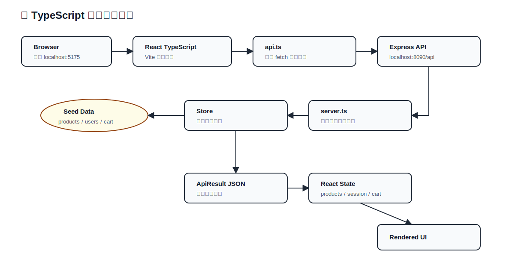

# JtProject-TypeScript：纯 TypeScript 全栈学习版

这个目录是基于原始 `JtProject` 业务复制出来的独立学习项目，目标是把前后端都改成 TypeScript。

- 后端：Node.js + Express + TypeScript
- 前端：React + Vite + TypeScript
- 共享类型：`packages/shared`
- 后端端口：`8090`
- 前端端口：`5175`
- 数据：内存数据仓库，初始数据来自原始 `JtProject/src/main/resources/data.sql`
- 这个项目不保留 JSP，也不依赖 Spring Boot，属于独立的纯 TypeScript 全栈路线

## 快速启动

安装依赖：

```bash
cd java-projects/JtProject-TypeScript
npm install
```

同时启动前后端：

```bash
npm run dev
```

访问地址：

```text
前端：http://localhost:5175
后端：http://localhost:8090/api
```

## 默认账号

- 普通用户：`lisa / 765`
- 管理员：`admin / 123`

## 学习顺序

如果你想系统学习 TypeScript 全栈框架，先看：

1. [docs/typescript-framework-guide.md](./docs/typescript-framework-guide.md)：框架系统知识总览
2. [docs/fullstack-typescript-flow.md](./docs/fullstack-typescript-flow.md)：前后端流程图
3. [packages/shared/src/index.ts](./packages/shared/src/index.ts)：共享类型定义
4. [apps/api/src/server.ts](./apps/api/src/server.ts)：Express API 后端
5. [apps/api/src/data/store.ts](./apps/api/src/data/store.ts)：内存数据层，类似 DAO
6. [apps/web/src/api.ts](./apps/web/src/api.ts)：前端统一 API 请求封装
7. [apps/web/src/App.tsx](./apps/web/src/App.tsx)：React + TypeScript 页面
8. [apps/api/src/data/seed.ts](./apps/api/src/data/seed.ts)：原始 JtProject 初始数据的 TypeScript 表达
9. [docs/original-jtproject-data.sql](./docs/original-jtproject-data.sql)：原始 JtProject 初始化数据对照

## 构建检查

```bash
npm run build
```

这个命令会执行：

- API TypeScript 类型检查
- Web TypeScript 类型检查
- Vite 前端生产构建

## 项目结构

```text
JtProject-TypeScript/
├── apps/
│   ├── api/              # Express + TypeScript 后端
│   └── web/              # React + Vite + TypeScript 前端
├── packages/
│   └── shared/           # 前后端共享 TypeScript 类型
├── docs/                 # 框架知识、流程图、原始 SQL 对照
├── package.json
└── tsconfig.base.json
```

## 前后端处理流程

完整流程图见：

[docs/fullstack-typescript-flow.md](./docs/fullstack-typescript-flow.md)


