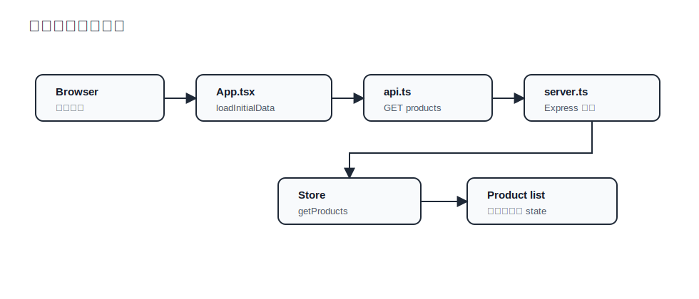
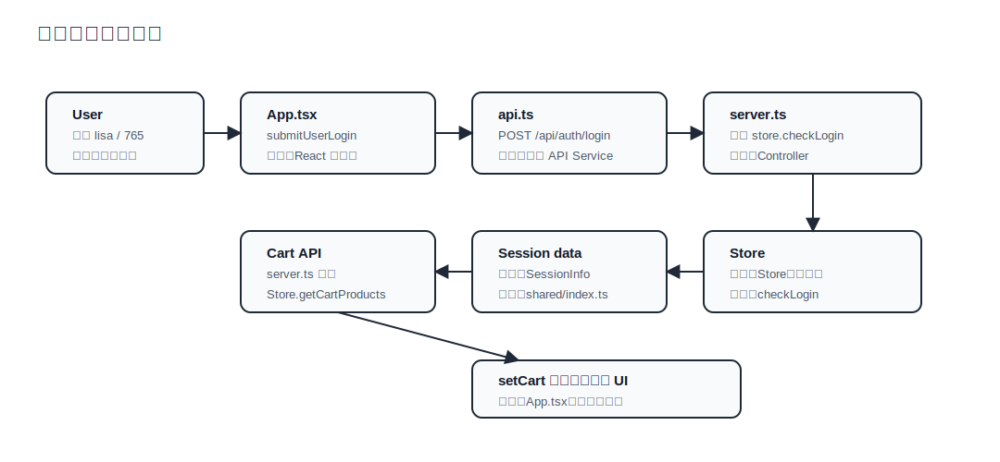

# 纯 TypeScript 全栈处理流程图

`JtProject-TypeScript` 的学习重点是：前端、后端、共享类型全部使用 TypeScript。和 Spring Boot 版本相比，这里没有 Java Controller / Service / DAO，而是用 Express 路由和 TypeScript Store 表达同一套业务。

如果你想先系统理解框架分层，先看：

- [TypeScript 全栈框架系统学习指南](./typescript-framework-guide.md)

## 关键文件

| 文件 | 作用 | 对应原始项目概念 |
| --- | --- | --- |
| `packages/shared/src/index.ts` | 前后端共享类型 | Java model / DTO |
| `apps/api/src/data/seed.ts` | 初始数据 | `data.sql` |
| `apps/api/src/data/store.ts` | 内存数据仓库 | DAO / Service 的一部分 |
| `apps/api/src/server.ts` | Express API | Controller |
| `apps/web/src/api.ts` | 前端请求封装 | API Service |
| `apps/web/src/App.tsx` | React 页面 | JSP / 前端页面 |

原始 SQL 已复制到：

- `docs/original-jtproject-data.sql`
- `docs/original-jtproject-basedata.sql`

## 整体流程

看图时按这条线明记：`App.tsx` 是前端页面层，`api.ts` 是前端请求封装层，`server.ts` 是后端 Controller 层，`Store` 是后端数据层类名，`seed.ts` 是初始数据文件。


## 商品列表加载流程

商品列表重点记：`App.tsx` 调 `api.ts`，`server.ts` 处理 `/api/products`，最后进入 `Store.getProducts()`，返回类型是 `Product[]`。



## 登录和购物车流程

登录和购物车重点记：登录入口在 `App.tsx`，请求经过 `api.ts` 到 `server.ts`，校验和购物车数据都落到 `Store` 类的方法。



## 共享类型如何工作

前后端都从 `packages/shared/src/index.ts` 引入类型：

```ts
import type { Product, SessionInfo, ApiResult } from '../../../packages/shared/src/index'
```

这样带来三个好处：

- 后端返回 `Product[]` 时，前端 `setProducts` 能获得准确类型。
- `api<T>()` 可以复用同一个请求函数，同时保留不同接口的返回类型。
- 修改字段时，前后端会一起被 TypeScript 检查到。

## 接口速查

| 页面动作 | 前端函数 | 后端接口 | 返回类型 |
| --- | --- | --- | --- |
| 首页加载 | `loadInitialData()` | `GET /api/session` | `SessionInfo` |
| 首页加载 | `loadInitialData()` | `GET /api/products` | `Product[]` |
| 普通用户登录 | `submitUserLogin()` | `POST /api/auth/login` | `SessionInfo` |
| 管理员登录 | `submitAdminLogin()` | `POST /api/admin/login` | `SessionInfo` |
| 加入购物车 | `addToCart(productId)` | `POST /api/cart/items/{productId}` | `Product[]` |
| 删除购物车 | `removeFromCart(productId)` | `DELETE /api/cart/items/{productId}` | `Product[]` |
| 后台概览 | `loadOverview()` | `GET /api/admin/overview` | `AdminOverview` |
