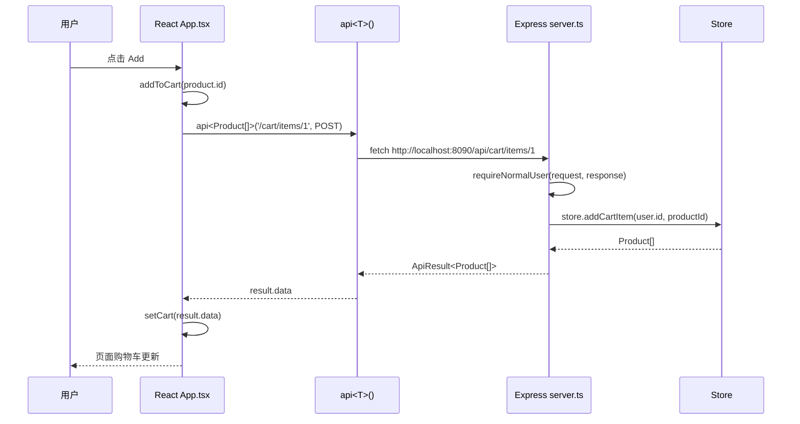

# TypeScript 全栈框架系统学习指南

这份文档用于系统理解 `JtProject-TypeScript` 使用的框架组合。它不是只解释某个文件，而是回答一个更大的问题：

> 一个纯 TypeScript 全栈项目，通常由哪些层组成？每一层解决什么问题？代码在这些层之间如何流动？

## 1. 整体框架分层

当前项目是一个小型 TypeScript monorepo：

```text
JtProject-TypeScript/
├── apps/
│   ├── api/              # 后端应用：Node.js + Express + TypeScript
│   └── web/              # 前端应用：React + Vite + TypeScript
├── packages/
│   └── shared/           # 共享包：前后端共用 TypeScript 类型
├── docs/                 # 学习文档
├── package.json          # 项目脚本和依赖
└── tsconfig.base.json    # TypeScript 公共编译配置
```

这个结构背后的思想是：

| 层 | 当前技术 | 主要职责 |
| --- | --- | --- |
| 前端 UI 层 | React | 显示页面、处理用户输入、管理页面状态 |
| 前端构建层 | Vite | 启动开发服务器、处理 TS/TSX、打包前端代码 |
| 前端请求层 | `fetch` + `api<T>()` | 调用后端接口、统一处理 JSON 和错误 |
| 后端 HTTP 层 | Express | 定义 API 路由、接收请求、返回响应 |
| 后端数据层 | TypeScript Store | 管理商品、用户、购物车数据 |
| 类型契约层 | shared types | 让前后端使用同一套数据结构 |
| 编译检查层 | TypeScript | 在运行前检查类型错误 |

## 2. TypeScript 在全栈项目里的位置

TypeScript 不是一个运行时框架，它是 JavaScript 的类型系统。

它主要解决这些问题：

- 给对象字段加类型，例如 `Product.name` 必须是 `string`
- 给函数参数和返回值加类型，例如 `api<Product[]>('/products')`
- 在运行前发现错误，例如把 `price` 写成字符串会报错
- 让编辑器有自动补全、跳转定义、重构能力
- 让前后端共享接口契约，减少字段不一致

在这个项目里，TypeScript 出现在三处：

```text
shared 类型定义 -> 后端 Express 使用 -> 前端 React 使用
```

典型例子：

```ts
export type Product = {
  id: number
  name: string
  price: number
}
```

后端返回 `Product[]`，前端也按 `Product[]` 接收。这样字段一改，两边都会被检查。

## 3. React 是什么

React 是前端 UI 框架。它负责把数据变成页面。

在这个项目里，React 的核心文件是：

```text
apps/web/src/App.tsx
```

React 的核心概念：

| 概念 | 在项目里的例子 | 作用 |
| --- | --- | --- |
| Component | `App()` | 页面由组件组成 |
| State | `useState<Product[]>([])` | 保存页面当前数据 |
| Effect | `useEffect(() => ...)` | 页面加载后执行副作用，例如请求 API |
| Event | `onSubmit`、`onClick` | 响应用户操作 |
| JSX | `<button>Login</button>` | 用类似 HTML 的语法描述 UI |

React 的基本数据流是单向的：

```text
state 改变 -> React 重新渲染 -> 页面更新
```

例如商品列表：

```text
GET /api/products -> setProducts(result.data) -> products.map(...) 渲染商品卡片
```

## 4. Vite 是什么

Vite 是前端开发服务器和构建工具。

在这个项目里，它负责：

- 启动前端开发服务器：`http://localhost:5175`
- 读取 `apps/web/index.html`
- 编译 `.ts` 和 `.tsx`
- 支持 React Fast Refresh
- 打包生产文件到 `dist/`

配置文件：

```text
apps/web/vite.config.ts
```

常用命令：

```bash
npm run dev:web
npm run build
```

你可以把 Vite 理解成：

```text
浏览器不直接懂 TSX -> Vite 编译 -> 浏览器运行 JavaScript
```

## 5. Express 是什么

Express 是 Node.js 后端 Web 框架。

在这个项目里，Express 的核心文件是：

```text
apps/api/src/server.ts
```

Express 负责：

- 监听后端端口：`http://localhost:8090`
- 定义 API 路由
- 解析 JSON 请求体
- 读取和写入 cookie
- 调用 Store 获取数据
- 返回 JSON 响应

典型路由：

```ts
app.get('/api/products', (_request, response) => {
  response.json(ok('Products loaded', store.getProducts()))
})
```

它的处理流程是：

```text
HTTP 请求 -> Express 路由 -> Store 数据层 -> JSON 响应
```

## 6. shared 类型为什么重要

`packages/shared/src/index.ts` 是这个项目最能体现“全栈 TypeScript”的地方。

如果没有 shared 类型，前后端可能会变成这样：

```text
后端以为 Product.price 是 number
前端以为 Product.price 是 string
运行时才发现页面格式化失败
```

有 shared 类型后：

```text
Product 类型只定义一次
后端 import Product
前端 import Product
字段不一致时编译就报错
```

这个思想在真实项目中很重要。常见做法包括：

- 前后端共享 TypeScript types
- 用 OpenAPI 生成类型
- 用 tRPC 直接共享接口类型
- 用 Zod 同时做运行时校验和类型推导

当前项目选择最容易学习的一种：手写 shared types。

## 7. API 封装层 `api<T>()`

前端请求统一放在：

```text
apps/web/src/api.ts
```

核心函数：

```ts
export async function api<T>(path: string, init?: RequestInit): Promise<ApiResult<T>>
```

这里的 `T` 是泛型。

使用时：

```ts
api<Product[]>('/products')
api<SessionInfo>('/session')
api<AdminOverview>('/admin/overview')
```

这样同一个请求函数可以服务所有接口，但每个接口的 `data` 类型仍然准确。

你可以这样理解：

```text
api<T>() 负责请求流程
T 负责告诉 TypeScript：这次 data 应该是什么形状
```

## 8. cookie 登录流程

这个项目用 cookie 模拟登录状态。

普通用户登录流程：

```text
1. 前端提交 username/password
2. Express 校验用户
3. 后端写入 cookie: jt_ts_session=lisa
4. 前端后续请求使用 credentials: 'include'
5. 后端从 cookie 里恢复当前用户
```

对应文件：

| 位置 | 代码点 |
| --- | --- |
| 前端 | `apps/web/src/api.ts` 的 `credentials: 'include'` |
| 后端 | `apps/api/src/server.ts` 的 `response.cookie(...)` |
| 后端 | `currentUser(request)` 从 cookie 找用户 |

这和 Spring Boot 的 Session 思路类似，只是这里用 Express + cookie 手写出来，便于理解。

## 9. Store 数据层

文件：

```text
apps/api/src/data/store.ts
```

Store 是本项目的数据层。它现在使用内存数据：

```ts
private products: Product[] = structuredClone(seedProducts)
private carts = new Map<number, number[]>()
```

它的职责：

- 查询商品
- 查询用户
- 校验登录
- 添加购物车
- 删除购物车商品
- 创建、更新、删除商品

为什么不直接在 `server.ts` 里写这些？

因为分层更清楚：

```text
server.ts 处理 HTTP
store.ts 处理数据
App.tsx 处理页面
shared 处理类型契约
```

以后如果换成数据库，可以把 Store 改成数据库访问层，API 路由不需要大改。

## 10. 一次完整请求如何走

以“加入购物车”为例：



## 11. 推荐学习顺序

如果你想系统学框架，建议这样读：

1. `package.json`
   先看脚本：`dev`、`dev:api`、`dev:web`、`build`。

2. `tsconfig.base.json`
   理解 TypeScript 项目怎么打开严格模式。

3. `packages/shared/src/index.ts`
   看前后端共享类型。

4. `apps/api/src/server.ts`
   看 Express 怎么定义接口。

5. `apps/api/src/data/store.ts`
   看数据层怎么管理业务状态。

6. `apps/web/src/api.ts`
   看前端怎么统一调用后端。

7. `apps/web/src/App.tsx`
   看 React 页面如何把 API 数据变成 UI。

8. `docs/fullstack-typescript-flow.md`
   用流程图把前后端串起来。

## 12. 和其他框架的关系

当前项目选择的是入门友好的组合：

```text
React + Vite + Express + TypeScript
```

真实项目里还可能看到：

| 类型 | 常见框架 | 和当前项目的关系 |
| --- | --- | --- |
| 前端应用框架 | Next.js | 比 Vite React 多了文件路由、SSR、服务端组件 |
| 后端框架 | NestJS | 比 Express 更工程化，有模块、依赖注入、装饰器 |
| 类型安全 API | tRPC | 可以让前端直接推导后端路由类型 |
| 校验库 | Zod | 可以同时做运行时校验和 TypeScript 类型推导 |
| 数据库 ORM | Prisma | 用 TypeScript 操作数据库并生成类型 |

学完当前项目后，最自然的升级路线是：

```text
Express Store -> Prisma 数据库
手写 shared types -> Zod / OpenAPI / tRPC
Vite React -> Next.js
Express -> NestJS
```

