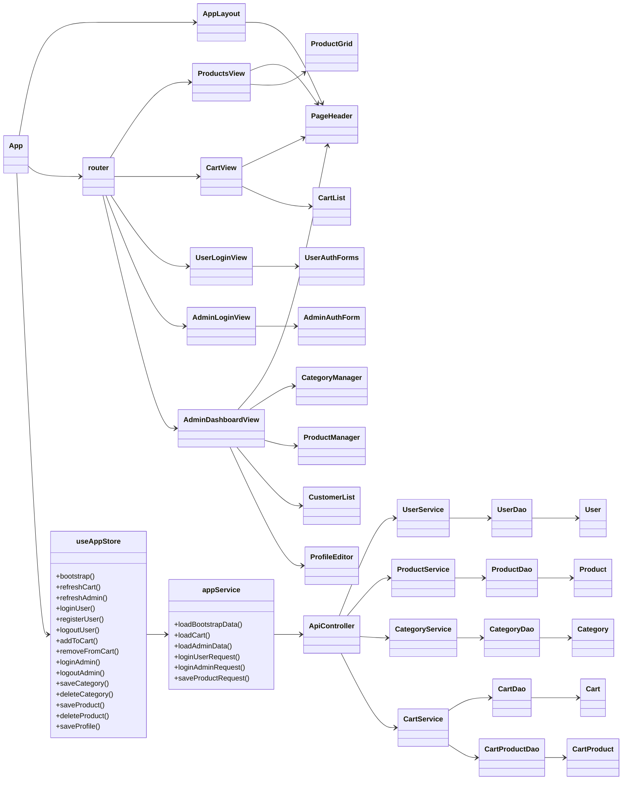
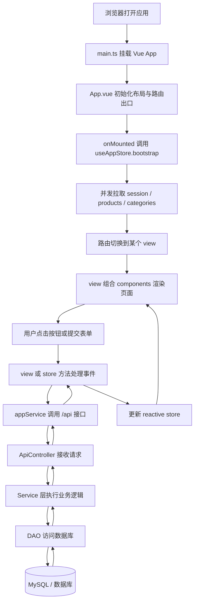
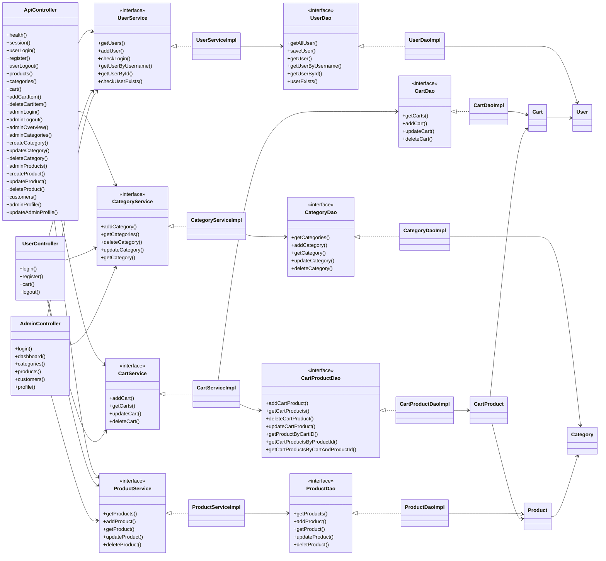
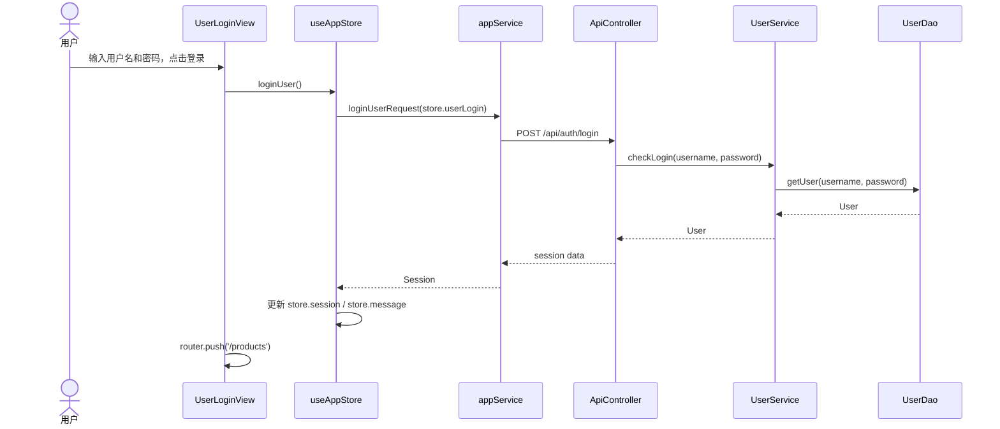
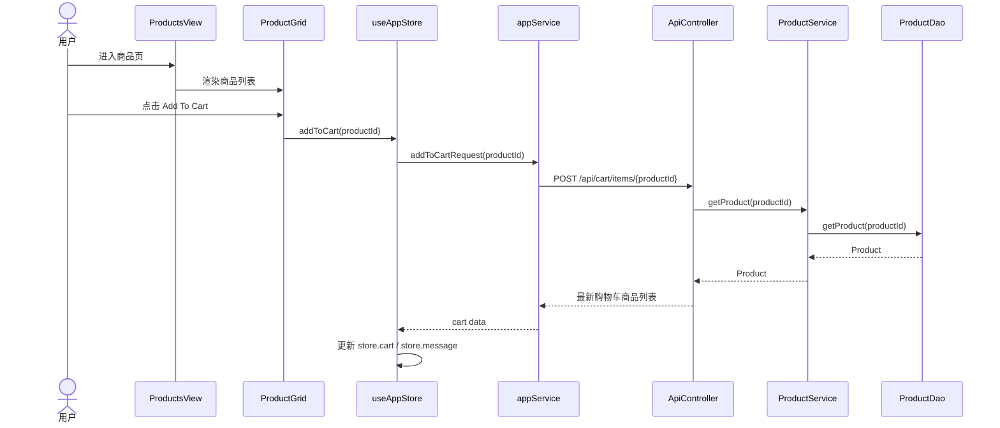
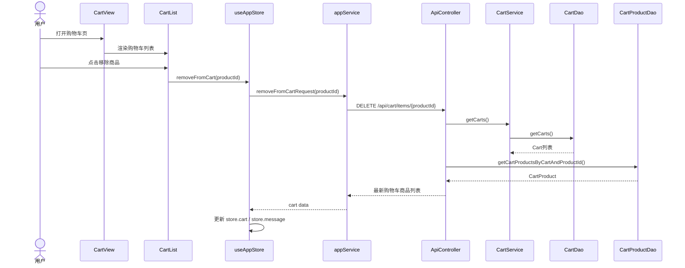
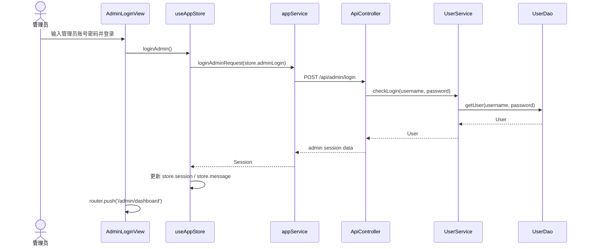
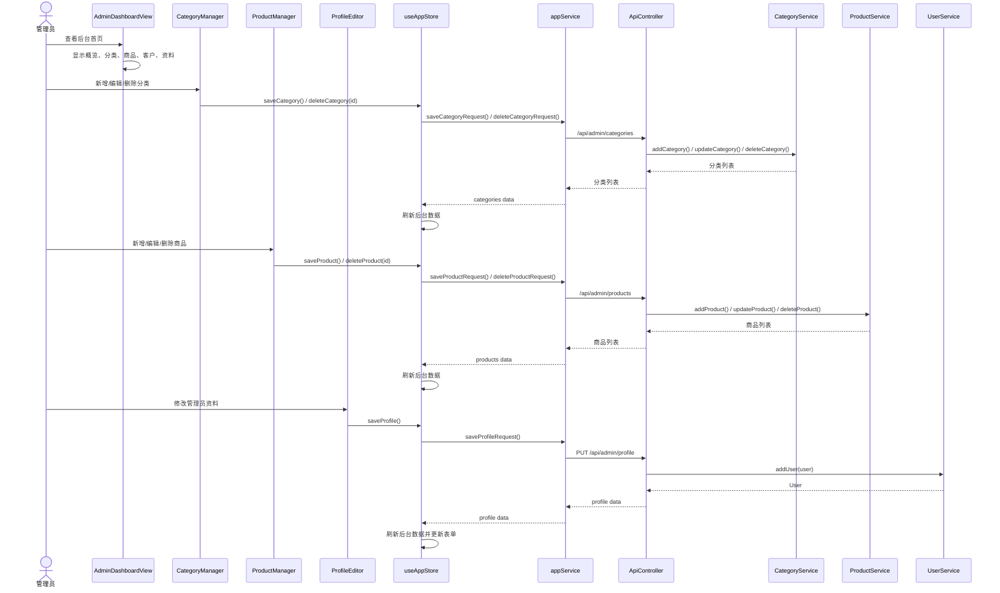

# JtProject-Vue 文档总索引

这个目录是 `JtProject-Vue` 的项目级文档入口，重点服务于：

- Vue 页面学习
- 前后端分离结构理解
- 组件、页面、Composables 和 Service 拆分学习
- 页面与后端 API 联动关系梳理

相关入口：

- 项目根入口：[README.md](../README.md)
- Java 项目总导航：[Java项目总启动导航.md](../../Java项目总启动导航.md)
- Java 项目文档入口：[doc/README.md](../../doc/README.md)

## 建议先看

如果你是第一次看这个项目，推荐顺序：

1. [README.md](../README.md)
2. [vue-learning-path.md](./vue-learning-path.md)
3. [vue-framework-notes.md](./vue-framework-notes.md)
4. [project-code-map.md](./project-code-map.md)
5. [composables-learning-guide.md](./composables-learning-guide.md)

## 文档分区

### 学习路线

- [vue-learning-path.md](./vue-learning-path.md)

适合按顺序学习 Vue 页面、状态和项目演进路线。

### 框架与概念

- [vue-framework-notes.md](./vue-framework-notes.md)
- [composables-learning-guide.md](./composables-learning-guide.md)

适合理解 Vue 关键概念、响应式状态和组合式函数用法。

### 项目结构与页面组织

- [project-code-map.md](./project-code-map.md)
- [page-structure-guide.md](./page-structure-guide.md)

适合理解目录结构、页面拆分、组件边界和服务层组织。

## 前端源码入口

如果你想边读文档边看 Vue 代码，可以从这里开始：

- 前端入口：[main.ts](../frontend/src/main.ts)
- 前端主页面：[App.vue](../frontend/src/App.vue)
- 全局样式：[style.css](../frontend/src/style.css)
- 状态组合：[useAppStore.ts](../frontend/src/composables/useAppStore.ts)
- 业务 Service：[appService.ts](../frontend/src/services/appService.ts)

## 后端源码入口

虽然这是 Vue 学习版，但后端仍然是 Spring Boot，可以从这里往下看：

- API 控制器：[ApiController.java](../src/main/java/com/jtspringproject/JtSpringProject/controller/ApiController.java)
- 用户控制器：[UserController.java](../src/main/java/com/jtspringproject/JtSpringProject/controller/UserController.java)
- 管理员控制器：[AdminController.java](../src/main/java/com/jtspringproject/JtSpringProject/controller/AdminController.java)

## 使用建议

- 想先把项目跑起来：先看 [README.md](../README.md)
- 想按路线学习 Vue：先看 [vue-learning-path.md](./vue-learning-path.md)
- 想先理解项目结构：先看 [project-code-map.md](./project-code-map.md)
- 想重点学 Composables：先看 [composables-learning-guide.md](./composables-learning-guide.md)

## 文档模板

Vue 和 React 的文档现在尽量使用同一套阅读模板，后续新增内容也建议按这个顺序组织：

1. 先看入口和推荐阅读。
2. 再看 views、components、layouts 的页面组织。
3. 接着看类图，理解页面层和后端层的对象关系。
4. 然后看流程图和时序图，理解一次请求怎么走完整条链路。
5. 最后看源码入口和学习文档，继续往细节里追。

## views 和 components 的关系

在这个 Vue 版本里，views 和 components 的关系可以理解成“页面”和“积木块”：

- views 是路由级页面，负责承载一个完整场景，例如商品页、购物车页、管理后台页。
- components 是可复用的小组件，负责完成局部 UI，例如商品网格、页面头部、分类管理表单。
- App.vue 负责把全局布局、鉴权态和路由出口串起来，再把数据交给 views。
- views 再把更细的 UI 拆给 components，保持页面组件只做组装，不直接承担网络请求。

一句话理解：App.vue 负责调度，views 负责页面编排，components 负责局部展示与交互。

## 类图

## 处理流程图

## 页面和组件的对照理解

- 商品页：ProductsView 是页面，ProductGrid 是商品展示组件。
- 购物车页：CartView 是页面，CartList 是购物车展示组件。
- 用户登录页：UserLoginView 是页面，UserAuthForms 是表单组件。
- 管理后台页：AdminDashboardView 是页面，CategoryManager、ProductManager、CustomerList、ProfileEditor 是局部组件。

如果你愿意，我还可以继续把这份文档补成“Vue 视图层 + Spring Boot 后端”的完整时序图版本，或者再画一张更细的“controller / service / dao / model”类图。

## 后端细化类图

这一张图只展开 Spring Boot 后端，重点看 controller / service / dao / model 的真实依赖关系。

## View 时序图

下面把各个 view 的核心流程拆开看，会更接近你在代码里真正看到的调用链。

### UserLoginView

## 目录结构（包含代表性文件，便于快速定位）

项目整体目录（重点列出当前存在的文件/文件夹类型）：

- frontend/ — Vue + TypeScript 前端源码（可单独运行）
	- package.json（项目依赖与启动脚本）
	- vite.config.ts（Vite 配置）
	- src/
		- main.ts（应用入口，挂载 Vue）
		- App.vue（路由壳与全局布局）
		- router.ts（路由分发与访问控制）
		- style.css（全局样式）
		- composables/
			- useAppStore.ts（集中状态 composable，实现 bootstrap、refreshCart、refreshAdmin）
		- services/
			- appService.ts（对后端 /api/* 的调用封装，如 loginUserRequest、saveProductRequest）
		- views/（按路由拆分的页面视图，代表文件）
			- UserLoginView.vue
			- ProductsView.vue
			- CartView.vue
			- AdminLoginView.vue
			- AdminDashboardView.vue
		- components/（可复用组件，代表文件）
			- PageHeader.vue
			- UserAuthForms.vue
			- AdminAuthForm.vue
			- ProductGrid.vue
			- ProductManager.vue
			- CategoryManager.vue
			- CartList.vue
			- CustomerList.vue
			- ProfileEditor.vue
		- layouts/
			- AppLayout.vue

- src/main/java/... — 后端 Spring Boot 项目（提供 API 或 MVC）
	- controller/ 包含 REST API（ApiController）以及历史 MVC 控制器（AdminController、UserController）
	- services/ 业务逻辑（应保留）
	- dao/ 数据访问（应保留）
	- models/ 实体类（应保留）
	- config/（例如 Hibernate、WebMvcConfig、事务配置）

- src/main/webapp/views/ — 传统 JSP 页面（如果前端替换为 Vue，可删除）

其他重要文件：

- README.md（仓库根文档）
- docs/vue-framework-notes.md（Vue 框架概念速查）
- docs/project-code-map.md（Vue 项目源码导读）
- docs/page-structure-guide.md（页面结构说明）
- docs/composables-learning-guide.md（Composables 学习文档）

### ProductsView

### CartView

### AdminLoginView

### AdminDashboardView

