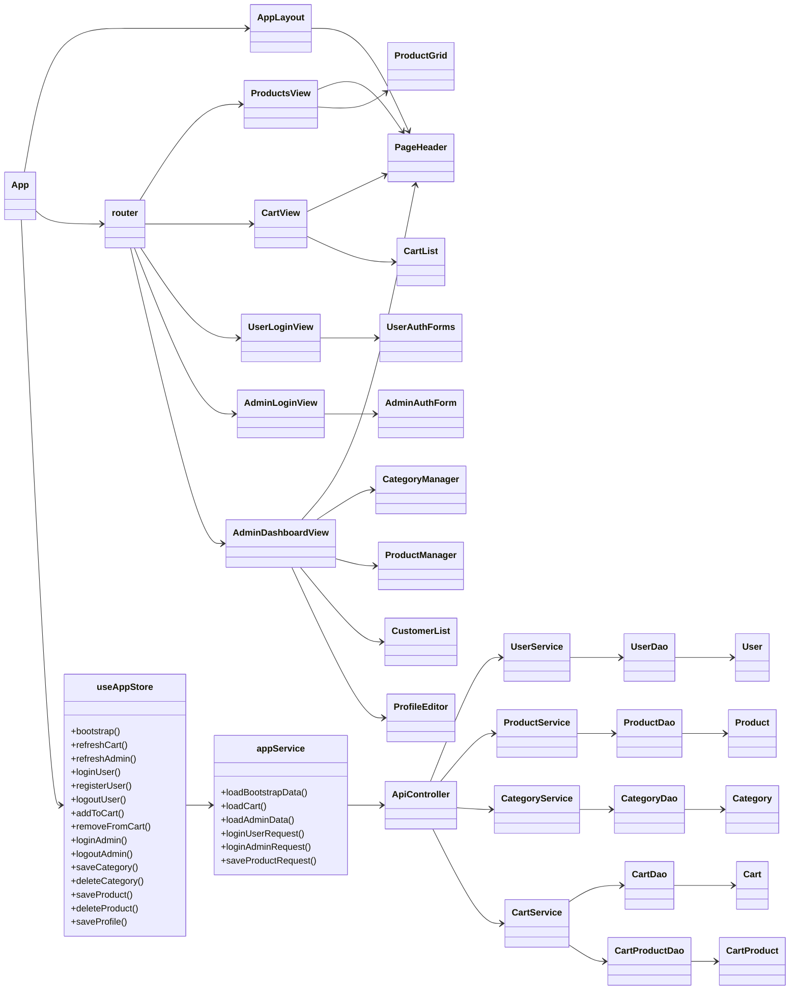
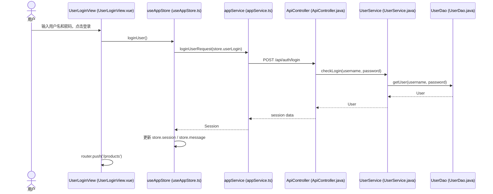
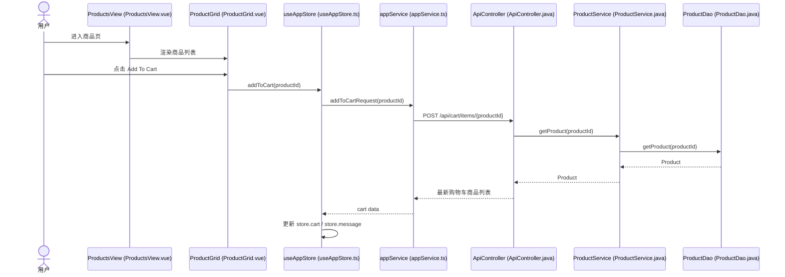
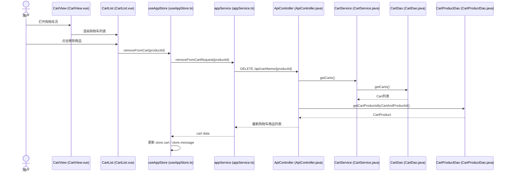
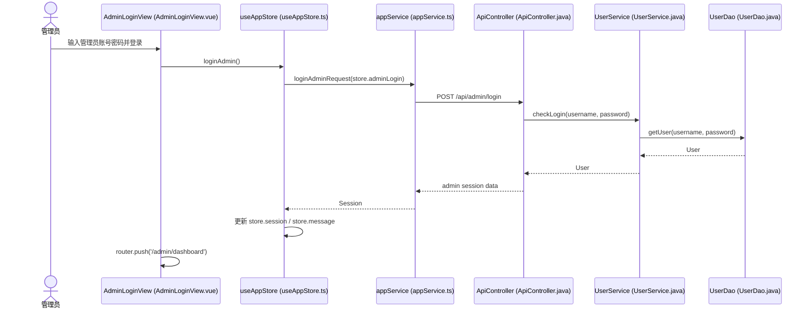
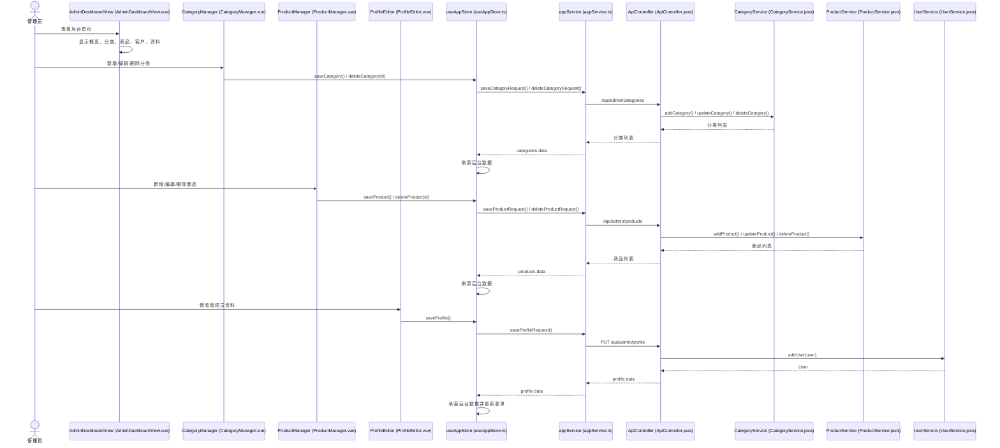

# JtProject-Vue 文档总索引

这个目录是 `JtProject-Vue` 的项目级文档入口，重点服务于：

- Vue 页面学习
- 前后端分离结构理解
- 组件、页面、Composables 和 Service 拆分学习
- 页面与后端 API 联动关系梳理

相关入口：

- 项目根入口：[README.md](../README.md)
- Java 项目总导航：[Java项目总启动导航.md](../../Java项目总启动导航.md)
- Java 项目文档入口：[doc/README.md](../../doc/README.md)

## 建议先看

如果你是第一次看这个项目，推荐顺序：

1. [README.md](../README.md)
- [App.vue](../frontend/src/App.vue) 负责把全局布局、鉴权态和路由出口串起来，再把数据交给 [views](../frontend/src/views/)。


## View 时序图
	<<interface>>
	+getCarts()
	+addCart()
	+updateCart()
	+deleteCart()
}

class CartProductDao {
	<<interface>>
	+addCartProduct()
	+getCartProducts()
	+deleteCartProduct()
	+updateCartProduct()
	+getProductByCartID()
	+getCartProductsByProductId()
	+getCartProductsByCartAndProductId()
}

class UserDaoImpl
class ProductDaoImpl
class CategoryDaoImpl
class CartDaoImpl
class CartProductDaoImpl

class User
class Product
class Category
class Cart
class CartProduct

ApiController --> UserService
ApiController --> ProductService
ApiController --> CategoryService
ApiController --> CartService

UserController --> UserService
UserController --> ProductService
UserController --> CategoryService
UserController --> CartService

AdminController --> UserService
AdminController --> ProductService
AdminController --> CategoryService

UserService <|.. UserServiceImpl
ProductService <|.. ProductServiceImpl
CategoryService <|.. CategoryServiceImpl
CartService <|.. CartServiceImpl

UserServiceImpl --> UserDao
ProductServiceImpl --> ProductDao
CategoryServiceImpl --> CategoryDao
CartServiceImpl --> CartDao
CartServiceImpl --> CartProductDao

UserDao <|.. UserDaoImpl
ProductDao <|.. ProductDaoImpl
CategoryDao <|.. CategoryDaoImpl
CartDao <|.. CartDaoImpl
CartProductDao <|.. CartProductDaoImpl

UserDaoImpl --> User
ProductDaoImpl --> Product
CategoryDaoImpl --> Category
CartDaoImpl --> Cart
CartProductDaoImpl --> CartProduct

Cart --> User
CartProduct --> Cart
CartProduct --> Product
Product --> Category
```

## View 时序图

下面把各个 view 的核心流程拆开看，会更接近你在代码里真正看到的调用链。

### UserLoginView



## 目录结构（包含代表性文件，便于快速定位）

项目整体目录（重点列出当前存在的文件/文件夹类型）：

- frontend/ — Vue + TypeScript 前端源码（可单独运行）
	- package.json（项目依赖与启动脚本）
	- vite.config.ts（Vite 配置）
	- src/
		- [main.ts](../frontend/src/main.ts)（应用入口，挂载 Vue）
		- [App.vue](../frontend/src/App.vue)（路由壳与全局布局）
		- [router.ts](../frontend/src/router.ts)（路由分发与访问控制）
		- [style.css](../frontend/src/style.css)（全局样式）
		- composables/
			- [useAppStore.ts](../frontend/src/composables/useAppStore.ts)（集中状态 composable，实现 bootstrap、refreshCart、refreshAdmin）
		- services/
			- [appService.ts](../frontend/src/services/appService.ts)（对后端 /api/* 的调用封装，如 loginUserRequest、saveProductRequest）
		- views/（按路由拆分的页面视图，代表文件）
			- [UserLoginView.vue](../frontend/src/views/UserLoginView.vue)
			- [ProductsView.vue](../frontend/src/views/ProductsView.vue)
			- [CartView.vue](../frontend/src/views/CartView.vue)
			- [AdminLoginView.vue](../frontend/src/views/AdminLoginView.vue)
			- [AdminDashboardView.vue](../frontend/src/views/AdminDashboardView.vue)
		- components/（可复用组件，代表文件）
			- [PageHeader.vue](../frontend/src/components/PageHeader.vue)
			- [UserAuthForms.vue](../frontend/src/components/UserAuthForms.vue)
			- [AdminAuthForm.vue](../frontend/src/components/AdminAuthForm.vue)
			- [ProductGrid.vue](../frontend/src/components/ProductGrid.vue)
			- [ProductManager.vue](../frontend/src/components/ProductManager.vue)
			- [CategoryManager.vue](../frontend/src/components/CategoryManager.vue)
			- [CartList.vue](../frontend/src/components/CartList.vue)
			- [CustomerList.vue](../frontend/src/components/CustomerList.vue)
			- [ProfileEditor.vue](../frontend/src/components/ProfileEditor.vue)
		- layouts/
			- [AppLayout.vue](../frontend/src/layouts/AppLayout.vue)

- src/main/java/... — 后端 Spring Boot 项目（提供 API 或 MVC）
	- controller/ 包含 REST API（ApiController）以及历史 MVC 控制器（AdminController、UserController）
	- services/ 业务逻辑（应保留）
	- dao/ 数据访问（应保留）
	- models/ 实体类（应保留）
	- config/（例如 Hibernate、WebMvcConfig、事务配置）

- src/main/webapp/views/ — 传统 JSP 页面（如果前端替换为 Vue，可删除）

其他重要文件：

- README.md（仓库根文档）
- docs/vue-framework-notes.md（Vue 框架概念速查）
- docs/project-code-map.md（Vue 项目源码导读）
- docs/page-structure-guide.md（页面结构说明）
- docs/composables-learning-guide.md（Composables 学习文档）

### ProductsView



### CartView



### AdminLoginView



### AdminDashboardView


