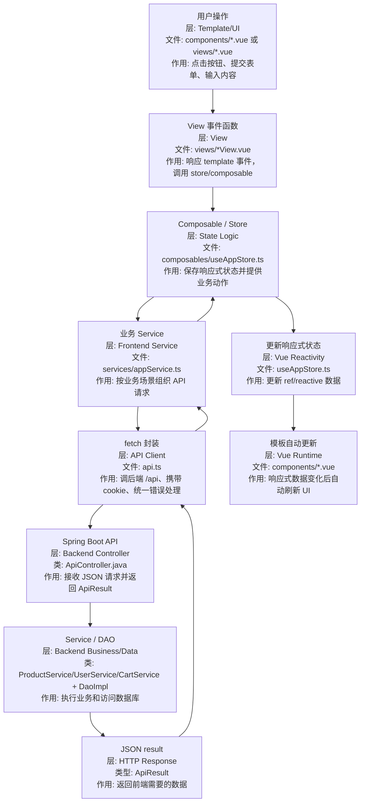

# Vue 框架系统学习指南

这份文档用于系统理解 `JtProject-Vue` 中的 Vue 3 框架。重点是：

> Vue 如何通过响应式数据、组件和组合式 API 组织前端页面？

## 1. Vue 是什么

Vue 是前端 UI 框架。它和 React 一样用于构建组件化页面，但思路更偏响应式。

核心理解：

```text
响应式数据变化 -> Vue 自动更新依赖这些数据的模板
```

## 2. 在本项目中的位置

```text
Browser
  -> Vite dev server
  -> main.ts
  -> App.vue
  -> router / views / components / composables
  -> Spring Boot /api
```

对应目录：

| 目录 | 作用 |
| --- | --- |
| `frontend/src/main.ts` | Vue 应用入口 |
| `frontend/src/App.vue` | 根组件 |
| `frontend/src/router` | 前端路由 |
| `frontend/src/views` | 页面级组件 |
| `frontend/src/components` | 可复用组件 |
| `frontend/src/composables` | 组合式逻辑 |
| `frontend/src/services` | API 调用 |

## 3. Vue 核心概念

| 概念 | 作用 |
| --- | --- |
| SFC | `.vue` 单文件组件，包含 template/script/style |
| Template | 描述页面结构 |
| Reactive state | `ref`、`reactive` 保存响应式数据 |
| Computed | 基于响应式数据派生值 |
| Methods | 响应用户事件 |
| Composables | 复用状态逻辑 |
| Router | 管理前端页面切换 |

## 4. Vue 3 组合式 API

组合式 API 的常见写法：

```ts
const products = ref<Product[]>([])

async function loadProducts() {
  products.value = await fetchProducts()
}
```

理解重点：

- `ref` 包装基本响应式值，访问时用 `.value`
- `reactive` 包装对象
- `computed` 表示派生值
- `watch` 监听变化
- composable 通常以 `useXxx` 命名

## 5. Vue 数据流



### 数据流节点追记

| 顺序 | 分层 | 文件/类名 | 做什么 |
| --- | --- | --- | --- |
| 1 | UI / Template 层 | `frontend/src/components/ProductGrid.vue`、`UserAuthForms.vue`、`CartList.vue` | 显示页面元素，通过 `@click`、`@submit`、`v-model` 接收用户操作 |
| 2 | View 层 | `frontend/src/views/ProductsView.vue`、`UserLoginView.vue`、`CartView.vue` | 页面级组件，连接路由、布局、组件和 store |
| 3 | Composable 状态层 | `frontend/src/composables/useAppStore.ts` | 保存 `products`、`cart`、`session` 等响应式状态，提供业务动作 |
| 4 | 业务 Service 层 | `frontend/src/services/appService.ts` | 封装登录、加载商品、加载购物车、后台管理等请求组合 |
| 5 | API Client 层 | `frontend/src/api.ts` | 统一调用 `fetch`，处理 base url、cookie 和后端错误 |
| 6 | 后端 Controller 层 | `src/main/java/.../controller/ApiController.java` | 接收 `/api/*` 请求，返回 JSON |
| 7 | 后端业务层 | `UserService`、`ProductService`、`CartService` | 执行业务逻辑 |
| 8 | 后端数据层 | `UserDaoImpl`、`ProductDaoImpl`、`CartProductDaoImpl` | 访问 H2 数据库 |
| 9 | Vue 响应式更新 | `useAppStore.ts` 中的 `ref` / `reactive` 数据 | 把后端结果写入响应式状态 |
| 10 | UI 自动刷新 | `components/*.vue` 的 template | Vue 发现依赖的数据变了，自动更新 DOM |

典型例子：

```text
UserLoginView 输入账号
-> UserAuthForms.vue 通过 v-model 收集 username/password
-> UserLoginView.vue 监听 submit
-> useAppStore.ts 调用 loginUser()
-> appService.ts 调用 loginUserRequest()
-> api.ts 发送 POST /api/auth/login
-> ApiController.java 校验账号密码
-> UserService/UserDao 查询用户
-> 后端返回 ApiResult<SessionInfo>
-> useAppStore.ts 更新 session 响应式状态
-> App.vue / AppLayout.vue / PageHeader.vue 自动刷新登录显示
```

## 6. Vue 和 React 的区别

| 对比点 | Vue | React |
| --- | --- | --- |
| 页面文件 | `.vue` 单文件组件 | `.tsx` 组件 |
| 模板 | template 指令 | JSX |
| 状态 | ref/reactive | useState |
| 逻辑复用 | composables | custom hooks |
| 条件渲染 | `v-if` | `{condition && ...}` |
| 列表渲染 | `v-for` | `array.map(...)` |
| 表单绑定 | `v-model` | value + onChange |

## 7. Vue 和 Spring Boot 的分工

| 层 | Vue 负责 | Spring Boot 负责 |
| --- | --- | --- |
| 页面 | view/component/template | 不渲染页面 |
| 状态 | ref/reactive/store | session、业务数据 |
| 请求 | service 调用 API | Controller 接收 API |
| 路由 | Vue Router | API 路径 |

## 8. 推荐学习顺序

1. `frontend/src/main.ts`
2. `frontend/src/App.vue`
3. `frontend/src/router`
4. `frontend/src/views`
5. `frontend/src/composables`
6. `frontend/src/services`
7. `docs/composables-learning-guide.md`
8. `docs/page-structure-guide.md`
