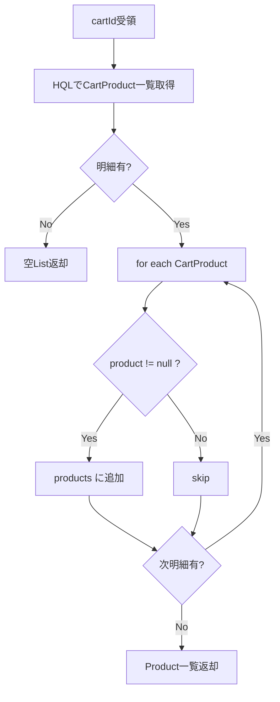

# CartProductDao 詳細設計書

## 1. 文書情報

| 項目 | 内容 |
|---|---|
| 文書名 | CartProductDao 詳細設計書 |
| 対象クラス | `CartProductDao` / `CartProductDaoImpl` |
| パッケージ | `dao` / `dao.impl` |
| 作成日 | 2026-03-15 |
| 作成者 | Codex |

## 2. クラス概要

| 項目 | 内容 |
|---|---|
| 役割 | `CART_PRODUCT` テーブルの追加、取得、更新、削除を担当する |
| アクセス技術 | Hibernate `SessionFactory` |
| 対象テーブル | `CART_PRODUCT` |
| 主な呼出元 | `UserController` から利用される各 Service / DAO 呼出経路 |

## 3. メソッド一覧

| No | メソッド名 | 役割 |
|---|---|---|
| 1 | `addCartProduct(cartProduct)` | カート商品明細追加 |
| 2 | `getCartProducts()` | カート商品明細全件取得 |
| 3 | `getProductByCartID(cartId)` | カート ID 指定の商品一覧取得 |
| 4 | `updateCartProduct(cartProduct)` | カート商品明細更新 |
| 5 | `deleteCartProduct(cartProduct)` | カート商品明細削除 |
| 6 | `getCartProductsByProductId(productId)` | 商品 ID 指定の明細取得 |
| 7 | `getCartProductsByCartAndProductId(cartId, productId)` | カート ID + 商品 ID 指定明細取得 |

## 4. メソッド詳細

### 4.1 `addCartProduct(cartProduct)`

処理手順:

1. `cart` と `product` を保持した `CartProduct` を受領する。
2. `Session.save(cartProduct)` を実行する。
3. 自動採番された ID を保持した `CartProduct` を返却する。

### 4.2 `getCartProducts()`

処理手順:

1. HQL `from CartProduct` を実行する。
2. 全明細 `List<CartProduct>` を取得する。
3. 件数をログ出力し返却する。

### 4.3 `getProductByCartID(cartId)`

処理手順:

1. HQL `from CartProduct cp where cp.cart.id = :cart_id` を実行する。
2. `CartProduct` 一覧を取得する。
3. Java 側ループで `cp.getProduct()` を抽出する。
4. `List<Product>` に再構成して返却する。

業務ルール:

- SQL join ではなく、明細取得後に Java 側で商品リストを組み立てる。
- カート画面表示時の商品一覧再構成に利用する。

処理フロー図:

### 4.4 `updateCartProduct(cartProduct)`

処理手順:

1. 更新対象 `CartProduct` を受領する。
2. `Session.update(cartProduct)` を実行する。
3. 戻り値なしで終了する。

### 4.5 `deleteCartProduct(cartProduct)`

処理手順:

1. 削除対象 `CartProduct` を受領する。
2. `Session.delete(cartProduct)` を実行する。
3. 戻り値なしで終了する。

### 4.6 `getCartProductsByProductId(productId)`

処理手順:

1. HQL `FROM CartProduct cp WHERE cp.product.id = :productId` を実行する。
2. 指定商品に紐づく明細一覧を取得する。
3. `List<CartProduct>` を返却する。

### 4.7 `getCartProductsByCartAndProductId(cartId, productId)`

処理手順:

1. HQL `FROM CartProduct cp WHERE cp.cart.id = :cartId AND cp.product.id = :productId` を実行する。
2. 指定カートと商品に一致する明細一覧を取得する。
3. `List<CartProduct>` を返却する。

業務ルール:

- 商品削除時の参照明細確認、カート商品削除時の対象特定に使える構成である。
- 現行設計では数量を持たないため、同一商品複数投入時の扱いは明細重複で表現される可能性がある。

## 5. 設計上の注意

- コメントでは原生 SQL とあるが、現行実装は HQL と Java 側再構成が中心である。
- `CartProduct` に数量属性がないため、明細の粒度設計が簡易である。
- 実案件では数量、単価スナップショット、登録日時などの属性追加が必要になる可能性が高い。

## 6. 関連資料

- [15c_DAO詳細設計書.md](15c_DAO詳細設計書.md)
- [15d-05_CartProduct詳細設計書.md](15d-05_CartProduct詳細設計書.md)
- [16_テーブル定義書.md](../03_database/16_テーブル定義書.md)

