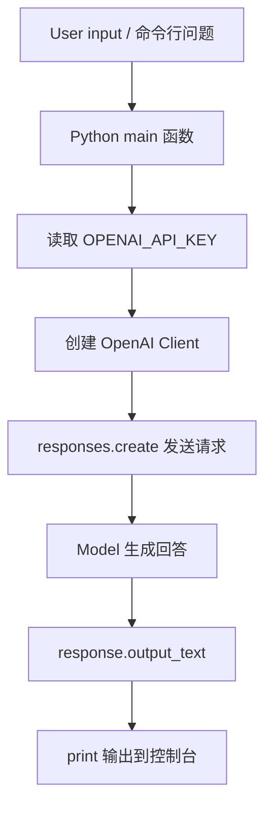

# 模型调用基础

## 1. 这一阶段要解决什么

第一阶段只做一件事：

- 稳定调用模型

你至少要会：

- 发送请求
- 控制模型参数
- 读取结果
- 处理异常
- 在命令行里运行最小样例

如果这一步不稳，后面的：

- 结构化输出
- `RAG`
- `FastAPI`
- Tool Calling

都会比较虚。

## 2. 为什么这一步重要

日本现场很多生成 AI PoC，第一版其实就是：

- `Python` 调模型
- 输入文本
- 输出结果

所以这一步虽然不复杂，但它是后面所有能力的起点。

如果你能把这一层练到熟，后面再补：

- schema
- 检索
- API 化

就会顺很多。

## 3. 这一章学完后，应该会什么

学完这一章，至少要能做到：

- 知道 API Key 怎么读取
- 知道怎么发一条最小请求
- 知道怎么取回模型输出文本
- 知道怎么切换模型名
- 知道怎么处理最常见的报错
- 能自己改一个命令行示例

## 4. 必学内容

这一阶段先学这些：

- API Key 管理
- `system` 指令或系统说明
- `user` 输入
- 模型参数
- 命令行运行方式
- 超时与错误处理

这里先不追求“对话产品”。

重点只是：

- 先把最小调用链打通

## 5. 系统角色先看懂

模型调用看起来只是一行 `client.responses.create(...)`，但实际可以分成几个角色。

| 角色 / 名词 | 可以理解成什么 | 主要作用 | 代码中常见位置 |
| --- | --- | --- | --- |
| User | 提问者 | 给出本次请求要解决的问题 | `input` 或命令行参数 |
| Application | 你的 Python 程序 | 读取输入、调用模型、处理输出 | `main()` |
| API Key | 身份凭证 | 证明程序有权限调用模型服务 | `OPENAI_API_KEY` |
| Client | API 客户端 | 帮你把 Python 调用发送到模型服务 | `OpenAI(api_key=api_key)` |
| Model | 大模型 | 根据输入生成回答 | `model="gpt-5"` |
| Instructions | 行为说明 | 规定模型回答风格、角色、限制 | `instructions=...` |
| Input | 本次问题 | 真正要模型处理的内容 | `input=...` |
| Response | 模型响应 | 包含模型返回的文本或结构化内容 | `response` |
| Output text | 输出文本 | 最简单、最常用的自然语言结果 | `response.output_text` |

先记住一句话：

- Python 程序负责“组织请求和处理结果”，模型负责“根据请求生成内容”。

## 6. 最小模型调用的数据流



如果对应到 `agent-lab/projects/chat_cli/main.py`，可以这样看：

| 流程步骤 | 文件 / 函数 | 属于哪一层 | 作用 |
| --- | --- | --- | --- |
| 读取问题 | `parse_args()` | 输入层 | 读取命令行问题、模型名、交互模式 |
| 检查密钥 | `build_client()` | 基础设施层 | 从环境变量读取 `OPENAI_API_KEY` |
| 发送请求 | `ask_once()` 或同类函数 | 模型调用层 | 调用 Responses API |
| 打印结果 | `main()` | 展示层 | 把 `response.output_text` 输出给用户 |

不同项目的函数名可能略有差异，但分层逻辑基本一样。

## 7. 教程：最小模型调用长什么样

最小模型调用，一般可以拆成 4 步：

1. 读取 API Key
2. 创建客户端
3. 发送输入
4. 读取输出

如果用当前工作区里的 `chat_cli` 思路，核心路径其实非常短。

### 步骤 1：读取 API Key

先从环境变量里读取：

```python
api_key = os.getenv("OPENAI_API_KEY")
```

这样做的原因是：

- 不把密钥写死在代码里
- 更接近实际项目做法

### 步骤 2：创建客户端

```python
client = OpenAI(api_key=api_key)
```

有了客户端后，后面就能统一调用模型接口。

### 步骤 3：发请求

```python
response = client.responses.create(
    model="gpt-5",
    instructions="You are a concise assistant.",
    input="用一句话解释什么是 RAG",
)
```

这一步最重要的是先理解 3 个输入：

- `model`
- `instructions`
- `input`

你现在不用一开始研究很多高级参数。

先把最小请求跑通更重要。

### 步骤 4：取输出

```python
print(response.output_text)
```

也就是说，这一阶段最核心的闭环就是：

- 输入一句话
- 模型返回一句话
- 你能把它稳定打印出来

## 8. 最小示例

下面给一个适合初学阶段理解的最小示例。

这个示例只做一件事：

- 接收一条固定问题
- 调模型
- 打印结果

```python
import os
import sys

from openai import OpenAI


def main() -> None:
    api_key = os.getenv("OPENAI_API_KEY")
    if not api_key:
        print("ERROR: OPENAI_API_KEY is not set.", file=sys.stderr)
        sys.exit(1)

    client = OpenAI(api_key=api_key)

    response = client.responses.create(
        model="gpt-5",
        instructions="You are a concise assistant.",
        input="用一句话解释什么是 Agent",
    )

    print(response.output_text)


if __name__ == "__main__":
    main()
```

### 这个最小示例学的是什么

你要从这段代码里看懂 4 个点：

1. 怎么读取环境变量
2. 怎么创建客户端
3. 怎么发送请求
4. 怎么读取文本输出

如果这 4 个点都看懂了，这一章的主目标就达到了。

## 9. 代码拆解

### 1. 为什么要先检查 API Key

因为这是最常见的失败原因之一。

如果没配 `OPENAI_API_KEY`，就算代码其他部分都对，也一定会失败。

所以比起让程序跑到中途报错，更好的做法是：

- 启动时就先检查

### 2. `instructions` 是做什么的

它相当于给模型一条比较稳定的行为说明，例如：

- 回答简洁一点
- 用中文回答
- 输出要专业一点

初学阶段先把它理解成：

- 给模型的全局要求

### 3. `input` 是做什么的

它是这次请求真正要问的问题。

比如：

- 总结一段文本
- 解释一个概念
- 给出一个计划

### 4. 为什么先只做单轮调用

因为初学阶段先练清楚“单次请求”的链路更重要。

如果一开始就做：

- 多轮上下文
- 历史消息管理
- 工具调用

复杂度会一下上来。

更合理的顺序是：

1. 先会单轮调用
2. 再会结构化输出
3. 再会检索与 API 化
4. 最后再做 Agent

## 10. 进一小步：做成命令行输入

上面的最小示例还是固定问题。

再进一步，你应该学会从命令行接收输入。

例如：

```python
import os
import sys

from openai import OpenAI


def main() -> None:
    api_key = os.getenv("OPENAI_API_KEY")
    if not api_key:
        print("ERROR: OPENAI_API_KEY is not set.", file=sys.stderr)
        sys.exit(1)

    if len(sys.argv) < 2:
        print("Usage: python main.py \"你的问题\"")
        sys.exit(1)

    prompt = sys.argv[1]
    client = OpenAI(api_key=api_key)

    response = client.responses.create(
        model="gpt-5",
        instructions="You are a concise assistant.",
        input=prompt,
    )

    print(response.output_text)


if __name__ == "__main__":
    main()
```

这样你就从“固定示例”进了一步，变成了“可复用脚本”。

## 11. 和当前工作区示例的对应关系

当前工作区里最适合这一章配套练的项目是：

- [agent-lab/projects/chat_cli/README.md](../agent-lab/projects/chat_cli/README.md)

这个示例已经帮你做好了这些基础能力：

- 命令行参数解析
- 读取 `OPENAI_API_KEY`
- 创建客户端
- 调模型
- 处理交互模式
- 打印异常信息

如果你已经能读懂并改这个项目，就说明这一章已经基本过关。

## 12. 最小运行方式

先安装依赖：

```bash
pip install -r agent-lab/projects/chat_cli/requirements.txt
```

Windows PowerShell 设置环境变量：

```powershell
$env:OPENAI_API_KEY="your_api_key"
```

运行单次请求：

```bash
python agent-lab/projects/chat_cli/main.py "用一句话解释什么是 agent"
```

进入交互模式：

```bash
python agent-lab/projects/chat_cli/main.py
```

指定模型：

```bash
python agent-lab/projects/chat_cli/main.py --model gpt-5 "给我一个三步学习计划"
```

## 13. 常见错误与排查

### 1. `OPENAI_API_KEY` 没有设置

表现通常是：

- 程序启动就报错
- 提示没有找到 API Key

优先检查：

- 当前终端是否设置了环境变量
- 是否在同一个终端窗口里运行脚本

### 2. 模型名写错

表现通常是：

- 请求失败
- 返回模型不存在或不可用

先做的事是：

- 检查模型名有没有拼错
- 先用项目默认值跑通

### 3. 网络或权限问题

表现通常是：

- 请求超时
- 连接失败
- 认证失败

初学阶段不用先深究底层网络。

先确认：

- API Key 是否正确
- 网络是否能访问对应服务
- 账号是否有对应模型权限

### 4. 只会跑，不会改

这也是常见问题。

如果你只是“跑通了一个例子”，但不会改：

- `instructions`
- `input`
- `model`

那说明还没真正学会。

这一章的关键不是“跑一下”，而是：

- 自己动手改过

## 14. 练习题

下面这些练习题，建议按顺序做。

### 练习 1：改提示词

把系统说明改成：

- 用中文回答
- 回答控制在三句话内

目标：

- 理解 `instructions` 会影响输出风格

### 练习 2：改用户输入

把固定问题从：

- 解释什么是 Agent

改成：

- 解释什么是 RAG
- 解释什么是结构化输出
- 给我一个 3 步学习计划

目标：

- 熟悉 `input` 的作用

### 练习 3：支持命令行参数

把固定输入脚本改成：

- `python main.py "你的问题"`

目标：

- 从写死内容进步到可复用脚本

### 练习 4：加异常处理

给模型调用部分加上：

- `try / except`

目标：

- 能把原始异常转成更容易看懂的错误信息

### 练习 5：增加模型参数

让脚本支持：

- `--model`

目标：

- 理解模型名是可以配置的，不要写死在业务逻辑里

### 练习 6：做一个简易问答脚本

功能要求：

- 命令行输入问题
- 返回模型回答
- 支持退出

目标：

- 为后面的 `chat_cli` 和 `FastAPI` 做准备

## 15. 这一章学到什么程度算过关

满足下面这些条件，就可以进入下一章：

- 能解释模型调用最小流程
- 能自己写出读取 API Key 的代码
- 能自己写出一次最小请求
- 能打印返回结果
- 能处理最基本的异常
- 能读懂并修改 `chat_cli`

## 16. 下一步学什么

这一步完成后，最适合继续学的是：

- [03-结构化输出.md](03-结构化输出.md)

因为现场真正更常用的，不只是“能聊天”，而是：

- 能输出 JSON
- 能做分类和信息提取
- 能把结果接到后端流程里

## 17. 日本现场高频关键词

- `Python`
- `OpenAI API`
- `Azure OpenAI`
- `Bedrock`
- `PoC`

## 18. 注意点

- 这一步现场价值不算最高，但它是所有后续能力的起点。
- 只会聊天还不够，要往结构化输出继续走。
- 重点不是参数背得多，而是先把最小调用链跑通。
