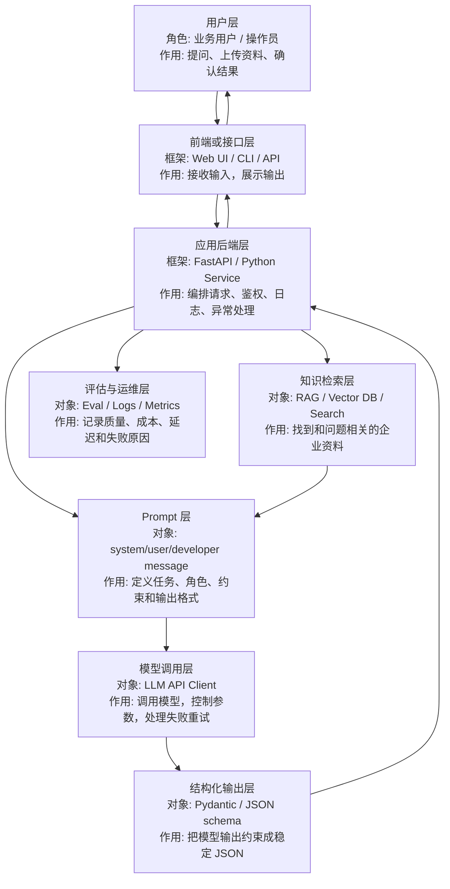
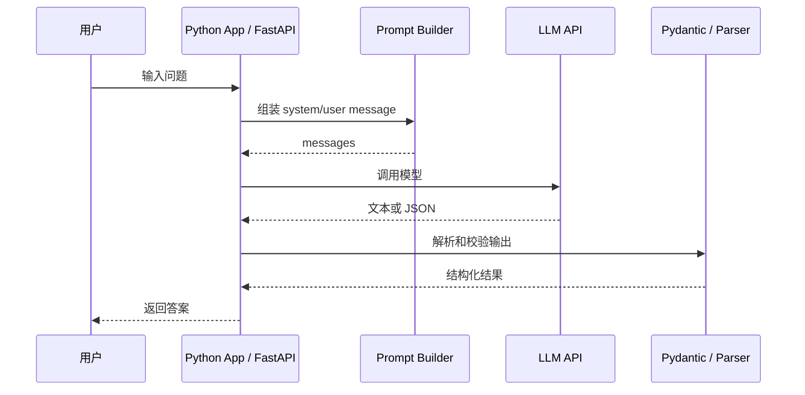
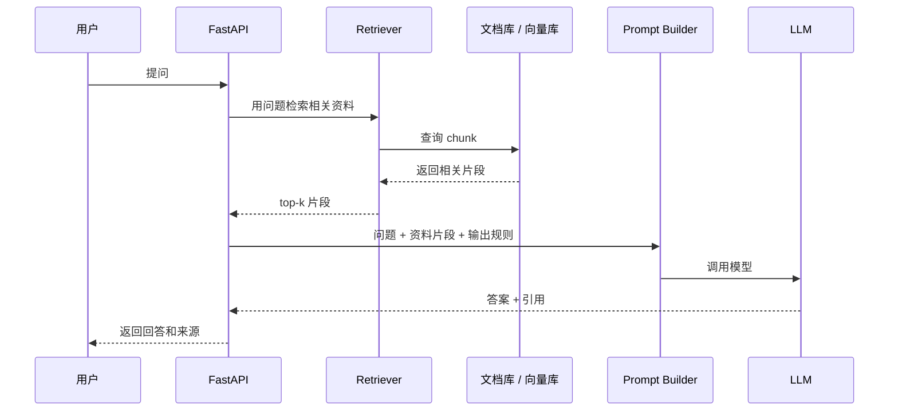

# LLM 应用框架系统知识

这份文档用于补齐 `llm-lab` 的系统知识。它回答的是：

> 一个可落地的 LLM 应用，到底由哪些角色、分层、组件和流程组成？每个名词是什么意思，负责什么？

`llm-lab` 的目标不是研究模型本身，而是学习如何把大模型能力做成可交付的业务应用。

## 1. 一句话理解 LLM 应用

LLM 应用不是“直接问模型一句话”这么简单。

更完整的结构是：

```text
用户问题
  -> 应用后端
  -> Prompt / 上下文组织
  -> 模型调用
  -> 结构化处理
  -> 检索或业务数据补充
  -> 返回答案
  -> 记录日志与评估
```

也就是说，模型只是中间的一个能力组件，不是整个系统。

## 2. LLM 应用的系统分层



## 3. 角色是什么

这里的“角色”不是权限角色，而是系统中不同参与者或消息身份。

| 名词 | 概念解释 | 作用 |
| --- | --- | --- |
| 用户 | 真实使用系统的人 | 提问题、上传文件、确认答案是否可用 |
| 应用后端 | 你写的 Python / FastAPI 程序 | 接住用户请求，组织 Prompt，调用模型，返回结果 |
| 模型 | LLM 服务，例如 OpenAI / Azure OpenAI / Bedrock | 根据输入生成文本、JSON、摘要或判断 |
| Prompt | 给模型的任务说明和上下文 | 决定模型应该扮演什么角色、做什么、怎么输出 |
| System message | 最高层级的行为说明 | 规定模型身份、边界、风格和禁止事项 |
| User message | 用户实际输入 | 表示用户这次要解决的问题 |
| Tool | 外部函数或接口 | 让模型间接使用搜索、数据库、HTTP、文件等能力 |
| RAG 检索器 | 从资料里找相关片段的模块 | 给模型补充企业内部知识，减少胡编 |
| Evaluator | 评估答案质量的人或程序 | 判断答案是否正确、有引用、可上线 |

## 4. 核心术语解释

| 术语 | 概念性理解 | 在项目里的学习位置 |
| --- | --- | --- |
| LLM | Large Language Model，大语言模型。它擅长根据上下文生成语言或结构化内容 | `02-模型调用基础.md` |
| Token | 模型处理文本的基本单位，近似“字/词片段” | 模型成本、上下文长度相关 |
| Context Window | 模型一次能看到的最大上下文范围 | RAG 和长文处理必须考虑 |
| Prompt | 给模型的输入说明，不只是问题，也包括规则、示例、资料 | `02-模型调用基础.md` |
| Temperature | 控制输出随机性。低温更稳定，高温更发散 | 模型参数控制 |
| Structured Output | 让模型输出固定 JSON 或 schema | `03-结构化输出.md` |
| Pydantic | Python 数据校验库，用来定义字段和校验结果 | `03-结构化输出.md` |
| Embedding | 把文本变成向量，用于相似度检索 | `04-RAG.md` |
| RAG | Retrieval-Augmented Generation，先检索资料，再让模型回答 | `04-RAG.md` |
| Chunk | 文档切分后的片段 | RAG 文档处理 |
| Retriever | 检索器，负责找相关 chunk | RAG 主流程 |
| Citation | 引用来源，说明答案依据哪段资料 | 企业问答可信度关键 |
| Eval | 评估，用测试问题集衡量质量 | `06-评估与运维.md` |
| Latency | 延迟，请求到响应的耗时 | 运维和用户体验 |
| Cost | 成本，通常和 token、模型、请求量有关 | 运维与上线评估 |

## 5. LLM 应用和传统 Web 应用的区别

| 对比点 | 传统 Web 应用 | LLM 应用 |
| --- | --- | --- |
| 输出 | 程序逻辑确定 | 模型生成，有不确定性 |
| 测试 | 输入固定，输出通常固定 | 输出可能变化，需要评估标准 |
| 数据 | 数据库为主 | 数据库 + 文档 + Prompt + 检索上下文 |
| 错误 | 多是异常或校验错误 | 还包括幻觉、引用错误、格式错误 |
| 运维 | 日志、性能、错误率 | 还要看 token、成本、答案质量 |

## 6. 最小 LLM 应用的数据流



## 7. RAG 应用的数据流



## 8. 各教程文件在系统里的位置

| 教程 | 属于哪一层 | 学到什么 |
| --- | --- | --- |
| `00-Python学习范围` | 编程基础层 | 能读写 LLM 应用所需的 Python |
| `02-模型调用基础` | 模型调用层 | 怎么组织 messages、调用模型、处理响应 |
| `03-结构化输出` | 输出约束层 | 怎么让模型输出可被程序使用的 JSON |
| `04-RAG` | 知识检索层 | 怎么把社内资料接入问答 |
| `05-FastAPI与企业集成` | 应用后端层 | 怎么把 LLM 能力做成 API |
| `06-评估与运维` | 评估运维层 | 怎么判断答案好不好、系统能不能上线 |
| `07-日本现场应用与案件关键词` | 业务场景层 | 日本现场常见用法和关键词 |

## 9. 学习时最重要的判断

学习 LLM 应用时，不要只问：

```text
模型会不会回答？
```

更应该问：

```text
输入从哪里来？
上下文怎么组织？
资料怎么检索？
输出能不能被程序稳定解析？
答案是否有依据？
失败时怎么处理？
成本和延迟能不能接受？
```

这些问题加起来，才是“LLM 应用开发”。

