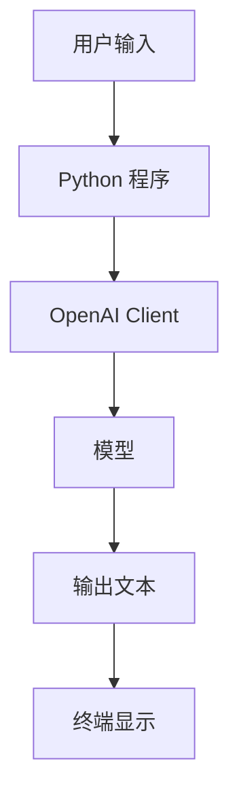

# chat_cli

最小可运行的大模型命令行对话示例（从 `agent-lab/projects/chat_cli` 复制）。

这个项目的作用是帮你先理解最基础的 LLM 应用闭环：

## 快速说明

- 前置条件：Python 3.10+，设置 `OPENAI_API_KEY`
- 安装依赖：`pip install -r requirements.txt`
- 运行：`python main.py "一句话提问"` 或交互模式 `python main.py`

## 学习重点

| 名词 | 概念理解 | 作用 |
| --- | --- | --- |
| API Key | 调用模型服务的身份凭证 | 让程序有权限访问模型 |
| Client | API 客户端对象 | 负责发送请求 |
| Model | 生成回答的大模型 | 根据输入返回结果 |
| Instructions | 给模型的行为规则 | 控制回答风格和边界 |
| Input | 用户问题 | 本次请求真正要处理的内容 |
| Output | 模型返回文本 | 程序最终展示给用户 |

详见源示例：[agent-lab/projects/chat_cli/README.md](../../../agent-lab/projects/chat_cli/README.md)
