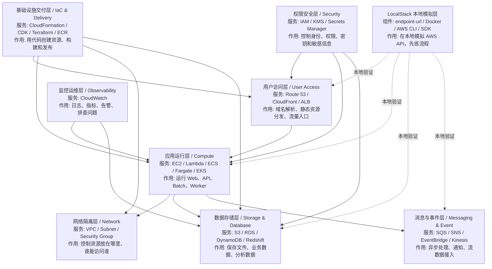
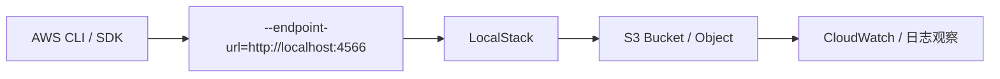
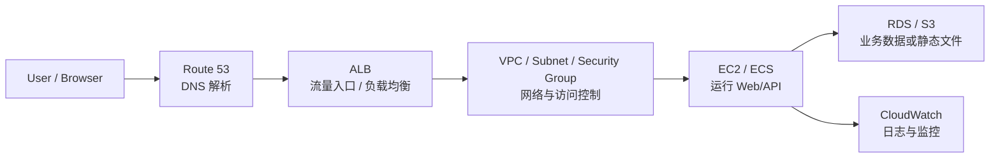
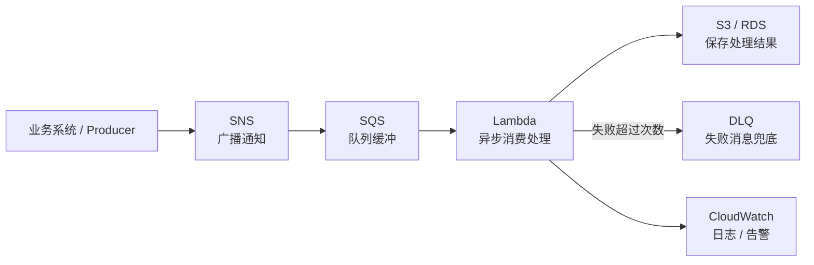
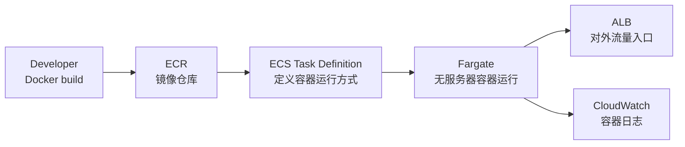
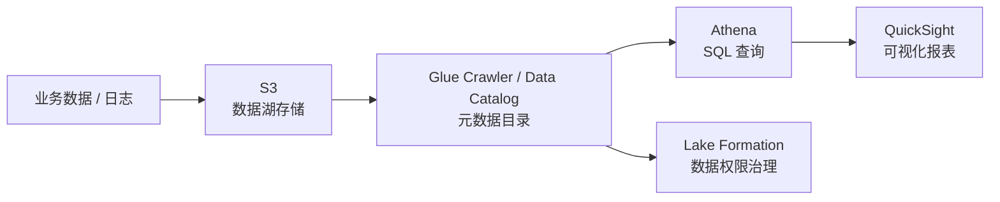

# AWS 系统学习路线（LocalStack 版）

这份文档用来解决一个问题：

```text
AWS 服务很多，不能只按服务名零散学习，要先知道它们在系统架构里属于哪一层。
```

LocalStack 适合做本地验证，所以这里的学习目标不是一开始就背所有服务，而是：

- 先看懂 AWS 系统分层
- 再按项目场景学习服务组合
- 最后用 LocalStack 练常见操作链路

## 1. AWS 系统整体分层



## 2. 核心层次速查

| 框架层 | 是什么 | 核心作用 | 常见 AWS 服务 | 日本现场说法 |
| --- | --- | --- | --- | --- |
| 用户访问层 | 用户进入系统的入口 | 域名、CDN、负载均衡 | Route 53 / CloudFront / ALB | 入口 / 配信 / ロードバランサー |
| 应用运行层 | 执行业务代码的地方 | 跑 Web、API、函数、容器 | EC2 / Lambda / ECS / Fargate / EKS | コンピュート / 実行基盤 |
| 网络隔离层 | 云上私有网络边界 | 控制网段、路由、访问边界 | VPC / Subnet / Security Group | ネットワーク / セキュリティグループ |
| 数据存储层 | 保存业务数据和文件 | 文件、数据库、数据仓库 | S3 / RDS / DynamoDB / Redshift | ストレージ / DB / DWH |
| 消息与事件层 | 系统之间的异步通道 | 解耦、排队、通知、流处理 | SQS / SNS / EventBridge / Kinesis | メッセージング / イベント駆動 |
| 权限安全层 | 身份、权限、密钥控制 | 谁能访问什么、如何保护密钥 | IAM / KMS / Secrets Manager | 権限管理 / 暗号化 / 秘密情報 |
| 监控运维层 | 观察系统运行状态 | 日志、指标、告警 | CloudWatch | 監視 / ログ / アラーム |
| IaC 与交付层 | 用代码管理基础设施 | 创建资源、复用环境、发布 | CloudFormation / CDK / Terraform / ECR | IaC / デプロイ / リリース |
| 本地模拟层 | LocalStack 提供的本地 AWS API | 不上云也能练 CLI / SDK 流程 | LocalStack / endpoint-url | ローカル検証 / モック環境 |

## 3. 推荐学习主线

不要直接按服务字母顺序学。建议按下面 5 条主线推进。

### 主线 1：AWS 基础操作感

目标：

- 理解 AWS CLI / SDK 如何访问服务
- 理解 LocalStack 的 endpoint 概念
- 先练最容易成功的 S3

阅读：

1. [S3.md](./S3.md)
2. [IAM.md](./IAM.md)
3. [CloudWatch.md](./CloudWatch.md)

流程：



### 主线 2：Web 系统部署

目标：

- 理解用户访问 Web 服务的完整路径
- 知道域名、负载均衡、计算资源、网络边界各自负责什么

阅读：

1. [Route53.md](./Route53.md)
2. [VPC.md](./VPC.md)
3. [EC2.md](./EC2.md)
4. [combos/EC2_ALB.md](./combos/EC2_ALB.md)
5. [combos/WebProject_Deployment.md](./combos/WebProject_Deployment.md)

流程：



### 主线 3：事件驱动与异步处理

目标：

- 理解“请求不一定马上处理”的系统设计
- 理解 SQS、SNS、Lambda、DLQ 的职责

阅读：

1. [Lambda.md](./Lambda.md)
2. [SQS.md](./SQS.md)
3. [SNS.md](./SNS.md)
4. [combos/SQS_Lambda.md](./combos/SQS_Lambda.md)
5. [combos/SQS_Lambda_DLQ.md](./combos/SQS_Lambda_DLQ.md)

流程：



### 主线 4：容器交付

目标：

- 理解 Docker 镜像如何从本地构建到云上运行
- 理解 ECR、ECS、Fargate 的分工

阅读：

1. [ECR.md](./ECR.md)
2. [ECS.md](./ECS.md)
3. [Fargate.md](./Fargate.md)
4. [combos/Docker_ECR_ECS.md](./combos/Docker_ECR_ECS.md)
5. [combos/ECS_ECR_Fargate.md](./combos/ECS_ECR_Fargate.md)

流程：



### 主线 5：数据分析与数据湖

目标：

- 理解 S3 数据湖、Glue 元数据、Athena 查询、QuickSight 报表之间的关系

阅读：

1. [S3.md](./S3.md)
2. [combos/S3_Athena.md](./combos/S3_Athena.md)
3. [combos/Glue_S3.md](./combos/Glue_S3.md)
4. [combos/Athena_Glue.md](./combos/Athena_Glue.md)
5. [combos/Athena_QuickSight.md](./combos/Athena_QuickSight.md)

流程：



## 4. LocalStack 学习时要特别记住的点

| 概念 | 是什么 | 为什么重要 |
| --- | --- | --- |
| endpoint-url | AWS CLI / SDK 的服务访问地址 | 指向 `localhost:4566` 才会打到 LocalStack |
| Region | 资源所属区域 | 本地也建议固定一个区域，养成真实 AWS 习惯 |
| Credentials | 访问凭证 | LocalStack 可用假凭证，但命令结构和 AWS 一样 |
| Resource name | 资源名 | Bucket、Queue、Function 名称要可读，方便排查 |
| Logs | 日志 | 学 AWS 不只看创建成功，还要会看执行结果 |
| IaC | 基础设施即代码 | 后期不要只手敲 CLI，要用模板复现环境 |

## 5. 日本项目现场常见表达

| 中文 | 日本語 | 现场语境 |
| --- | --- | --- |
| 本地验证 | ローカル検証 | LocalStack で AWS リソースの動作を確認します |
| 事件驱动 | イベント駆動 | S3 や SQS のイベントをトリガーに処理します |
| 异步处理 | 非同期処理 | SQS を使って処理を非同期化します |
| 权限设计 | 権限設計 | IAM ロールとポリシーを整理します |
| 监控告警 | 監視アラート | CloudWatch でログとメトリクスを確認します |
| 基础设施即代码 | IaC | Terraform / CloudFormation で環境を構築します |
| 数据湖 | データレイク | S3 を中心に分析用データを蓄積します |
| 数据治理 | データガバナンス | Lake Formation でアクセス制御します |

## 6. 怎么使用现有文档

| 你想学什么 | 先读 | 再读 | 最后读 |
| --- | --- | --- | --- |
| AWS 基础概念 | [AWS知识点总览](../AWS_Knowledge_Map.md) | [S3.md](./S3.md) | [IAM.md](./IAM.md) |
| Web 部署 | [VPC.md](./VPC.md) | [EC2.md](./EC2.md) | [WebProject_Deployment.md](./combos/WebProject_Deployment.md) |
| 异步处理 | [SQS.md](./SQS.md) | [Lambda.md](./Lambda.md) | [SQS_Lambda_DLQ.md](./combos/SQS_Lambda_DLQ.md) |
| 容器部署 | [ECR.md](./ECR.md) | [ECS.md](./ECS.md) | [ECS_ECR_Fargate.md](./combos/ECS_ECR_Fargate.md) |
| 数据分析 | [S3.md](./S3.md) | [S3_Athena.md](./combos/S3_Athena.md) | [Athena_QuickSight.md](./combos/Athena_QuickSight.md) |
