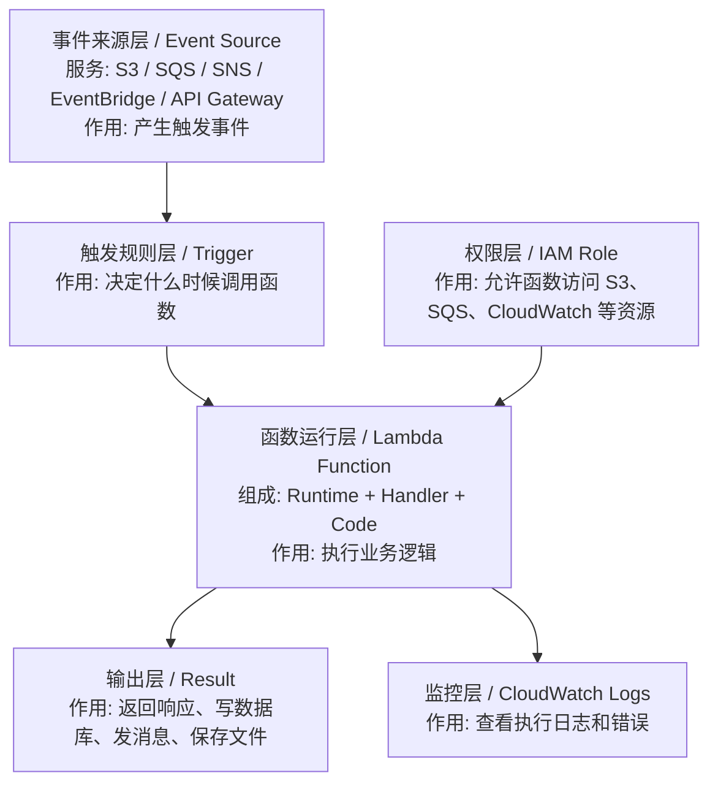
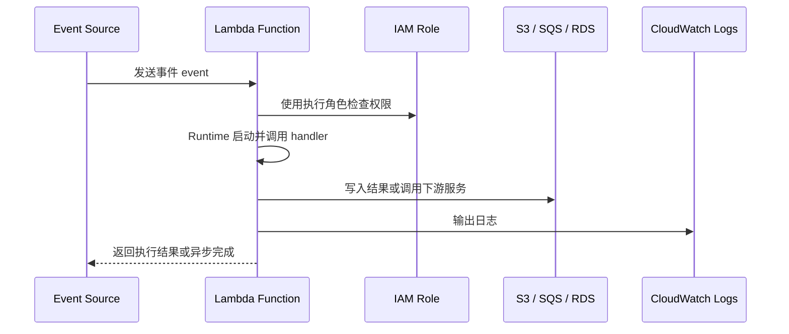

# Lambda 学习笔记（中日对照）

Lambda 是 AWS 的无服务器函数服务，适合学习事件驱动、按需执行、低运维的思路。

## 1. 这个服务是什么 / このサービスは何か

- 中文：Lambda 是在事件触发时运行的函数，不需要你自己维护服务器。
- 日本語：Lambda はイベント発生時に実行される関数で、サーバー管理が不要です。

## 2. 核心概念 / 基本概念

| 英文 | 中文说明 | 日本語説明 |
|---|---|---|
| Function | 函数，Lambda 的执行单元 | 関数。Lambda の実行単位 |
| Trigger | 触发器 | トリガー |
| Event Source | 事件来源 | イベントソース |
| Runtime | 运行时环境 | ランタイム |
| Handler | 入口方法 | ハンドラー |
| Timeout | 超时时间 | タイムアウト |
| Memory | 内存配置 | メモリ設定 |

## 3. 学习重点 / 学習ポイント

- 中文：理解“事件触发 -> 函数执行 -> 返回结果”的模型。
- 日本語：「イベント発生 -> 関数実行 -> 結果返却」のモデルを理解する。
- 中文：理解 Lambda 适合短时、无状态任务。
- 日本語：Lambda は短時間でステートレスな処理に向いていることを理解する。
- 中文：理解和 S3、EventBridge、SQS、API Gateway 的组合方式。
- 日本語：S3、EventBridge、SQS、API Gateway との組み合わせを理解する。

## 4. Lambda 在系统里的位置 / システム内の位置づけ

| 框架层 | AWS 概念 | 是什么 | 核心作用 |
| --- | --- | --- | --- |
| 事件来源层 | Event Source | 触发 Lambda 的外部服务 | 提供事件输入 |
| 触发规则层 | Trigger | 事件和函数之间的绑定关系 | 决定何时执行函数 |
| 函数运行层 | Function / Runtime / Handler | Lambda 代码执行环境 | 运行短时无状态业务逻辑 |
| 权限层 | IAM Role | Lambda 执行时使用的角色 | 允许访问其他 AWS 服务 |
| 输出层 | Result / Side effect | 函数执行后的结果 | 返回响应、写入 S3/RDS/SQS |
| 监控层 | CloudWatch Logs | 函数执行日志 | 排查错误和观察运行结果 |

## 5. Lambda 处理流程 / 処理フロー

## 6. LocalStack 里怎么练 / LocalStack での練習方法

- 中文：先练最简单的函数调用，再练事件驱动调用。
- 日本語：まずは単純な関数呼び出しから始め、次にイベント駆動で呼ぶ練習をする。
- 中文：在本地主要验证“触发 -> 执行 -> 结果”这一条链路。
- 日本語：ローカルでは「トリガー -> 実行 -> 結果」の流れを確認するのが中心です。

## 7. 常见坑 / よくある落とし穴

- 中文：函数依赖过重，导致冷启动和部署复杂度上升。
- 日本語：依存関係が重すぎてコールドスタートやデプロイが複雑になる。
- 中文：把 Lambda 当成长驻服务来设计。
- 日本語：Lambda を常駐サービスのように設計してしまう。
