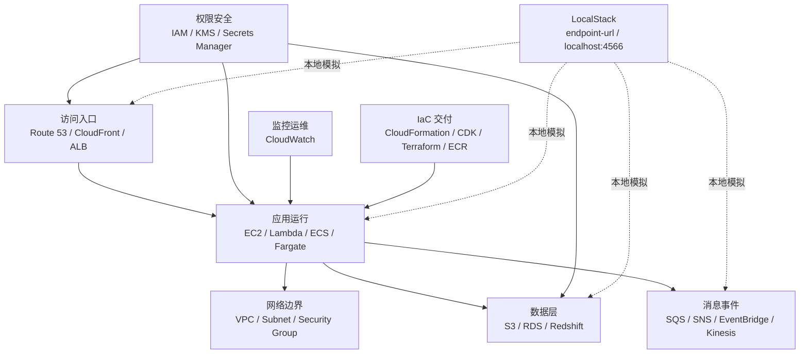

# AWS 单页笔记索引

这里收录按服务拆分的中日对照笔记，适合从总览继续往下学。

如果你觉得主题太分散，建议先读：

- [AWS 系统学习路线（LocalStack 版）](./AWS系统学习路线.md)

这份路线会先按“系统分层”和“项目现场场景”组织知识，再回到下面的单服务笔记。

## AWS 系统分层总览

## 按项目场景学习

| 场景 | 先理解什么 | 主要服务 | 推荐文档 |
| --- | --- | --- | --- |
| 本地 AWS 操作感 | CLI / SDK / endpoint | LocalStack / S3 / IAM | [AWS系统学习路线.md](./AWS系统学习路线.md) |
| Web 项目部署 | 用户访问到应用的链路 | Route 53 / ALB / EC2 / VPC | [WebProject_Deployment.md](./combos/WebProject_Deployment.md) |
| 异步任务处理 | 消息排队、消费、失败兜底 | SQS / SNS / Lambda / DLQ | [SQS_Lambda_DLQ.md](./combos/SQS_Lambda_DLQ.md) |
| 容器项目发布 | 镜像构建、仓库、运行 | Docker / ECR / ECS / Fargate | [ECS_ECR_Fargate.md](./combos/ECS_ECR_Fargate.md) |
| 数据分析 | 数据湖、元数据、SQL 查询、报表 | S3 / Glue / Athena / QuickSight | [Athena_QuickSight.md](./combos/Athena_QuickSight.md) |
| 监控与运维 | 日志、指标、告警 | CloudWatch / RDS / ECS | [CloudWatch.md](./CloudWatch.md) |

## 索引

- [AWS 系统学习路线（LocalStack 版）](./AWS系统学习路线.md)
- [S3 学习笔记](./S3.md)
- [EC2 学习笔记](./EC2.md)
- [IAM 学习笔记](./IAM.md)
- [VPC 学习笔记](./VPC.md)
- [Lambda 学习笔记](./Lambda.md)
- [SQS 学习笔记](./SQS.md)
- [SNS 学习笔记](./SNS.md)
- [CloudWatch 学习笔记](./CloudWatch.md)
- [ECR 学习笔记](./ECR.md)
- [ECS 学习笔记](./ECS.md)
- [Fargate 学习笔记](./Fargate.md)
- [EKS 学习笔记](./EKS.md)
- [KMS 学习笔记](./KMS.md)
- [Secrets Manager 学习笔记](./SecretsManager.md)
- [Route 53 学习笔记](./Route53.md)
- [CloudFormation 学习笔记](./CloudFormation.md)
- [CDK 学习笔记](./CDK.md)
- [Terraform 学习笔记](./Terraform.md)

## 高频架构组合

- [高频架构组合索引](./combos/README.md)
- [S3 + CloudFront](./combos/S3_CloudFront.md)
- [EC2 + ALB](./combos/EC2_ALB.md)
- [SQS + Lambda](./combos/SQS_Lambda.md)
- [Docker / ECR / ECS](./combos/Docker_ECR_ECS.md)
- [ECS + ECR + Fargate](./combos/ECS_ECR_Fargate.md)
- [RDS + CloudWatch](./combos/RDS_CloudWatch.md)
- [S3 + Lambda](./combos/S3_Lambda.md)
- [SQS + SNS](./combos/SQS_SNS.md)
- [S3 + SNS](./combos/S3_SNS.md)
- [SQS + Lambda + DLQ](./combos/SQS_Lambda_DLQ.md)
- [RDS + Lambda](./combos/RDS_Lambda.md)
- [S3 + Athena](./combos/S3_Athena.md)
- [Glue + S3](./combos/Glue_S3.md)
- [Kinesis + Lambda](./combos/Kinesis_Lambda.md)
- [Redshift + S3](./combos/Redshift_S3.md)
- [Athena + Glue](./combos/Athena_Glue.md)
- [Kinesis + Firehose](./combos/Kinesis_Firehose.md)
- [Lake Formation + Glue](./combos/LakeFormation_Glue.md)
- [Athena + QuickSight](./combos/Athena_QuickSight.md)
- [Redshift + QuickSight](./combos/Redshift_QuickSight.md)
- [Lake Formation + Athena](./combos/LakeFormation_Athena.md)
- [QuickSight + Lake Formation](./combos/QuickSight_LakeFormation.md)
- [Redshift + Lake Formation](./combos/Redshift_LakeFormation.md)
- [Web Project 部署流程](./combos/WebProject_Deployment.md)
- [Batch 部署流程](./combos/Batch_Deployment.md)

## 建议阅读顺序

1. 先看 [AWS知识点总览（中日对照）](../AWS_Knowledge_Map.md)
2. 再看 [AWS 系统学习路线（LocalStack 版）](./AWS系统学习路线.md)，先建立分层和主线
3. 再按场景读单服务笔记，不要一开始平均用力
4. 然后看高频架构组合，把单服务串成一条完整链路
5. 最后配合 LocalStack 的项目示例做实操
