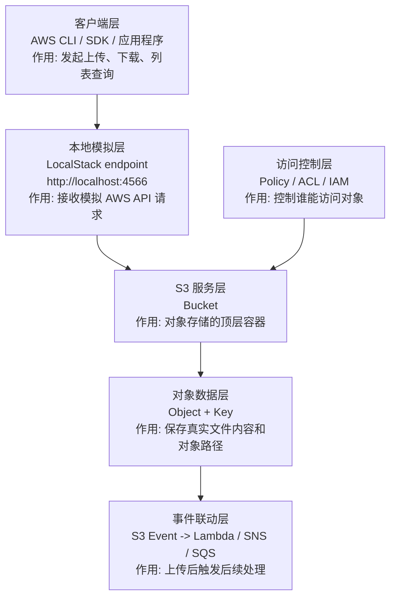
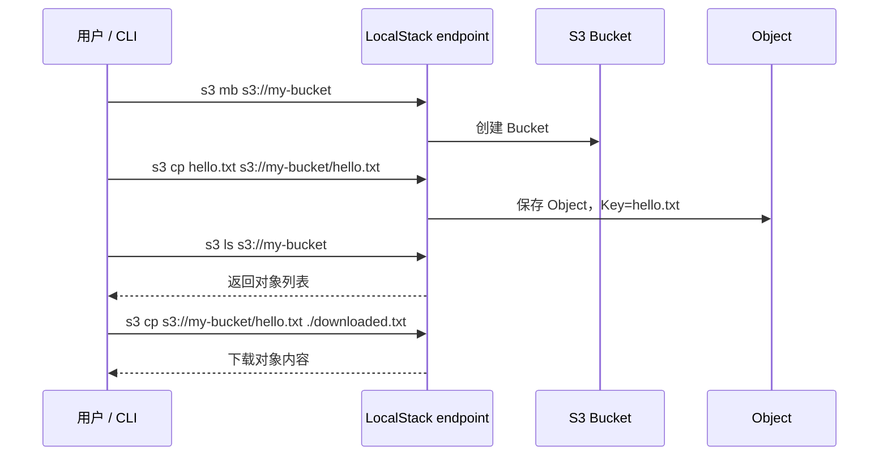

# S3 学习笔记（中日对照）

S3 是 AWS 最常用的对象存储服务，也是 LocalStack 里最适合上手的第一个服务。

## 1. 这个服务是什么 / このサービスは何か

- 中文：S3 用来存放对象数据，例如图片、日志、备份文件、前端静态资源。
- 日本語：S3 はオブジェクトデータを保存するサービスで、画像、ログ、バックアップ、静的ファイルなどに使います。

## 2. 核心概念 / 基本概念

| 英文 | 中文说明 | 日本語説明 |
|---|---|---|
| Bucket | 存储桶，S3 的顶层容器 | バケット。S3 の最上位コンテナ |
| Object | 对象，真实保存的数据 | オブジェクト。実データ本体 |
| Key | 对象路径/名称 | オブジェクトキー。名前またはパス |
| Prefix | 前缀，用于模拟目录 | プレフィックス。フォルダのように扱う単位 |
| Versioning | 版本控制 | バージョニング |
| ACL / Policy | 访问控制方式 | アクセス制御 |

## 3. 为什么先学 S3 / なぜ S3 から学ぶか

- 中文：S3 的 API 简单、概念直观、LocalStack 支持度高，适合建立 AWS 操作手感。
- 日本語：S3 は API が分かりやすく、概念も直感的で、LocalStack でも扱いやすいため、AWS の操作感をつかむのに最適です。

## 4. S3 在系统里的位置 / システム内の位置づけ



| 框架层 | AWS 概念 | 是什么 | 核心作用 | LocalStack 练习 |
| --- | --- | --- | --- | --- |
| 客户端层 | AWS CLI / SDK | 调用 S3 API 的入口 | 上传、下载、查询对象 | `aws --endpoint-url=... s3 ...` |
| 本地模拟层 | LocalStack endpoint | 本地 AWS API 地址 | 把请求打到本地而不是真 AWS | `http://localhost:4566` |
| 存储容器层 | Bucket | S3 顶层容器 | 按业务或用途组织对象 | `s3 mb` / `s3 ls` |
| 对象数据层 | Object / Key | 文件内容和对象路径 | 保存图片、日志、备份、静态资源 | `s3 cp` |
| 访问控制层 | IAM / Policy / ACL | 权限控制规则 | 控制读写权限 | 概念理解为主 |
| 事件联动层 | Event Notification | 对象变化事件 | 上传后触发 Lambda / SNS / SQS | 后续看组合文档 |

## 5. LocalStack 里怎么练 / LocalStack での練習方法

### 创建桶 / バケット作成

```bash
aws --endpoint-url=http://localhost:4566 s3 mb s3://my-bucket
aws --endpoint-url=http://localhost:4566 s3 ls
```

### 上传文件 / ファイルアップロード

```bash
aws --endpoint-url=http://localhost:4566 s3 cp ./hello.txt s3://my-bucket/hello.txt
aws --endpoint-url=http://localhost:4566 s3 ls s3://my-bucket
```

### 下载文件 / ファイルダウンロード

```bash
aws --endpoint-url=http://localhost:4566 s3 cp s3://my-bucket/hello.txt ./downloaded-hello.txt
```

## 6. S3 基本处理流程 / 基本処理フロー



## 7. 学习重点 / 学習ポイント

- 中文：理解 bucket、object、key、prefix 的关系。
- 日本語：bucket、object、key、prefix の関係を理解する。
- 中文：理解公开读、私有读、临时访问链接这类访问控制方式。
- 日本語：公開/非公開アクセスや一時的なアクセス URL の考え方を理解する。
- 中文：理解静态网站托管和前端资源部署的常见场景。
- 日本語：静的サイトホスティングやフロントエンド配信の典型シナリオを理解する。

## 8. 常见坑 / よくある落とし穴

- 中文：把 S3 当成传统文件系统，容易忽略 key 和前缀的概念。
- 日本語：S3 を通常のファイルシステムとして考えると、key と prefix の概念を見落としやすいです。
- 中文：LocalStack 和真实 AWS 在权限、事件通知、少数高级功能上可能有差异。
- 日本語：LocalStack と実 AWS では、権限やイベント通知など一部機能に差がある場合があります。
