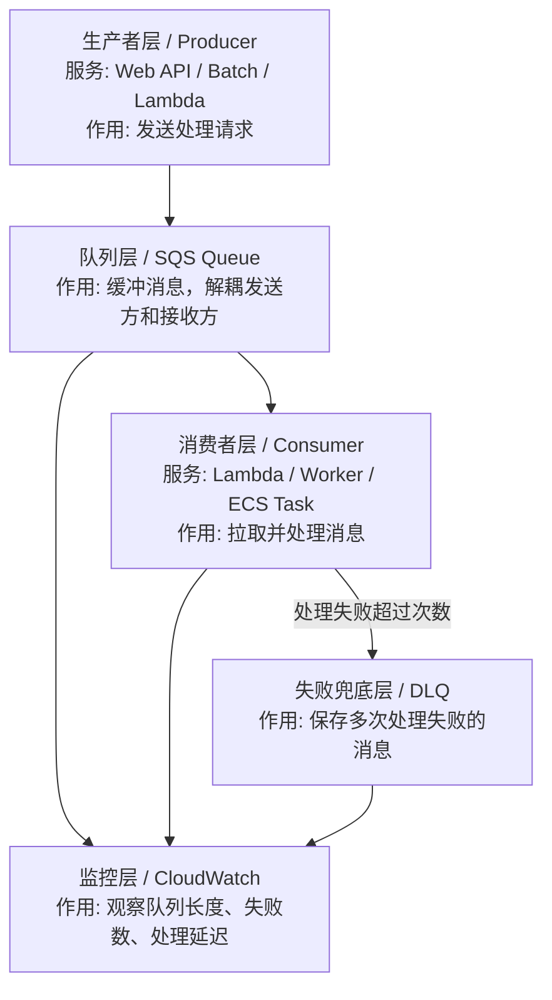
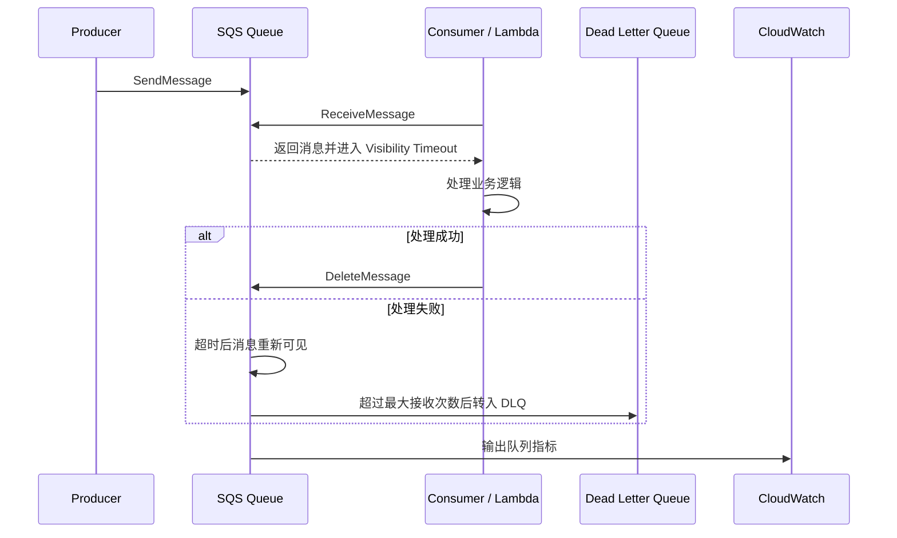

# SQS 学习笔记（中日对照）

SQS 是 AWS 的消息队列服务，适合学习异步处理、削峰填谷、解耦系统这些概念。

## 1. 这个服务是什么 / このサービスは何か

- 中文：SQS 用来在系统之间传递消息，让发送方和接收方解耦。
- 日本語：SQS はシステム間でメッセージをやり取りし、送信側と受信側を分離するためのサービスです。

## 2. 核心概念 / 基本概念

| 英文 | 中文说明 | 日本語説明 |
|---|---|---|
| Queue | 队列 | キュー |
| Message | 消息 | メッセージ |
| Producer | 发送方 | 送信側 |
| Consumer | 消费方 | 受信側 |
| Visibility Timeout | 可见性超时 | 可視性タイムアウト |
| Dead Letter Queue | 死信队列 | DLQ。失敗メッセージの退避先 |

## 3. 学习重点 / 学習ポイント

- 中文：理解“生产者发送消息，消费者异步处理”的模型。
- 日本語：「プロデューサーがメッセージを送信し、コンシューマーが非同期で処理する」モデルを理解する。
- 中文：理解标准队列和 FIFO 队列的差别。
- 日本語：標準キューと FIFO キューの違いを理解する。
- 中文：理解可见性超时和重试机制。
- 日本語：可視性タイムアウトと再試行の仕組みを理解する。

## 4. SQS 在系统里的位置 / システム内の位置づけ

| 框架层 | AWS 概念 | 是什么 | 核心作用 |
| --- | --- | --- | --- |
| 生产者层 | Producer | 发送消息的系统 | 把任务放入队列 |
| 队列层 | SQS Queue | 消息缓冲区 | 解耦系统、削峰填谷 |
| 消费者层 | Consumer | 处理消息的系统 | 异步执行业务处理 |
| 可见性控制层 | Visibility Timeout | 消息被取走后的隐藏时间 | 避免多个消费者同时处理同一消息 |
| 失败兜底层 | DLQ | 失败消息保存队列 | 便于后续排查和补偿 |
| 监控层 | CloudWatch | 队列指标和告警 | 观察积压和失败 |

## 5. SQS 消息处理流程 / メッセージ処理フロー

## 6. LocalStack 里怎么练 / LocalStack での練習方法

- 中文：先练发送消息和拉取消息，再练死信队列和重试。
- 日本語：まず送信と受信を練習し、その後 DLQ と再試行を確認する。
- 中文：把 SQS 和 Lambda、EventBridge 连起来，更容易理解事件驱动架构。
- 日本語：SQS を Lambda や EventBridge と組み合わせると、イベント駆動アーキテクチャが理解しやすくなります。

## 7. 常见坑 / よくある落とし穴

- 中文：把队列当成持久数据库。
- 日本語：キューを永続データベースのように扱う。
- 中文：忽略可见性超时导致重复消费。
- 日本語：可視性タイムアウトを無視して重複処理が起きる。
