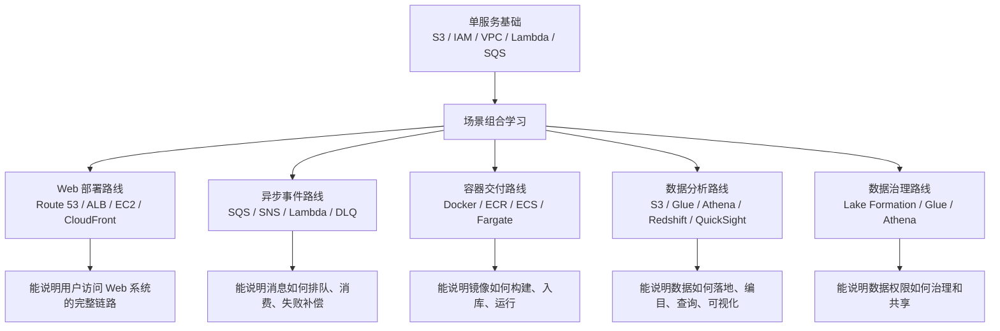

# 高频架构组合索引

这里收录按“服务联动场景”组织的中日对照笔记，适合从单服务学习切换到架构学习。

组合文档很多，不建议从上到下硬读。先按项目现场场景分组：

## 场景路线图

## 按场景聚合阅读

| 场景 | 先学组合 | 再学组合 | 学完要能说明什么 |
| --- | --- | --- | --- |
| Web 部署 | [S3 + CloudFront](./S3_CloudFront.md) / [EC2 + ALB](./EC2_ALB.md) | [Web Project 部署流程](./WebProject_Deployment.md) | 用户访问如何经过 DNS、CDN、LB 到应用 |
| 异步处理 | [SQS + Lambda](./SQS_Lambda.md) / [SQS + SNS](./SQS_SNS.md) | [SQS + Lambda + DLQ](./SQS_Lambda_DLQ.md) | 消息如何排队、消费、失败后进入 DLQ |
| 容器交付 | [Docker / ECR / ECS](./Docker_ECR_ECS.md) | [ECS + ECR + Fargate](./ECS_ECR_Fargate.md) | 镜像如何从本地构建到云上运行 |
| 数据湖查询 | [S3 + Athena](./S3_Athena.md) / [Glue + S3](./Glue_S3.md) | [Athena + Glue](./Athena_Glue.md) | S3 数据如何被 Glue 编目并由 Athena 查询 |
| 报表分析 | [Athena + QuickSight](./Athena_QuickSight.md) | [Redshift + QuickSight](./Redshift_QuickSight.md) | 查询结果如何变成 BI 看板 |
| 数据治理 | [Lake Formation + Glue](./LakeFormation_Glue.md) | [Lake Formation + Athena](./LakeFormation_Athena.md) | 数据访问权限如何统一控制 |
| 实时处理 | [Kinesis + Lambda](./Kinesis_Lambda.md) | [Kinesis + Firehose](./Kinesis_Firehose.md) | 流数据如何实时处理或落地 |

## 索引

| 组合 | 中文说明 | 日本語説明 |
|---|---|---|
| [S3 + CloudFront](./S3_CloudFront.md) | S3 存静态资源，CloudFront 做全球分发。 | S3 に静的資産を置き、CloudFront がグローバル配信を担当します。 |
| [EC2 + ALB](./EC2_ALB.md) | EC2 承载应用，ALB 负责流量分发和负载均衡。 | EC2 がアプリを実行し、ALB がトラフィック分散と負荷分散を担います。 |
| [SQS + Lambda](./SQS_Lambda.md) | SQS 缓冲消息，Lambda 异步消费处理。 | SQS がメッセージをバッファし、Lambda が非同期で処理します。 |
| [Docker / ECR / ECS](./Docker_ECR_ECS.md) | Docker 打镜像，ECR 存镜像，ECS 跑容器服务，适合 Web、API、Batch 和 Worker。 | Docker でイメージ化し、ECR に保存し、ECS で Web / API / バッチ / worker を動かします。 |
| [ECS + ECR + Fargate](./ECS_ECR_Fargate.md) | ECR 管镜像，ECS + Fargate 运行容器。 | ECR がイメージを管理し、ECS + Fargate がコンテナを実行します。 |
| [RDS + CloudWatch](./RDS_CloudWatch.md) | RDS 提供数据库，CloudWatch 做监控告警。 | RDS が DB を提供し、CloudWatch が監視とアラームを担います。 |
| [Web Project 部署流程](./WebProject_Deployment.md) | 以 Route 53 / ALB / EC2 / Auto Scaling 说明 Web 项目部署。 | Route 53 / ALB / EC2 / Auto Scaling で Web デプロイを学びます。 |
| [Batch 部署流程](./Batch_Deployment.md) | 以 EventBridge Scheduler / Lambda / S3 / SQS 说明批处理部署。 | EventBridge Scheduler / Lambda / S3 / SQS でバッチデプロイを学びます。 |
| [S3 + Lambda](./S3_Lambda.md) | S3 事件触发 Lambda 做自动处理。 | S3 イベントで Lambda を起動して自動処理します。 |
| [SQS + SNS](./SQS_SNS.md) | SNS 广播消息，SQS 负责排队消费。 | SNS が配信し、SQS がキュー処理を担当します。 |
| [S3 + SNS](./S3_SNS.md) | S3 对象事件通知 SNS，再分发给订阅者。 | S3 のオブジェクトイベントを SNS で通知し、購読先へ配信します。 |
| [SQS + Lambda + DLQ](./SQS_Lambda_DLQ.md) | 主队列消费失败后进入 DLQ 兜底。 | メインキュー失敗時に DLQ で受け止めます。 |
| [RDS + Lambda](./RDS_Lambda.md) | Lambda 查询或同步 RDS 数据。 | Lambda が RDS を検索・同期します。 |
| [S3 + Athena](./S3_Athena.md) | Athena 直接查询 S3 上的数据湖。 | Athena が S3 上のデータレイクを直接検索します。 |
| [Glue + S3](./Glue_S3.md) | Glue 负责编目、转换和 ETL。 | Glue がカタログ化、変換、ETL を担います。 |
| [Kinesis + Lambda](./Kinesis_Lambda.md) | Kinesis 提供流数据，Lambda 做近实时处理。 | Kinesis がストリームを提供し、Lambda が準リアルタイムで処理します。 |
| [Redshift + S3](./Redshift_S3.md) | S3 落地数据，Redshift 做仓库分析。 | S3 にデータを置き、Redshift で DWH 分析します。 |
| [Athena + Glue](./Athena_Glue.md) | Glue 提供元数据，Athena 基于目录查询。 | Glue がメタデータを提供し、Athena がその定義で検索します。 |
| [Kinesis + Firehose](./Kinesis_Firehose.md) | Kinesis 接流，Firehose 自动投递到存储。 | Kinesis が流を受け、Firehose が自動配信します。 |
| [Lake Formation + Glue](./LakeFormation_Glue.md) | Lake Formation 管权限，Glue 管目录和 ETL。 | Lake Formation が権限、Glue がカタログと ETL を担います。 |
| [Athena + QuickSight](./Athena_QuickSight.md) | Athena 查询结果给 QuickSight 做可视化。 | Athena の結果を QuickSight で可視化します。 |
| [Redshift + QuickSight](./Redshift_QuickSight.md) | Redshift 的分析结果直接做 BI 展示。 | Redshift の分析結果を BI として表示します。 |
| [Lake Formation + Athena](./LakeFormation_Athena.md) | Lake Formation 控制受控查询边界。 | Lake Formation が受控クエリの境界を制御します。 |
| [QuickSight + Lake Formation](./QuickSight_LakeFormation.md) | 共享看板基于受控数据访问。 | 共有ダッシュボードは制御されたデータアクセスに基づきます。 |
| [Redshift + Lake Formation](./Redshift_LakeFormation.md) | 数据仓库纳入统一权限治理。 | DWH を統一された権限制御に組み込みます。 |

## 总览流程图 / 全体フロー図

```mermaid
flowchart TD
	A[单服务笔记] --> B[组合索引]
	B --> C[S3 + CloudFront]
	B --> D[EC2 + ALB]
	B --> E[SQS + Lambda]
	B --> E1[Docker / ECR / ECS 路线]
	B --> F[ECS + ECR + Fargate]
	B --> G[RDS + CloudWatch]
	B --> H1[Web Project 部署流程]
	B --> H2[Batch 部署流程]
	B --> H[S3 + Lambda]
	B --> I[SQS + SNS]
	B --> Q[S3 + SNS]
	B --> R[SQS + Lambda + DLQ]
	B --> S[RDS + Lambda]
	B --> W[S3 + Athena]
	B --> X[Glue + S3]
	B --> Y[Kinesis + Lambda]
	B --> AC[Redshift + S3]
	B --> AD[Athena + Glue]
	B --> AE[Kinesis + Firehose]
	B --> AI[Lake Formation + Glue]
	B --> AJ[Athena + QuickSight]
	B --> AK[Redshift + QuickSight]
	B --> AO[Lake Formation + Athena]
	B --> AP[QuickSight + Lake Formation]
	B --> AQ[Redshift + Lake Formation]
	C --> J[存储与分发]
	D --> K[负载均衡与扩展]
	E --> L[异步处理]
	E1 --> M1[容器交付链路]
	F --> M[容器交付链路]
	G --> N[数据库监控]
	H --> O[事件驱动数据处理]
	I --> P[消息广播与排队]
	Q --> T[事件通知]
	R --> U[失败转移与补偿]
	S --> V[轻量数据处理]
	W --> Z[无服务器分析]
	X --> AA[ETL 与数据编目]
	Y --> AB[实时流处理]
	AC --> AF[数据仓库分析]
	AD --> AG[查询与元数据联动]
	AE --> AH[实时摄取与落地]
	AI --> AL[数据治理与共享]
	AJ --> AM[查询结果可视化]
	AK --> AN[仓库 BI 展示]
	AO --> AO1[受控查询]
	AP --> AP1[权限驱动报表]
	AQ --> AQ1[仓库治理边界]
```

## 建议阅读顺序

1. 先看 [AWS知识点总览（中日对照）](../AWS_Knowledge_Map.md)
2. 再按单服务笔记理解基础概念
3. 最后读这里的组合场景，把多个服务串成一条链路
