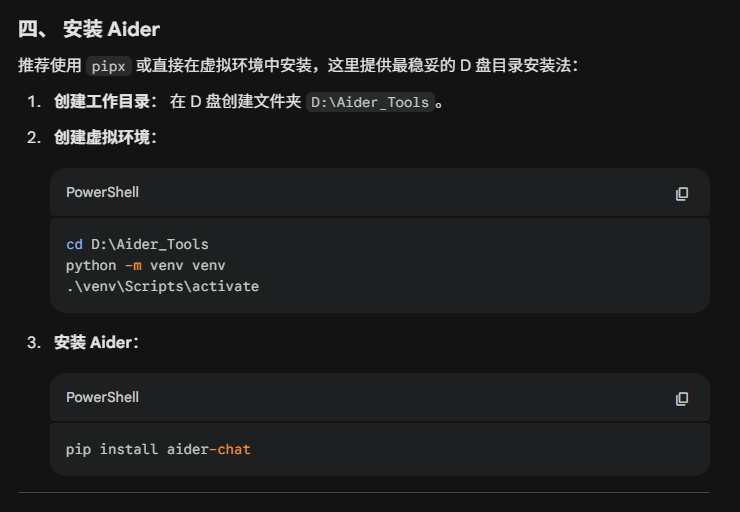

# UM890 Pro 本地部署 Aider + Ollama 详细指南

本教程专为 **Minisforum UM890 Pro** (AMD Ryzen 9 8945HS / 32G RAM / Radeon 780M) 编写。


## 一、 硬件层：BIOS 显存优化 (核心步骤)
由于 Aider 调用模型需要较大的显存空间，必须手动调整核显占用。

1. **进入 BIOS**：开机连续敲击 `Del` 键。
2. **路径**：`Advanced` -> `AMD CBS` -> `NBIO Common Options` -> `GFX Configuration`。
3. **设置**：
   - `iGPU Configuration` -> 修改为 **UMA_Specified**。
   - `UMA Frame Buffer Size` -> 修改为 **8G** (若不运行大型 3D 游戏，可设为 **16G**)。
4. **保存**：按 `F10` 保存并重启。


## 二、 系统层：软件环境安装
建议所有大型工具和模型文件均安装在 **D 盘**，以保护 C 盘空间。

### 1. 基础工具
* **Git**: [官方下载](https://git-scm.com/download/win) (Aider 依赖 Git 进行代码审计)。
* **Python 3.11/3.12**: [官方下载](https://www.python.org/downloads/windows/) (安装时**必须勾选** "Add Python to PATH")。

### 2. Ollama 服务端
1. 下载安装 [Ollama for Windows](https://ollama.com/)。
2. **将模型存入 D 盘** (可选)：
   - 右键“此电脑” -> 属性 -> 高级系统设置 -> 环境变量。
   - 在“用户变量”中新建：
     - 变量名：`OLLAMA_MODELS`
     - 变量值：`D:\OllamaModels` (需手动创建该目录)。
3. 重启 Ollama。


## 三、 模型层：下载指定模型
在 PowerShell 中输入以下命令，下载为您挑选的 Q4 量化版模型：

```powershell
# 下载 Qwen2.5-Coder 14B (目前 14B 编程最强)
ollama pull qwen2.5-coder:14b

# 下载 DeepSeek-Coder-V2 Lite 16B (擅长逻辑分析)
ollama pull deepseek-coder-v2:16b-lite-instruct-q4_K_M
```


