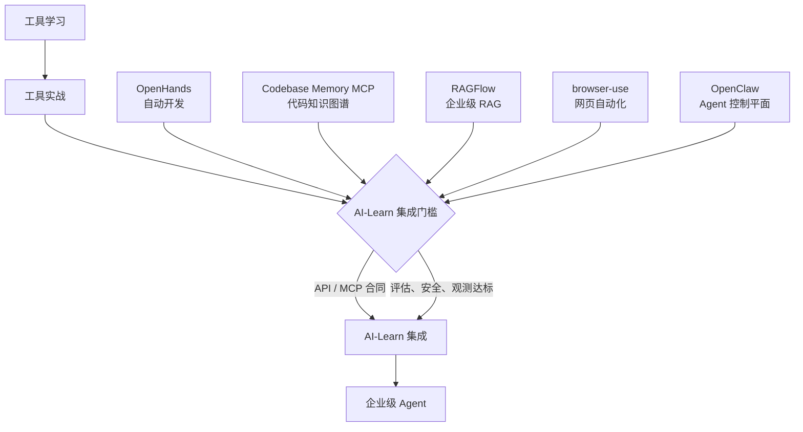

# AI-Learn 未来集成路线

> 当前假设：AI-Learn 会保留稳定的业务 API，外部 Agent 和工具通过有界接口集成，不直接共享数据库凭证或无限制 Shell 权限。

## 完整成长路径

## 集成顺序

| 阶段 | 工具 | 作用 | 当前状态 | 集成时间 |
| --- | --- | --- | --- | --- |
| 第一阶段 | OpenHands | 自动开发助手 | 学习中 | 待定 |
| 第二阶段 | Codebase Memory MCP | 代码知识图谱 | 未开始 | 待定 |
| 第三阶段 | RAGFlow | 企业级 RAG | 未开始 | 待定 |
| 第四阶段 | browser-use | 网页自动化 | 未开始 | 待定 |
| 第五阶段 | OpenClaw | 多 Agent 平台与控制平面 | 学习中 | 待定 |

## 第一阶段：OpenHands

- 先以独立测试仓库建立任务合同、Docker 沙箱和测试验收基线。
- 集成形态：AI-Learn 创建有界任务，OpenHands 在隔离分支/工作树中执行，Codex 或人工复核。
- 通关条件：修改范围可限制、测试可重复、失败可回滚。

## 第二阶段：Codebase Memory MCP

- 先以只读 MCP 工具集成，建立 AI-Learn 架构、符号和调用链地图。
- 集成形态：Codex/OpenHands 调用 MCP，AI-Learn 业务服务仍通过稳定 API 对外提供能力。
- 通关条件：图查询结果能与源码抽查对齐，索引可刷新，超时与错误可观测。

## 第三阶段：RAGFlow

- 建立 AI-Learn 文档语料、切块策略、混合检索和引用机制。
- 集成形态：AI-Learn 通过受认证 API/MCP 获取上下文，不让 Agent 直接读取底层存储。
- 通关条件：Recall@5、引用正确率和忠实度达到预设基线，支持文档删除与权限过滤。

## 第四阶段：browser-use

- 先实现公开站点只读采集和 AI-Learn Web 测试。
- 集成形态：域名白名单、测试账号、人工审批与截图/操作日志。
- 通关条件：任务成功率可测，越域和写操作被技术性拒绝，超时可停止。

## 第五阶段：OpenClaw

- 在前四个能力接口稳定后，再评估用 OpenClaw 做多 Agent 控制平面。
- 集成形态：有限 workspace、模型路由、MCP 工具白名单、不可逆操作的人工批准。
- 通关条件：子 Agent 合同、超时/重试、幂等性、审计日志和成本计量全部可验证。

## 企业级集成门槛

1. **合同**：输入/输出 schema、错误码、超时、重试和版本策略明确。
2. **安全**：认证、授权、最小权限、密钥管理、提示注入防护和供应链检查完成。
3. **可靠性**：任务有幂等键、检查点、可回滚路径，高影响动作必须人工批准。
4. **观测性**：结构化日志、追踪、延迟、成功率、Token/成本与质量指标可查询。
5. **评估**：先有离线基线，再进行小流量在线验证，最后才扩大范围。
