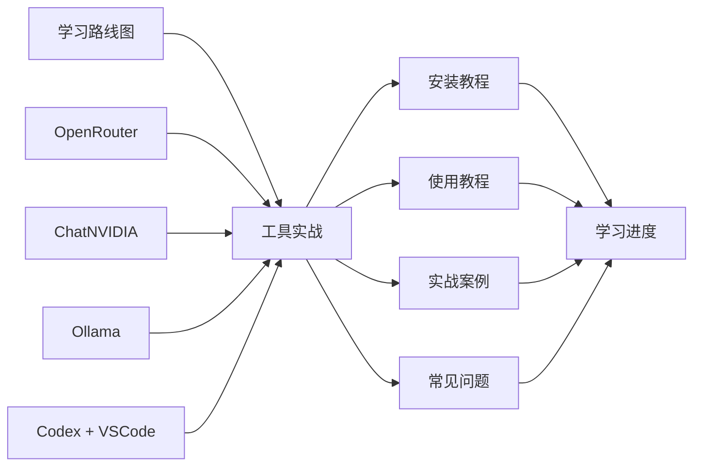

# GitHub AI 工具学习体系

> 建立日期：2026-06-29  
> 内容来源：[`github网站工具推荐_优化完整版.md`](github网站工具推荐_优化完整版.md)  
> 适用环境：Windows 11 + WSL Ubuntu + Docker Desktop + VSCode + Codex

## 一、学习目标

第一批聚焦五个工具：

| 工具 | 学习定位 | 主要成果 |
| --- | --- | --- |
| Codebase Memory MCP | 代码知识图谱与 MCP | 让 Codex 检索、理解和跟踪代码调用链 |
| browser-use | 浏览器 Agent | 用受限权限的 Agent 完成网页信息采集 |
| RAGFlow | RAG 知识库 | 完成文档导入、检索、问答和评估 |
| OpenHands | 软件开发 Agent | 在 Docker 沙箱内完成一个可验证的代码任务 |
| OpenClaw | 本地个人 AI 助手 | 运行 Gateway，配置模型、工具和安全边界 |

## 二、系统结构

## 三、目录入口

- [学习路线图](学习路线图/README.md)
- [工具实战](工具实战/README.md)
- [学习进度](学习进度/README.md)
- [公共环境与模型配置](学习路线图/公共环境与模型配置.md)
- [第一批学习路线](学习路线图/第一批学习路线.md)
- [新增工具模板](学习路线图/新增工具模板.md)

## 四、模型优先级

1. OpenRouter：优先用于学习和验证 Agent 完整能力。
2. ChatNVIDIA：OpenRouter 不可用或需要 NVIDIA 模型时使用。
3. Ollama `qwen2.5-coder:1.5b`：离线、低成本和简单任务备用。

`1.5b` 是小模型，适合连通性测试、简单代码和短文本。复杂工具调用、长任务规划和浏览器操作失败时，应切回 OpenRouter 或 ChatNVIDIA，不要首先怀疑安装环境。

## 五、维护规则

- 每个工具始终保留四篇文档：安装、使用、实战、常见问题。
- 命令不写死 `latest` 以外的版本；如必须锁定，记录版本、日期和升级原因。
- 密钥只通过环境变量或工具密钥库传递，不得写入 Markdown、Git 或截图。
- 每次学习后更新 `学习进度/总进度.md`，并保存一份学习记录。
- 教程变更前先查看官方 README、文档和 Release，不以旧视频作为唯一依据。

