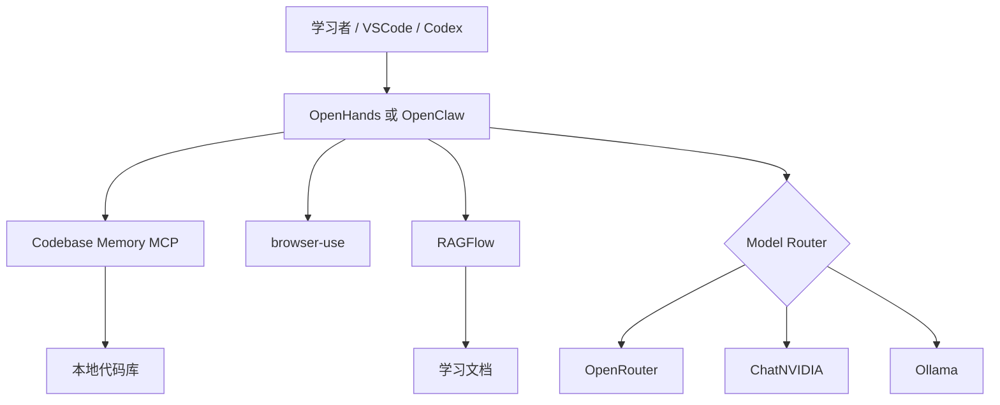

# 第一批学习路线

## 建议顺序

| 阶段 | 工具 | 建议时间 | 通关成果 |
| --- | --- | --- | --- |
| 0 | 公共环境 | 0.5–1 天 | WSL、Docker、VSCode、Codex 和三级模型可验证 |
| 1 | Codebase Memory MCP | 1–2 天 | Codex 能索引仓库并追踪调用链 |
| 2 | browser-use | 2–3 天 | 受限域名的浏览器采集任务成功 |
| 3 | RAGFlow | 3–5 天 | 完成小型知识库并记录检索评估 |
| 4 | OpenHands | 2–4 天 | 在沙箱内修改项目并通过测试 |
| 5 | OpenClaw | 3–5 天 | Gateway、模型、工具和最小权限配置完成 |
| 6 | 联合实战 | 3–7 天 | OpenClaw/OpenHands 调用 RAG 与 MCP，并生成可审计报告 |

## 每个阶段的固定循环

1. 安装：只验证端口、版本和健康状态。
2. 使用：完成最小可用操作，不急于添加插件。
3. 实战：选一个可重复、可评估、可回滚的任务。
4. 排错：至少主动演练一次密钥缺失、端口冲突或模型失败。
5. 记录：填写学习记录，更新总进度。

## 联合架构目标

## 不建议的学习方式

- 不要同时启动五个工具再排错。
- 不要用 `qwen2.5-coder:1.5b` 的复杂 Agent 成功率判断工具是否可用。
- 不要让 Agent 首次实战就操作主分支、真实账号、付费操作或敏感数据。

