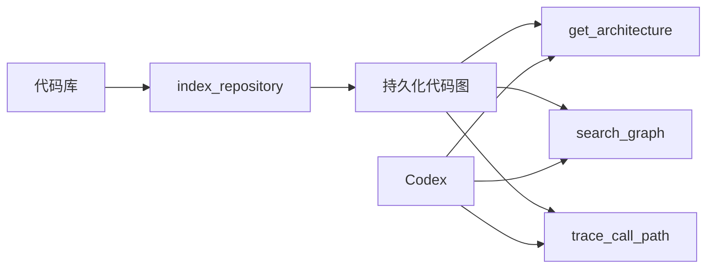

# Codebase Memory MCP 使用教程

## 核心流程



## 步骤 1：选择测试仓库

- **为什么做**：首次学习应使用体积小、结构清晰、没有敏感代码的仓库。
- **做什么**：在 WSL 中进入一个测试项目，用 VSCode 打开。
- **执行命令**：

```bash
cd ~/code/<your-test-repo>
git status
code .
```

- **预期结果**：`git status` 显示当前分支，VSCode 左下角显示 WSL。

## 步骤 2：让 Codex 索引仓库

- **为什么做**：所有架构查询都依赖先建立图索引。
- **做什么**：启动 Codex，明确要求调用 `index_repository`，并传入绝对路径。
- **执行命令**：

```bash
pwd
codex
```

在 Codex 中输入：

```text
请使用 codebase-memory 的 index_repository 索引当前仓库，然后用 index_status 告诉我节点数、边数和是否完成。不修改任何文件。
```

- **预期结果**：Codex 报告索引完成，节点和边数大于 0。

## 步骤 3：先看架构，再问细节

- **为什么做**：直接查某个函数容易缺失项目上下文。
- **做什么**：先调用 `get_architecture`，再用 `search_graph` 定位具体符号。
- **执行命令**：在 Codex 中输入：

```text
请先调用 get_architecture 生成仓库概览，再用 search_graph 找出入口函数和主要模块。结果按“入口、模块、外部依赖、高风险点”分类。
```

- **预期结果**：报告中的文件和符号可在 VSCode 中找到，且没有只凭文件名猜测。

## 步骤 4：追踪调用链

- **为什么做**：调用链能回答“改这个函数会影响谁”，比普通文本搜索更有价值。
- **做什么**：先用 `search_graph` 获得 qualified name，再调用 `trace_call_path`。
- **执行命令**：在 Codex 中输入：

```text
找到 <函数名> 的 qualified name，再用 trace_call_path 分别向上和向下追踪 3 层。列出每条边的文件位置，不修改代码。
```

- **预期结果**：输出包含调用者、被调用者和路径，手动抽查至少一条关系与源码一致。

