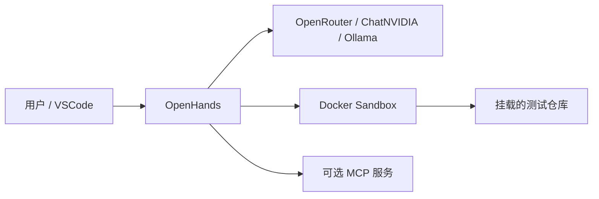

# OpenHands 使用教程

## 运行关系



## 步骤 1：选择模型

- **为什么做**：编码 Agent 对工具调用、长上下文和错误恢复要求高，模型能力会直接影响成功率。
- **做什么**：在 CLI 中按 `Ctrl+P` 打开 Settings，或在 GUI 打开 Settings > LLM，按下表配置。
- **执行命令**：

```bash
openhands
# CLI 内按 Ctrl+P -> Settings
```

| 顺序 | Custom Model | Base URL | API Key |
| --- | --- | --- | --- |
| OpenRouter | `openrouter/<当前模型-ID>` | 通常交由 provider 默认处理；高级模式可填 `https://openrouter.ai/api/v1` | OpenRouter Key |
| ChatNVIDIA | `openai/<build.nvidia.com-模型-ID>` | `https://integrate.api.nvidia.com/v1` | NVIDIA Key |
| Ollama | `openai/qwen2.5-coder:1.5b` | GUI 容器用 `http://host.docker.internal:11434/v1` | `ollama` 占位值 |

- **预期结果**：设置保存成功，发送“只回答 OK”能获得响应。

> `qwen2.5-coder:1.5b` 低于 OpenHands 官方对复杂本地 Agent 的推荐规模，仅用于连通性与小任务。

## 步骤 2：编写可验收的任务

- **为什么做**：“帮我优化项目”无法判断完成，也会扩大 Agent 修改范围。
- **做什么**：任务中写明目标、可修改文件、禁止项、验证命令和完成条件。
- **执行命令**：在 OpenHands 中输入：

```text
目标：在 src/calculator.py 增加 divide(a, b)。
范围：只允许修改 src/calculator.py 和 tests/test_calculator.py。
约束：b=0 时抛出 ValueError；不添加依赖。
验证：uv run pytest -q。
完成条件：新增正常和除零测试，全部测试通过，最后汇报 git diff --stat。
```

- **预期结果**：Agent 只修改允许的两个文件，并在结束前运行测试。

## 步骤 3：使用确认与暂停

- **为什么做**：Agent 可能对任务边界产生不同理解，初学阶段不应全自动批准。
- **做什么**：保留默认确认模式，看到越界动作时按 `Esc` 暂停并改写任务。
- **执行命令**：

```bash
openhands
# 运行中按 Esc 暂停，Ctrl+Q 退出
```

- **预期结果**：用户可在写文件、安装依赖或执行高影响命令前介入。

## 步骤 4：用 VSCode 和 Codex 独立审查

- **为什么做**：让执行 Agent 自己评判自己的修改会引入盲点。
- **做什么**：OpenHands 结束后，在宿主用 VSCode 查看 diff，再让 Codex 仅审查不修改。
- **执行命令**：

```bash
git diff --check
git diff
codex review --uncommitted
```

- **预期结果**：可清楚区分“OpenHands 的实现”和“Codex 的审查意见”，再由人决定是否接受。

