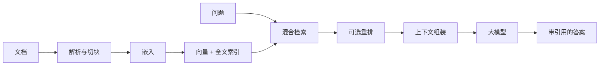

# RAGFlow 使用教程

## RAG 基线流程



## 步骤 1：配置生成模型

- **为什么做**：RAGFlow 只管理检索流程，仍需一个生成模型完成问答。
- **做什么**：打开 RAGFlow 的 Model Providers/Settings，按优先级添加 OpenRouter，失败时添加 ChatNVIDIA，最后添加 Ollama。
- **执行命令**：

```bash
explorer.exe http://localhost
ollama list
```

端点参数：

| Provider | Base URL | Key | Model |
| --- | --- | --- | --- |
| OpenRouter/OpenAI-compatible | `https://openrouter.ai/api/v1` | `OPENROUTER_API_KEY` | 支持当前任务的模型 ID |
| ChatNVIDIA/OpenAI-compatible | `https://integrate.api.nvidia.com/v1` | `NVIDIA_API_KEY` | build.nvidia.com 中的 Model ID |
| Ollama | 容器可达的 `http://host.docker.internal:11434` | 按 UI 要求填占位值 | `qwen2.5-coder:1.5b` |

- **预期结果**：RAGFlow 的模型连通性测试成功，密钥未写入仓库文件。

## 步骤 2：配置嵌入模型

- **为什么做**：生成模型和嵌入模型职责不同；`qwen2.5-coder:1.5b` 不能替代专用 embedding 模型。
- **做什么**：优先选择 OpenRouter/ChatNVIDIA 或 RAGFlow 当前支持的 embedding 服务；纯本地时额外安装 Ollama embedding 模型。
- **执行命令**：

```bash
ollama pull nomic-embed-text
ollama list
```

- **预期结果**：RAGFlow 中有一个已通过连通测试的 Chat Model 和一个独立 Embedding Model。

## 步骤 3：创建最小数据集

- **为什么做**：小语料容易手工判断检索是否正确。
- **做什么**：创建 `github-ai-learning` 数据集，选择 General/Markdown 类解析方式，上传 3–5 份本体系文档。
- **执行命令**：

```bash
mkdir -p ~/ragflow-lab-data
cp ~/code/<github-docs-repo>/github网站工具推荐_优化完整版.md ~/ragflow-lab-data/
explorer.exe "$(wslpath -w ~/ragflow-lab-data)"
```

- **预期结果**：文档上传后解析进度达到 100%，切块预览中可读到正确标题和段落。

## 步骤 4：先运行检索测试

- **为什么做**：如果检索不到正确块，再强的生成模型也无法给出有根据的答案。
- **做什么**：使用 Retrieval Test 输入 5 个已知答案的问题，记录 top-k 是否包含正确块。
- **执行命令**：

```bash
code ~/ragflow-lab-data/evaluation.md
```

- **预期结果**：得到基线 `Recall@5 = 命中问题数 / 5`，并记录未命中问题。

## 步骤 5：创建带引用的聊天助手

- **为什么做**：最终答案必须能追溯到检索文档，而不是只看语言是否流畅。
- **做什么**：将助手只绑定 `github-ai-learning` 数据集，提示词要求无证据时明确说不知道。
- **执行命令**：在助手中输入：

```text
根据知识库说明第一批学习工具有哪些，并为每项给出引用。如知识库没有证据，直接说“知识库中未找到”。
```

- **预期结果**：答案与原文一致，引用可点开并定位到相关块。

