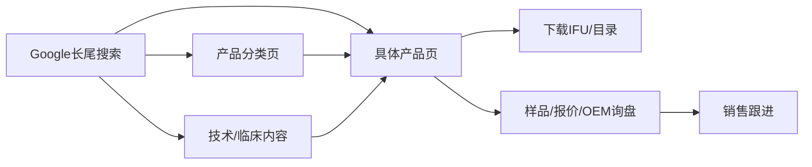

# ATBIO 官网 SEO 与海外询盘增长提案书（优化版）

版本：v1.2

制作日期：2026-06-29

对象网站：[ATBIO Dental Materials](https://www.atmbio.com/)

参考页面：[HVDIODE HSD-Series Axial Lead SiC High Voltage Diodes](https://cn.hvdiode.com/products/hsd-series-axial-lead-sic-high-voltage-diodes)

---

## 1. 提案结论

ATBIO 官网已经不是“没有 SEO 基础”的网站。根据 2026-06-29 对首页、产品集合页和代表性产品详情页的公开页面抽样检查，网站已经具备：

- 独立产品 URL；
- Title 与 Meta Description；
- Canonical；
- 英语、西班牙语、阿拉伯语、法语 hreflang；
- XML Sitemap 与 robots.txt；
- JSON-LD 结构化数据；
- 产品参数表；
- IFU 与产品目录下载；
- FAQ；
- 产品分类内部链接；
- OEM / ODM、样品、报价与经销合作说明。

因此，本项目不应再以“补齐基础标签”为唯一卖点，也不应直接承诺“自然流量增长 200%～300%”。

ATBIO 下一阶段更需要的是：

> 把现有网站从“产品资料展示站”升级为“产品关键词矩阵 + 技术内容矩阵 + 海外经销/OEM询盘”的持续获客系统。



---

## 2. 本次诊断范围与限制

本提案基于公开网页进行抽样诊断，检查范围包括：

- ATBIO 首页；
- ATBIO 产品集合页；
- ATBIO 代表性产品页 `Z250 Universal Restorative`；
- ATBIO robots.txt 与 sitemap.xml；
- 客户指定的 HVDIODE HSD-Series 产品页；
- 现有报价单中的服务内容与价格边界。

本次没有取得以下后台数据：

- Google Search Console；
- GA4；
- Google Tag Manager；
- CMS 后台；
- 服务器日志；
- 实际关键词排名与询盘归因数据。

因此，现阶段不能严谨判断自然流量、收录率、点击率和询盘率；下方综合评分只作为公开页面诊断与客户沟通工具，不作为流量实测结果。正式实施前应先建立数据基线。

### 2.1 ATBIO 与 HVDIODE SEO成熟度评分

为了让客户直观看到两站在“搜索入口建设成熟度”上的差距，本提案保留以下100分制相对评分：

| 项目 | ATBIO | HVDIODE |
|---|---:|---:|
| SEO基础结构 | 70 | 85 |
| 产品关键词覆盖 | 60 | 90 |
| 长尾关键词布局 | 45 | 88 |
| 产品详情页深度 | 50 | 92 |
| Blog引流能力 | 30 | 80 |
| 外链获取能力 | 55 | 75 |
| B2B询盘转化能力 | 75 | 85 |
| **综合评分** | **55～60** | **85～90** |

### 2.2 评分口径

该评分属于公开页面抽样后的提案诊断分，不是Google官方评分，也不是GSC、GA4或第三方流量平台的实测结果。

| 评分项 | 主要判断依据 |
|---|---|
| SEO基础结构 | Title、Description、Canonical、hreflang、Schema、Sitemap、robots及模板完整性 |
| 产品关键词覆盖 | 产品分类、产品型号、用途和采购意图对应的独立URL数量与层级 |
| 长尾关键词布局 | 材料、用途、规格、临床问题、采购问题和比较型搜索入口 |
| 产品详情页深度 | 全站产品页的规格、适应症、使用说明、FAQ、下载、内链和CTA覆盖一致性 |
| Blog引流能力 | 技术、临床、选型、采购及问题解决型内容，而不只是展会和公司新闻 |
| 外链获取能力 | 可被行业媒体、经销商、协会、合作伙伴和专业内容引用的资产基础 |
| B2B询盘转化能力 | 报价、样品、技术咨询、OEM/ODM和经销合作入口及其可追踪性 |

特别说明：ATBIO抽样的Z250产品页本身已有规格表、IFU、目录下载和FAQ。“产品详情页深度50分”评价的是全站产品页覆盖率、一致性、产品专属内容和关键词矩阵，而不是否定该单页已经完成的基础建设。

该评分用于确定优先级和向客户解释差距。项目启动后，应使用GSC、GA4、页面清单和询盘数据建立基线，再用实测KPI替代主观评分。

---

## 3. ATBIO 当前网站真实情况

### 3.1 已具备的优势

| 维度 | 已确认情况 | 价值 |
|---|---|---|
| 品牌定位 | 首页明确表达 Dental Materials Manufacturer、成立年份、认证与全球市场 | 有利于企业可信度与主题识别 |
| 产品矩阵 | 已有 Composite Resin、Adhesive、Cement、Orthodontics、3D Printing 等分类 | 具备扩展关键词矩阵的基础 |
| 多语言 | 英、西、阿、法版本及 hreflang | 有海外市场基础，但仍需逐语言质量检查 |
| 产品详情 | 抽样页面有描述、规格表、IFU、目录下载和 FAQ | 已接近B2B产品落地页基本形态 |
| 内部链接 | FAQ 和产品正文中存在分类、相关产品、OEM/ODM链接 | 有建立 Topic Cluster 的条件 |
| 技术SEO | Canonical、Schema、Sitemap、robots.txt 已存在 | 不需要从零建设 |
| 转化信息 | 已说明样品、报价、交期、经销合作与营销支持 | 已具备B2B询盘素材 |

### 3.2 当前更值得优先检查的问题

| 问题 | 公开页面观察 | 优化方向 |
|---|---|---|
| 页面标题偏品牌/型号 | 部分产品页 Title 只有产品名，未充分覆盖材料类型、用途和 Manufacturer/Supplier 意图 | 建立产品页标题公式与关键词映射 |
| 英文内容质量不稳定 | 抽样页存在拼写、空格、语句表达不自然等问题 | 进行专业英文编辑，不用批量直译 |
| FAQ复用程度可能偏高 | 抽样产品页 FAQ 大量回答公司通用问题 | 保留通用FAQ，同时补产品专属临床、规格和采购问题 |
| 分类页搜索意图不清晰 | 产品集合页可浏览产品，但需进一步确认每个分类页是否具备采购型内容深度 | 将分类页升级为关键词 Landing Page |
| 内容入口偏新闻型 | 首页 NEWS 主要为展会和公司动态 | 增加技术、选型、操作、对比、法规和采购内容 |
| 询盘归因未确认 | 公开页面能看到联系入口，但无法确认 GA4 是否记录产品、下载、表单事件 | 建立完整转化事件与月度漏斗 |
| 多语言规模较大 | 多语言本身不是排名保证，低质量翻译可能造成重复或低价值页面 | 按目标市场分批优化，不建议一次铺开所有语言 |

### 3.3 不应继续使用的旧判断

旧提案中“ATBIO缺少技术参数、FAQ、下载资料、产品详情深度”的表达过于绝对。抽样页面已经包含上述内容。

更准确的说法是：

> ATBIO 已有一批结构较完整的产品页，但需要检查覆盖率、一致性、英文质量、关键词映射和产品专属内容深度，不能用单个优秀页面代表全站，也不能把全站都判断为缺失。

### 3.4 既有项目源码与后台能力

结合 `web-projects/docs/atbio/` 中的历史实施资料和本地项目结构，可以进一步确认：

| 项目 | 已存在能力 | 对本次提案的影响 |
|---|---|---|
| 网站架构 | PHP CMS + MySQL + 模板系统 | 内容更新优先通过CMS，结构修改才进入模板代码 |
| SEO后台 | 可管理首页、栏目和产品的Title、Description等内容 | 不需要重新开发基础TDK后台 |
| SeoGeoPro | 已包含Meta、Canonical、hreflang、Open Graph、Twitter Card、Schema、面包屑、SEO诊断和GEO能力 | 本次应先审计、配置、验证，不能按“从零开发”重复报价 |
| GoogleTools | 已支持GTM注入与Search Console验证，GA4可通过GTM配置 | 本次重点是账号归属、配置正确性和事件验收 |
| 产品模板 | 已有面包屑、规格、IFU下载、产品目录和FAQ组件 | 优先提升内容质量、产品专属FAQ和转化事件 |
| 多语言数据 | CMS和数据结构已有多语言基础 | 需要验证语言对应、翻译质量和hreflang闭环 |
| 运维资料 | 已有CMS、模板、服务器、备份和发布说明 | 不应重复制作泛化教程，应补实际账号归属和验收清单 |

这意味着ATBIO当前最缺的不是SEO功能数量，而是：

1. 已有功能是否全部正确启用；
2. 各语言页面是否一一对应；
3. Schema数据是否真实、完整且符合Google规则；
4. 关键词是否与具体URL绑定；
5. 产品、下载和询盘事件是否进入数据分析；
6. 内容团队是否能持续发布产品与技术入口。

---

## 4. HVDIODE 的引流方式拆解

### 4.1 它不是靠一个产品页引流

客户给出的 HSD-Series 页面只是整个搜索入口体系中的一环。其路径表现为：

```text
High Voltage Diodes
→ SiC High Voltage Diodes
→ Axial Lead SiC High Voltage Diodes
→ HSD-Series具体产品页
```

这类结构同时覆盖：

- 大类词；
- 材料词；
- 封装/形态词；
- 型号词；
- 电压、电流、应用等规格长尾词。

### 4.2 代表性产品页的获客组件

| 组件 | HVDIODE页面表现 | 对ATBIO的启发 |
|---|---|---|
| 清晰H1 | 使用完整产品名称 | H1应同时说明产品名、材料和用途 |
| 多级面包屑 | 大类→材料→产品形态→型号 | 建立 Dental Materials→品类→用途→产品的层级 |
| 参数表 | 型号、电压、电流、封装等可扫描数据 | ATBIO应标准化规格、适应症、包装、颜色、固化方式等字段 |
| Product Schema | 产品名、SKU、图片、描述等结构化信息 | 对现有ATBIO Schema逐模板验证，不是重复安装插件 |
| 页面内询盘 | 页面顶部和正文附近均有 Get a Quote | 产品页应提供报价、样品、OEM/ODM三类明确CTA |
| 询盘表单 | 用户可在产品页直接提交需求 | 减少跳转，并记录来源产品URL |
| 分类内部链接 | 产品与多个系列/分类互相连接 | 建立相关产品、搭配产品和临床用途链接 |
| 多语言 | 同一产品覆盖多个语言市场 | 只在有市场和内容维护能力时扩展 |

### 4.3 HVDIODE 也不是全部照抄

参考对象同样存在可改善之处，例如抽样页 Meta Description 与产品名接近，内容表达和结构化评价信息仍需结合真实性、平台规则继续审核。

ATBIO 应学习其“关键词层级 + 产品矩阵 + 参数内容 + 页面内询盘”方法，而不是复制文案、URL或页面外观。

---

## 5. ATBIO 应采用的 SEO 获客模型

### 5.1 四层关键词结构

| 层级 | 页面类型 | 关键词示例 | 搜索意图 |
|---|---|---|---|
| L1 | 核心业务页 | dental materials manufacturer | 寻找厂家 |
| L2 | 产品分类页 | dental composite resin manufacturer | 寻找特定品类供应商 |
| L3 | 产品详情页 | nanohybrid composite resin 19 shades | 对比产品与规格 |
| L4 | 技术/采购内容 | how to choose dental composite resin | 学习、选型、评估供应商 |

### 5.2 五类建议内容

1. 产品分类 Landing Page：Composite Resin、Adhesive、Cement、Orthodontics 等。
2. 核心产品页：围绕规格、适应症、操作步骤、IFU、FAQ、相关产品深化。
3. 临床教育内容：操作流程、病例选择、常见错误、材料兼容性。
4. 经销/OEM内容：MOQ、样品、包装、认证、交期、市场支持、合作流程。
5. 对比与选型内容：材料类型、使用场景、产品差异和采购检查表。

### 5.3 页面转化路径

每个核心产品页至少设置以下可测量动作：

- Request a Quote；
- Request a Sample；
- Ask a Technical Question；
- Download IFU；
- Download Catalogue；
- OEM / ODM Inquiry；
- Distributor Partnership。

GA4/GTM需要分别记录事件，不能只统计页面访问量。

### 5.4 实施位置与责任边界

| 工作 | 实施位置 | 主要产物 |
|---|---|---|
| 产品标题、描述、参数、FAQ、文章 | CMS后台 | 页面内容和关键词映射 |
| Canonical、hreflang、Schema、OG | 现有SeoGeoPro配置与验证 | 配置表、验证结果、缺陷清单 |
| GSC、GTM、GA4 | 客户所有的Google账号 + 现有GoogleTools | 账号归属表、事件表、调试记录 |
| H标签、图片Alt、CTA、相关内容 | 页面模板或CMS字段 | 模板差异、代表URL验收 |
| 产品分类与技术内容 | CMS栏目与内容系统 | 分类Landing Page、产品页、文章 |
| 发布与回滚 | 私有源码副本、测试环境、生产环境 | 变更清单、备份记录、回滚方案 |

只有审计确认现有插件无法满足需求或存在缺陷时，才进入代码修改；不能把“验证已有功能”和“重新开发功能”同时收费。

---

## 6. 历史报价评审

原SEO基础优化报价可作为技术检查的参考，但根据现有系统能力，本次建议将预算重点从“新增SEO功能”调整为“现有功能验收 + 内容引流建设”。

| 原报价中需要进一步明确的项目 | 本地项目核查后的判断 | 最新处理 |
|---|---|---|
| 把Canonical、hreflang、Schema等列为新工作 | 现有SeoGeoPro已经包含这些能力 | 改为审计、配置、验证；缺陷修复另估 |
| 把GTM/GSC接入列为代码开发 | 现有GoogleTools已经具备注入和验证入口 | 改为客户账号配置与事件验收 |
| 没有内容数量 | HVDIODE式引流主要依赖分类、产品和技术内容矩阵 | 报价必须写明页面和文章数量 |
| 没有关键词与URL地图 | 无法判断每个页面服务哪个搜索意图 | 作为内容试点的必要交付物 |
| 没有测试和回滚 | PHP CMS与生产数据库直接修改风险较高 | 增加备份、测试、发布和回滚门禁 |
| Cloudflare和服务器迁移混入SEO | 可能影响DNS、SSL、邮件和稳定性 | 独立评估、独立确认、独立报价 |
| 年度维护和单次修改范围模糊 | 容易产生无限修改和成本争议 | 继续采用明确的包含项、排除项和最低委托金额 |

网站运用移交与管理资料整理可继续作为独立选配项；年度维护、单次修改和服务器迁移仍应与SEO增长项目分开。

---

## 7. 最新推荐报价方案

### 方案A：现有SEO系统审计、配置与验收

税前：¥100,000

| 工作 | 范围 |
|---|---|
| 现有功能盘点 | SeoGeoPro、GoogleTools、CMS SEO字段、模板、Sitemap、robots |
| 代表URL检查 | 最多20个URL，覆盖首页、分类、产品、文章和多语言样本 |
| 配置验证 | Canonical、hreflang、Schema、OG、面包屑、GTM/GSC/GA4 |
| 数据基线 | 建立收录、曝光、点击、自然访问和询盘事件基线 |
| 发布安全 | 备份、测试、变更清单、上线验证和回滚方案 |
| 输出 | 审计报告、配置表、缺陷表、验收记录、后续优先级 |

本方案不重新开发已有插件。发现插件缺陷、模板兼容问题或安全问题时，先提交影响与修复工时，再另行确认代码修改费用。

#### 方案A验收标准

- 提交现有SEO能力清单；
- 20个以内代表URL完成检查；
- 约定配置完成并通过页面源码或官方工具验证；
- Google账号归客户所有，服务方仅获得必要权限；
- GA4/GTM约定事件可在调试模式验证；
- 提交未解决问题、风险和后续报价建议。

---

### 方案B：HVDIODE式产品引流试点

税前：¥300,000

建议在现有系统审计完成后实施。

| 项目 | 数量 | 单价 | 小计 |
|---|---:|---:|---:|
| 关键词矩阵与URL地图 | 1式，约30组关键词 | ¥40,000 | ¥40,000 |
| 产品分类Landing Page深化 | 4页 | ¥30,000 | ¥120,000 |
| 核心产品页SEO深化 | 8页 | ¥12,500 | ¥100,000 |
| 技术/采购文章 | 4篇 | ¥10,000 | ¥40,000 |
| **合计** |  |  | **¥300,000** |

本方案属于试点阶段优惠组合。页面基于现有CMS模板制作，并以客户按时提供完整产品事实、认证、规格、IFU/SDS/Catalog和基础文案为前提。本报价包含SEO结构策划与英文优化，不包含从零撰写医学论文、专业翻译、平面设计或未经客户确认的医疗功效表达。

### 方案B交付成果

- 关键词分层表；
- 关键词与URL一一对应表；
- 4个产品分类入口；
- 8个高优先级产品页；
- 4篇技术/采购内容；
- 面包屑、相关产品、相关文章和询盘CTA联动；
- 页面上线清单及索引检查。

### 方案B验收标准

- 16个约定页面完成并上线；
- 每页有唯一主关键词、Title、Description和H1；
- 产品事实与客户确认资料一致；
- 每页至少连接相关分类、产品或技术内容；
- 产品页具备明确询盘或下载动作；
- 不以排名和流量作为当期制作验收条件。

---

### 方案C：上线后3个月SEO运营（可选）

税前：¥60,000/月 × 3个月 = ¥180,000

| 内容 | 频率 |
|---|---|
| GSC收录、曝光、点击和查询分析 | 每月 |
| GA4渠道、页面与转化事件分析 | 每月 |
| 重点关键词与落地页跟踪 | 每月 |
| Title、Description、内链小幅调整 | 每月 |
| 月度报告与下一月行动清单 | 每月 |

新页面、专业翻译、摄影、视频、复杂设计和程序开发不包含在运营费内。

---

## 8. 最新推荐组合

### 最低可行方案

方案A：¥100,000（税前）／¥110,000（含税）

适合确认已有插件和数据工具是否真正可用，并建立后续内容增长基线。它不是完整的引流方案。

### 推荐试点方案

| 内容 | 税前 |
|---|---:|
| 方案A：现有系统审计、配置与验收 | ¥100,000 |
| 方案B：产品引流试点 | ¥300,000 |
| **税前合计** | **¥400,000** |
| 消费税10% | ¥40,000 |
| **含税合计** | **¥440,000** |

该组合先验证现有系统，再建设可被搜索的内容入口，避免重复开发和重复收费。

网站管理移交资料整理如仍需实施，可另加税前 ¥15,000；加入后税前 ¥415,000，含税 ¥456,500。

### 6个月增长组合

方案A + 方案B + 方案C：

- 税前：¥580,000；
- 消费税10%：¥58,000；
- 含税：¥638,000。

如同时选择税前 ¥15,000 的管理移交，合计税前 ¥595,000，含税 ¥654,500。

前三个月完成基础与内容试点，后三个月依据真实搜索数据决定是否扩大产品页、技术文章或多语言市场。

---

## 9. 客户需要提供的资料

为保证关键词、产品事实、医疗表达和项目进度准确，客户需在内容制作开始前提供以下资料：

| 资料 | 用途 | 最低要求 |
|---|---|---|
| 产品规格表 | 生成产品页参数、型号和包装信息 | 可确认的最新版本 |
| 认证资料 | 支撑质量、合规和目标市场说明 | 明确适用产品与有效期 |
| IFU / SDS / Catalog | 支撑使用方法、安全信息和下载内容 | 文件名、语言和版本清晰 |
| 目标市场 | 决定语言、国家和搜索意图 | 至少明确优先国家/地区 |
| 重点产品 | 决定8个产品页的优先顺序 | 提供产品名称、型号和商业优先级 |
| OEM / ODM条件 | 制作经销、贴牌和合作内容 | MOQ、交期、包装、样品和支持范围 |
| 禁止使用的医疗功效表达 | 避免不合规或未经证实的宣传 | 由客户或法规负责人确认 |
| GSC / GA4 / GTM权限 | 建立数据基线和转化事件 | 使用客户拥有的账号授权 |
| 品牌与图片素材 | 页面制作和社交分享 | 有使用权的Logo、产品图、临床图和视频 |
| 审核负责人 | 确认内容、技术和合规 | 指定一名最终确认人 |

### 资料与进度规则

- 客户对产品规格、认证、医疗表述和素材使用权负责最终确认；
- 服务方不根据猜测补写产品功效、认证、适应症或临床结论；
- 资料缺失的页面暂停制作，不以占位内容直接上线；
- 客户反馈或资料延迟导致的排期顺延，不计为服务方交付延期；
- 超出约定页面数量、语言数量或发生大幅返工时，双方另行确认费用和工期。

---

## 10. 年度维护与单次修改建议

### 年度维护 ¥250,000/年

建议明确包含：

- CMS与插件/程序的安全更新检查；
- SSL、域名、备份和可用性检查；
- 每月最多2项简单文字或图片替换；
- 工作日2个营业日内首次响应；
- 每季度一次管理状态报告。

建议明确不包含：

- 新页面、新功能、新语言；
- SEO文章制作；
- 大规模版式调整；
- 第三方服务费；
- 服务器迁移；
- 紧急夜间或节假日处理。

### 单次修改 ¥2,000/项

建议仅适用于：

- 客户提供最终文字后的简单替换；
- 客户提供已处理图片后的单图替换；
- 单个PDF或链接替换；
- 不改变页面结构、程序和SEO策略的操作。

以下内容应另行报价：

- 图片设计或修图；
- 英文撰写、翻译、校对；
- HTML/CSS/JavaScript修改；
- 表单、模板、导航和布局修改；
- SEO标题、结构化数据或内部链接设计；
- 故障调查。

可设置每次委托最低金额 ¥5,000，避免沟通、备份、测试和发布成本高于作业费。

---

## 11. 日本服务器迁移建议

“服务器位于日本”不是单独的SEO排名保证。是否迁移应根据以下证据决定：

- 主要用户所在国家；
- Core Web Vitals与真实加载速度；
- 当前Hostinger稳定性和续费成本；
- CMS、数据库、邮件和备份依赖；
- 迁移停机窗口；
- DNS、SSL、CDN和回滚方案。

迁移前必须：

1. 完整备份；
2. 建立测试环境；
3. 保持URL不变；
4. 准备DNS与TTL计划；
5. 检查Canonical、Sitemap、robots与hreflang；
6. 准备回滚方案；
7. 上线后监控状态码、收录和表单。

服务器迁移建议继续保留“另行报价”。

---

## 12. KPI与效果说明

### 项目实施KPI

- 约定页面完成率；
- 技术问题关闭率；
- Sitemap提交与索引状态；
- GA4/GTM事件验证率；
- 产品页询盘与下载动作可用率；
- 关键词与URL映射完成率。

### 上线后观察KPI

- 非品牌自然搜索曝光；
- 有效关键词数量；
- 产品与分类页自然点击；
- IFU/目录下载；
- 报价、样品、OEM/ODM询盘；
- 自然搜索访问到询盘的转化率。

SEO效果受Google算法、竞争度、网站历史、内容质量、客户审批速度和持续更新影响。本项目不保证具体排名、流量百分比或询盘数量。

---

## 13. 建议实施顺序

| 周期 | 工作 | 主要成果 |
|---|---|---|
| 第1周 | 私有源码、备份、插件和账号审计 | 能力清单、风险清单、数据基线 |
| 第2周 | 现有SEO插件、GSC/GA4/GTM配置验证 | 配置表、事件表、验证记录 |
| 第3周 | 缺陷确认、发布测试与方案A验收 | 完成报告、遗留清单、回滚方案 |
| 第4周 | 关键词矩阵与页面选择 | 关键词-URL地图 |
| 第5～8周 | 4个分类页、8个产品页、4篇内容 | 16个搜索入口上线 |
| 后续3个月 | 数据观察与持续调整 | 月报与下一步扩展建议 |

---

## 14. 实施保障与风险管理

本地交付目录包含完整CMS、插件、模板、运行文件和部分安装/备份/配置类资料。此类资料必须继续作为客户私有资产管理。

| 风险 | 控制措施 |
|---|---|
| 客户源码或配置泄露 | 不上传公开GitHub，不在提案、邮件或聊天中记录账号密码和服务器入口 |
| 安装/备份/日志被公网访问 | 上线前检查Web访问权限并关闭不必要入口 |
| 直接修改生产环境 | 优先使用测试环境或测试副本，生产环境只发布已验证变更 |
| 模板或插件修改失败 | 修改前备份网站文件与数据库，保留变更清单和文件回滚方案 |
| 数据库变化无法恢复 | 涉及结构或内容批量变更前执行数据库备份并验证恢复方式 |
| SEO标签重复或冲突 | 检查CMS模板与SeoGeoPro输出，避免重复Title、Canonical或Schema |
| 多语言对应错误 | 按代表URL验证语言对应、Canonical与hreflang闭环 |
| 医疗表达或认证不准确 | 所有产品事实、功效和认证由客户最终审核 |
| 修改后无法评估效果 | 上线前建立GSC、GA4和GTM基线，保留发布日期与URL清单 |

实施门禁：

1. 确认客户授权与账号归属；
2. 确认资料完整性；
3. 完成文件和数据库备份；
4. 在测试环境验证；
5. 客户确认页面内容；
6. 按变更清单发布；
7. 检查页面、表单、下载、Schema和统计事件；
8. 保留回滚方案和上线记录。

---

## 15. 最终建议

1. 原SEO基础优化报价继续作为技术检查参考，并将预算重点平滑调整到现有功能验收与内容引流建设。
2. 先用税前 ¥100,000 审计、配置和验收现有SeoGeoPro、GoogleTools及代表页面，避免重复开发。
3. 真正的HVDIODE式引流预算放到关键词矩阵、分类页、产品页和技术内容，试点税前 ¥300,000。
4. 初期推荐组合为税前 ¥400,000、含税 ¥440,000；管理移交可另行选配。
5. 先用4个分类页、8个产品页和4篇内容做试点，根据GSC与询盘数据再扩大。
6. 所有代码修改必须经过私有版本记录、备份、测试、上线验证和回滚流程。
7. 删除“6个月流量提升200%～300%”等无基线承诺，改用制作物与数据监控验收。

一句话总结：

> ATBIO已经具备SEO技术底座；最新投入应先验证底座，再把主要预算用于关键词、产品内容和可追踪询盘，而不是重复购买已有功能。

---

## 16. 公开页面依据

- [ATBIO官网](https://www.atmbio.com/)
- [ATBIO产品集合页](https://www.atmbio.com/product-collection/)
- [ATBIO Z250 Universal Restorative产品页](https://www.atmbio.com/dental-composite-resins/nanofil-z250-universal-restorative-composite)
- [ATBIO robots.txt](https://www.atmbio.com/robots.txt)
- [ATBIO sitemap.xml](https://www.atmbio.com/sitemap.xml)
- [HVDIODE HSD-Series产品页](https://cn.hvdiode.com/products/hsd-series-axial-lead-sic-high-voltage-diodes)

## 更新记录

### v1.2（2026-06-29）

- 将原SEO基础报价改为技术检查参考，避免否定此前方案，并将预算重点转向现有功能验收与内容引流。
- 将方案B扩展为4个分类页、8个产品页和4篇技术/采购文章，明确试点优惠的资料与模板前提。
- 新增客户资料清单、审核责任、资料延迟和超范围返工规则。
- 将源码与发布治理内容移动到后部“实施保障与风险管理”。

### v1.1（2026-06-29）

- 根据ATBIO公开页面重新核实SEO现状，纠正“缺少参数、FAQ、下载和技术SEO基础”的过度判断。
- 删除无数据依据的网站评分与固定流量增长承诺。
- 拆解HVDIODE的分类、产品、长尾关键词和询盘转化路径。
- 评审现有¥181,500报价的优点、范围风险和改写方式。
- 增加技术SEO基础包、产品引流试点和3个月运营三档报价。
- 增加交付物、验收标准、排除项、维护边界和服务器迁移风险说明。
- 对照 `web-projects/docs/atbio/` 历史实施资料与本地项目结构，确认既有SeoGeoPro、GoogleTools、CMS多语言和产品模板能力。
- 将Canonical、hreflang、Schema、OG及GTM/GSC等从“重新开发”调整为“现有系统审计、配置与验收”。
- 增加私有源码、安装/备份/配置资料隔离、测试环境、版本记录和回滚门禁。
- 提出税前 ¥100,000 系统审计验收 + ¥300,000 内容引流试点的预算拆分，后续在v1.2中进一步调整为平滑衔接原报价。
- 恢复ATBIO与HVDIODE的SEO成熟度评分表，并补充评分口径、限制和产品详情页分数解释。
