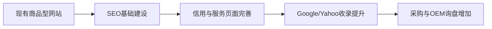
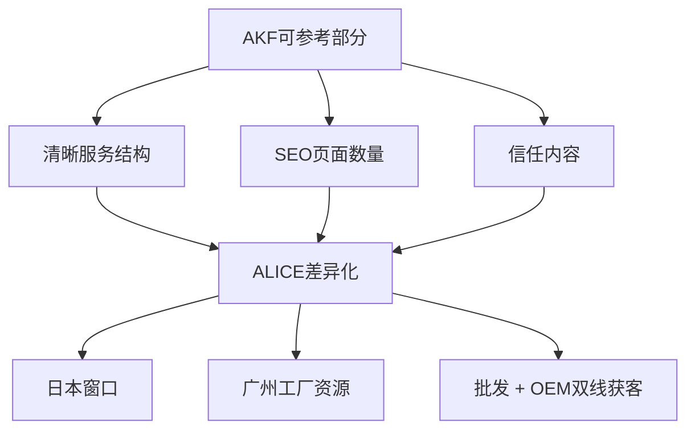
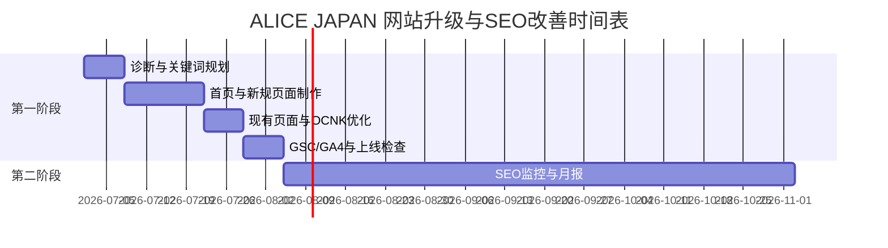

# ALICE JAPAN 网站升级与SEO改善提案书 v2.0

对象网站：ALICE JAPAN  
提案方向：面向日本市场的B2B采购与OEM/ODM询盘增长  
制作日期：2026年6月

---

## 1. 提案目标

本提案的目标不是单纯增加访问量，而是让日本客户在 Google / Yahoo Japan 搜索服装批发、アパレルOEM、アパレルODM、小ロット生産、中国縫製工場等关键词时，更容易找到 ALICE JAPAN，并提高询盘率。

本次建议重点：

| 目标 | 改善方向 | 客户能看到什么 |
|---|---|---|
| 提高搜索可见度 | 增加SEO页面、优化关键词、完善Title/Description | Google收录页面增加，关键词排名开始出现 |
| 提高信任感 | 增加会社概要、工場紹介、品質管理、FAQ等内容 | 网站更像专业B2B生产与采购平台 |
| 提高询盘率 | 优化首页、服务页、联系路径 | 客户更容易理解业务并提交咨询 |
| 建立长期增长机制 | SEO监控、GA4、Search Console | 每月可查看访问、排名、询盘变化 |

---

## 2. ALICE vs AKF 综合比较

以下为基于网站结构、SEO内容、信任表达、转化路径的综合评估。

| 项目 | ALICE JAPAN | AKF | 差距说明 |
|---|---:|---:|---|
| 网站定位清晰度 | 60 / 100 | 85 / 100 | ALICE目前批发、商品、OEM信息混合，核心业务不够突出 |
| SEO页面数量 | 55 / 100 | 88 / 100 | AKF更重视专题页面、服务页面、长尾关键词覆盖 |
| OEM/ODM内容深度 | 58 / 100 | 86 / 100 | ALICE需要补充流程、案例、FAQ、品质管理等内容 |
| 公司信任感 | 62 / 100 | 84 / 100 | AKF更容易让客户判断公司真实性与服务能力 |
| 转化路径 | 60 / 100 | 82 / 100 | ALICE需要强化咨询按钮、联系说明、服务导线 |
| 技术SEO基础 | 65 / 100 | 80 / 100 | ALICE需要完善Search Console、GA4、站内SEO设定 |
| 综合评分 | **60 / 100** | **84 / 100** | ALICE有业务基础，但需要网站结构与SEO内容升级 |

---

## 3. AKF成功因素与ALICE差异化策略

### AKF成功原因总结

| 成功因素 | 具体表现 | 对SEO的帮助 |
|---|---|---|
| 业务定位明确 | 清楚表达可承接的业务范围 | Google容易判断网站主题 |
| 服务页面充足 | 每个服务有独立页面 | 容易覆盖更多关键词 |
| 信任信息完整 | 公司、流程、案例、品质信息较清楚 | 提高日本客户咨询意愿 |
| 长尾关键词覆盖 | 面向具体需求制作内容 | 容易获得稳定自然流量 |
| 咨询路径清晰 | 页面中有明确行动入口 | 降低客户联系成本 |

### ALICE如何参考AKF，并做出差异化

ALICE不应简单复制AKF，而应利用自身优势做差异化：

| 参考AKF | ALICE差异化做法 |
|---|---|
| 学习其服务页面结构 | 强化“日本客户窗口 + 中国广州工厂 + 小批量对应” |
| 学习其SEO关键词布局 | 同时覆盖“批发采购”和“OEM/ODM生产委托”两类客户 |
| 学习其信任表达方式 | 增加工厂照片、品控流程、交易流程、FAQ、案例内容 |
| 学习其咨询导线 | 建立“首次咨询更容易”的页面与表单说明 |

---

## 4. 项目总预算

| 阶段 | 内容 | 金额 |
|---|---|---:|
| 第一阶段 | 网站基础建设、SEO基础优化、页面制作 | 标准价 648,000 日元 / 提案优惠价 **598,000 日元** |
| 第二阶段 | SEO监控与成长支持，3个月 | **150,000 日元** |
| 第三阶段 | 自由选配扩展项目 | 按选择项目另计 |
| 基础合计 | 第一阶段优惠价 + 第二阶段 | **748,000 日元** |

说明：第三阶段为自由选配项目，客户可逐项选择“要 / 不要”。

---

## 5. 第一阶段：网站基础建设

### 制作什么

第一阶段重点是把 ALICE JAPAN 从“商品展示型网站”升级为“B2B采购 + OEM/ODM询盘型网站”。

主要制作内容：

| 内容 | 说明 |
|---|---|
| 首页改版 | 明确展示批发、OEM、ODM、中国工厂、小批量生产等核心业务 |
| 新规SEO页面 | 制作アパレルOEM、ODM、小ロット、中国縫製工場等服务页面 |
| 现有页面修改 | 调整现有页面标题、说明、结构、内部链接 |
| 关键词规划 | 规划日本客户会搜索的核心关键词 |
| SEO诊断 | 检查当前网站结构、收录、页面标题、问题点 |
| OCNK SEO整体优化 | 优化OCNK后台可设置的SEO项目 |
| Search Console / GA4设置 | 建立后续监控基础 |

### 第一阶段预算明细

| 项目 | 数量 | 单价 | 小计 |
|---|---:|---:|---:|
| SEO诊断 | 1项 | 80,000 日元 | 80,000 日元 |
| 首页改版 | 1页 | 50,000 日元 | 50,000 日元 |
| 新规页面制作 | 10页 | 30,000 日元 / 页 | 300,000 日元 |
| 现有页面修改 | 10页 | 10,000 日元 / 页 | 100,000 日元 |
| 关键词规划 | 3个 | 20,000 日元 / 个 | 60,000 日元 |
| OCNK SEO整体优化 | 1项 | 40,000 日元 | 40,000 日元 |
| Search Console / GA4 设置 | 1项 | 18,000 日元 | 18,000 日元 |
| **标准价格合计** |  |  | **648,000 日元** |
| **提案优惠价** |  |  | **598,000 日元** |

### 交付成果

| 类型 | 交付内容 |
|---|---|
| 页面 | 首页改版、10个新规SEO页面、10个现有页面修改 |
| SEO | 关键词规划、Title/Description建议、内部链接建议 |
| 工具 | Google Search Console、GA4基础设置 |
| 报告 | 初期SEO诊断与改善完成说明 |

### 客户能看到什么

客户可以看到首页信息更清楚、服务页面更完整、OEM/ODM相关内容更容易理解，网站整体更像日本客户可以安心咨询的专业B2B网站。

### 预期效果

| 时间 | 预期变化 |
|---|---|
| 完成后1个月 | Google收录页面增加，网站主题更明确 |
| 1-3个月 | 部分长尾关键词开始出现排名 |
| 3个月以后 | OEM、ODM、批发采购相关询盘基础改善 |

### 验收标准

| 项目 | 验收标准 |
|---|---|
| 页面制作 | 约定页面完成并可正常访问 |
| 文案内容 | 主题清楚，包含目标关键词与服务说明 |
| SEO设定 | 主要页面具备Title、Description、H1等基础设置 |
| 工具设置 | Search Console / GA4完成基础连接 |

---

## 6. 第二阶段：SEO监控与成长

第二阶段为第一阶段上线后的3个月监控与调整。

### 预算

| 项目 | 数量 | 单价 | 小计 |
|---|---:|---:|---:|
| SEO监控与月度改善 | 3个月 | 50,000 日元 / 月 | **150,000 日元** |

### 制作什么

| 内容 | 说明 |
|---|---|
| 排名监控 | 跟踪重点关键词排名变化 |
| 收录监控 | 检查Google收录状况 |
| 访问分析 | 查看GA4访问、页面、来源 |
| 改善建议 | 每月提出下一步优化建议 |

### 交付成果

| 类型 | 交付内容 |
|---|---|
| 月度报告 | 关键词、访问、收录、问题点 |
| 调整建议 | 标题、内容、内部链接、下一批页面建议 |
| 会议说明 | 可按月进行简短说明与方向确认 |

### 客户能看到什么

客户可以每月看到网站访问、关键词、收录是否在改善，并知道下一步应该继续加强哪些内容。

### 预期效果

| 时间 | 预期变化 |
|---|---|
| 第1个月 | 确认收录与数据基础是否正常 |
| 第2个月 | 观察关键词变化，调整页面方向 |
| 第3个月 | 判断后续内容建设与询盘改善方向 |

### 验收标准

| 项目 | 验收标准 |
|---|---|
| 月报 | 每月提交1次SEO监控报告 |
| 数据 | 可查看Search Console与GA4基础数据 |
| 建议 | 每月提供可执行的改善建议 |

---

## 7. 第三阶段：自由选配扩展项目

第三阶段为可选项目，客户可根据预算与业务优先级选择“要 / 不要”。

| 选配项目 | 预算 | 是否选择 | 说明 |
|---|---:|---|---|
| OEM案例页面追加 | 30,000 日元 / 页 | 要 / 不要 | 用于展示真实制作案例，提高信任感 |
| FAQ页面追加 | 30,000 日元 / 页 | 要 / 不要 | 回答MOQ、交期、样品、支付、出货等问题 |
| 品质管理页面 | 30,000 日元 / 页 | 要 / 不要 | 展示检品流程、不良品处理、出货标准 |
| 工厂介绍页面 | 30,000 日元 / 页 | 要 / 不要 | 展示广州工厂、设备、生产能力 |
| 关键词追加规划 | 20,000 日元 / 个 | 要 / 不要 | 针对新业务或新产品继续扩展SEO关键词 |
| 新规专题页面 | 30,000 日元 / 页 | 要 / 不要 | 如ヨガウェアOEM、水着OEM、レディースOEM等 |
| AI客服 | 100,000 日元起 | 要 / 不要 | 需确认OCNK是否支持插件接入；如需独立开发则另行报价 |

### 制作什么

根据客户选择，追加案例、FAQ、信用增强、专题SEO页面或AI客服功能。

### 交付成果

| 项目类型 | 交付成果 |
|---|---|
| 页面类 | 对应页面文案、页面结构、SEO基础设置 |
| 关键词类 | 关键词表、页面布局建议 |
| AI客服类 | 接入可行性确认、功能范围说明、报价确认 |

### 客户能看到什么

客户可以看到网站内容更加完整，潜在客户能更快理解ALICE的生产能力、交易流程与服务优势。

### 预期效果

提升网站信任感、扩大长尾关键词覆盖，并为后续SEO增长提供更多内容入口。

### 验收标准

| 项目 | 验收标准 |
|---|---|
| 选配页面 | 页面上线并可正常访问 |
| SEO设置 | 页面具备基础SEO标题与说明 |
| AI客服 | 完成OCNK接入可行性确认；若可接入，按确认范围实施 |

---

## 8. 实施时间表

| 周期 | 工作内容 | 主要成果 |
|---|---|---|
| 第1周 | 资料确认、关键词规划、SEO诊断 | 明确页面清单与关键词方向 |
| 第2-3周 | 首页改版、新规页面制作 | 完成主要页面初稿 |
| 第4周 | 现有页面修改、OCNK SEO设置 | 完成基础SEO建设 |
| 第5周 | Search Console / GA4设置、检查 | 完成上线检查与初期数据准备 |
| 第2-4个月 | SEO监控与月度改善 | 每月报告与优化建议 |

---

## 9. 验收标准

| 阶段 | 验收项目 | 验收标准 |
|---|---|---|
| 第一阶段 | 页面制作 | 首页、10个新规页面、10个修改页面完成 |
| 第一阶段 | SEO基础 | 主要页面完成Title、Description、H1、关键词布局 |
| 第一阶段 | 工具设置 | Search Console / GA4基础设置完成 |
| 第一阶段 | OCNK优化 | OCNK可设置范围内完成SEO整体优化 |
| 第二阶段 | 月度监控 | 连续3个月提交SEO监控报告 |
| 第二阶段 | 改善建议 | 每月提供下一步可执行建议 |
| 第三阶段 | 选配项目 | 按客户选择项目逐项验收 |

补充说明：SEO属于中长期改善项目，排名与询盘会受到Google算法、竞争对手、客户资料完整度、内容更新频率等因素影响。本项目验收以约定制作物、设置项、报告与可执行建议为标准。

---

## 10. 最终目标

ALICE JAPAN具备真实业务基础、商品资源与中国广州工厂优势。当前最需要改善的是：网站定位、SEO页面数量、信任内容与咨询路径。

通过本次升级，目标是让ALICE JAPAN从“商品展示型网站”升级为：

> 面向日本客户的服装批发 + OEM/ODM生产委托获客网站

最终希望实现：

| 目标 | 结果 |
|---|---|
| 搜索排名提升 | 覆盖更多アパレルOEM、ODM、批发采购相关关键词 |
| 信任感提升 | 日本客户更容易判断公司真实性与生产能力 |
| 询盘率提升 | 客户更容易咨询批发、OEM、ODM、小批量生产 |
| 长期资产形成 | 网站内容持续积累，成为稳定获客渠道 |

建议优先执行第一阶段基础建设与第二阶段3个月SEO监控，再根据数据选择第三阶段扩展项目。
