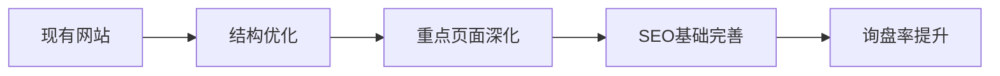
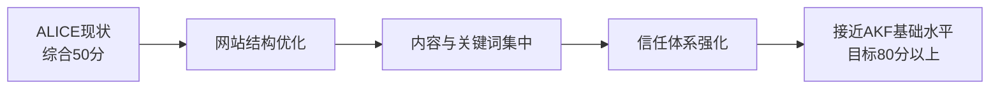
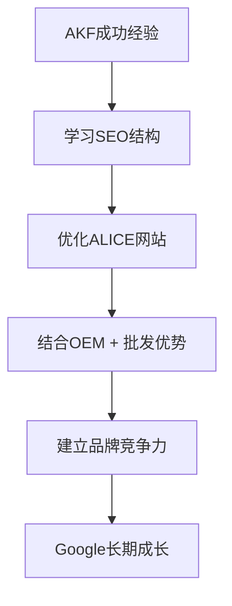
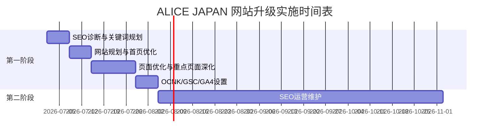

# ALICE JAPAN 网站升级与SEO改善提案书 v3.0

对象网站：ALICE JAPAN  
提案方向：网站结构优化 + SEO基础改善 + 询盘率提升  
制作日期：2026年6月

---

## 1. 提案目标

本提案面向日本客户，目标是将 ALICE JAPAN 从“商品展示型网站”优化为“采购 + OEM + ODM 询盘型网站”。

| 目标 | 改善方向 | 预期效果 |
|---|---|---|
| 提高搜索表现 | 优化网站结构、关键词、页面内容 | Google / Yahoo 更容易理解网站主题 |
| 提升专业形象 | 深化首页、OEM、ODM、工厂、品质等重点内容 | 浏览者更容易判断ALICE的服务能力 |
| 提高询盘率 | 优化咨询导线与服务说明 | 采购、OEM、ODM咨询更容易发生 |
| 建立长期基础 | 设置GA4、Search Console、SEO监控 | 后续可持续分析与改善 |

---

## 2. ALICE vs AKF 综合比较

### 先说结论

如果满分为100分，ALICE目前并不是OCNK技术本身落后，而是网站结构、内容、信任度和关键词策略需要系统优化。

| 项目 | ALICE | AKF |
|---|---:|---:|
| OCNK技术SEO | 70 | 75 |
| 商品销售SEO | 60 | 85 |
| OEM SEO | 45 | 90 |
| 信任体系 | 30 | 85 |
| Google理解度 | 50 | 95 |
| 关键词布局 | 40 | 90 |
| 内容营销 | 20 | 80 |
| **综合** | **50** | **88** |

### 主要差距

| 项目 | ALICE现状 | AKF优势 | 改善方向 |
|---|---|---|---|
| 网站主题 | 商品、批发、OEM信息分散 | Google容易理解网站主题 | 明确批发、OEM、ODM三条主线 |
| 页面内容 | 内容有基础，但深度不足 | 页面内容完整、信息密度高 | 深化重点服务页面 |
| 服务介绍 | 服务说明不够集中 | 服务介绍完整 | 明确流程、优势、适合客户 |
| 关键词布局 | 关键词分散 | SEO关键词布局集中 | 以核心关键词规划页面结构 |
| 企业信任 | 公司与工厂信息需强化 | 企业信任体系完善 | 强化工厂、品质、案例、FAQ |
| 转化路径 | 咨询动线可优化 | 行动入口清楚 | 强化联系入口与咨询说明 |

**总结：**  
ALICE并不是复制AKF，而是参考AKF成功经验，结合自身商品销售、OEM、ODM业务，建立更符合ALICE发展的SEO结构。

---

## 3. AKF成功因素与ALICE差异化策略

### AKF真正优势

| AKF优势 | 对网站的影响 |
|---|---|
| 页面内容完整 | 浏览者能快速理解服务范围 |
| 页面信息密度高 | Google更容易判断页面价值 |
| 服务介绍完整 | 客户更容易产生咨询意愿 |
| SEO关键词布局集中 | 关键词排名更容易积累 |
| 企业信任体系完善 | 降低日本客户的不安感 |
| Google容易理解网站主题 | 自然搜索表现更稳定 |

### ALICE差异化方向

| 参考AKF | ALICE应强化的差异化 |
|---|---|
| SEO结构 | 批发采购 + OEM + ODM 三线并行 |
| 服务页面 | 强化日本客户关心的流程、交期、MOQ、品质 |
| 信任体系 | 展示广州工厂、品质管理、日本语对应 |
| 商品基础 | 利用现有商品销售内容带动采购询盘 |
| 品牌表达 | 建立ALICE自己的专业形象，而非复制AKF |

---

## 4. ALICE优化策略

本次优化的核心不是复制AKF，而是学习AKF，将其成功结构转化为适合ALICE自身业务的SEO与网站架构。

| 优化重点 | 执行方向 |
|---|---|
| 网站结构 | 让Google明确理解ALICE主营业务 |
| 内容深化 | 优化现有内容，必要时补充页面 |
| 信任增强 | 强化公司、工厂、品质、FAQ、联系信息 |
| SEO基础 | 关键词、标题、描述、内部链接、监控工具 |
| 成交导向 | 让浏览者更快理解服务并提交咨询 |

---

## 5. 项目总预算

| 阶段 | 内容 | 金额 |
|---|---|---:|
| 第一阶段 | 网站基础建设：现有页面优化 + 重点服务页面深化 | **¥598,000** |
| 第二阶段 | SEO运营维护（3个月） | **¥150,000** |
| 第三阶段 | 网站功能扩展（可选） | 自由选择，另行计算 |
| **基础合计** | 第一阶段 + 第二阶段 | **¥748,000** |

---

## 6. 第一阶段：网站基础建设

### 制作内容

第一阶段不是重新制作网站，而是在现有网站基础上进行“页面优化 + 重点页面深化”。这里的页面优化属于大量修改，不是简单修改标题或文字，而是重构页面信息、强化服务说明、提升到接近或超过AKF同类页面的信息完整度。

| 类别 | 内容 |
|---|---|
| 网站整体规划 | 调整网站信息结构、服务分类、SEO方向 |
| 首页整体改版 | 明确批发、OEM、ODM、工厂优势与咨询入口 |
| 现有页面优化 | 大幅优化标题、说明、内容结构、服务表达、内部链接 |
| 重点服务页面深化 | 深化OEM、ODM、工厂介绍、品质管理等内容，信息完整度达到或超过AKF同类页面 |
| SEO基础设置 | OCNK SEO、Search Console、GA4、关键词规划 |

重点页面深化范围示例：

| 页面 | 优化方向 |
|---|---|
| 首页 | 清楚表达ALICE主营业务与优势 |
| OEM介绍 | 说明可对应品类、流程、MOQ、交期 |
| ODM介绍 | 说明企划、样品、量产支持 |
| 工厂介绍 | 展示广州工厂、生产能力、对应范围 |
| 品质管理 | 展示检品流程、出货标准、不良品处理 |
| FAQ | 回答日本客户常见疑问 |
| 公司介绍 | 提升企业真实性与信任感 |
| 联系我们 | 简化咨询路径，明确回复方式 |

### 第一阶段预算

| 项目 | 数量 | 单价 | 小计 |
|---|---:|---:|---:|
| SEO诊断 | 1 | ¥80,000 | ¥80,000 |
| 首页整体改版 | 1 | ¥50,000 | ¥50,000 |
| 现有页面优化（大量修改） | 10页 | ¥10,000 | ¥100,000 |
| 重点服务页面深化（OEM、ODM、工厂介绍等，达到或超过AKF同类页面信息完整度） | 4页 | ¥30,000 | ¥120,000 |
| 关键词规划 | 6个 | ¥20,000 | ¥120,000 |
| OCNK整体SEO优化 | 1式 | ¥40,000 | ¥40,000 |
| Search Console / GA4 | 1式 | ¥18,000 | ¥18,000 |
| 网站整体规划与架构优化 | 1式 | ¥70,000 | ¥70,000 |
| **标准价格** |  |  | **¥598,000** |

### 交付成果

| 类型 | 交付内容 |
|---|---|
| 页面优化 | 首页、现有页面、重点服务页面的大幅内容修改与结构优化 |
| SEO基础 | 关键词规划、标题/描述建议、内部链接建议 |
| OCNK设置 | OCNK可设置范围内的SEO整体优化 |
| 数据工具 | Search Console / GA4基础设置 |
| 报告 | 初期诊断与实施完成说明 |

### 预期效果

| 项目 | 预期效果 |
|---|---|
| Google理解 | 网站主题更集中，批发/OEM/ODM方向更清楚 |
| 浏览者体验 | 更容易了解OEM、ODM及采购服务 |
| 信任度 | 提升网站专业形象及企业可信度 |
| 询盘 | 提高咨询按钮、联系页面、服务说明的转化效率 |

### 验收标准

| 项目 | 标准 |
|---|---|
| 页面优化 | 约定页面完成大幅修改，内容完整度接近或超过AKF同类页面，并可正常访问 |
| 重点页面深化 | 4个重点服务页面完成内容深化 |
| SEO基础 | 主要页面完成基础SEO设定 |
| 数据工具 | Search Console / GA4完成基础连接 |

---

## 7. 第二阶段：SEO运营维护（3个月）

第一阶段上线后，建议进行3个月SEO运营维护，用数据确认改善方向。

### 预算

| 项目 | 单价 | 周期 | 合计 |
|---|---:|---:|---:|
| SEO运营维护 | ¥50,000 / 月 | 3个月 | **¥150,000** |

### 运营内容

| 内容 | 说明 |
|---|---|
| Google排名监控 | 跟踪重点关键词在Google的变化 |
| Yahoo排名监控 | 跟踪Yahoo Japan搜索表现 |
| Search Console分析 | 分析曝光、点击、关键词、收录 |
| GA4分析 | 分析访问来源、页面表现、用户行为 |
| 关键词调整 | 根据数据调整关键词重点 |
| 页面微调 | 对标题、描述、内部链接进行小幅优化 |
| 每月SEO报告 | 每月提交一次报告与改善建议 |

### 预期效果

| 阶段 | 预期效果 |
|---|---|
| 第1个月 | 确认收录、访问、关键词基础数据 |
| 第2个月 | 观察关键词变化并微调页面 |
| 第3个月 | 判断后续SEO扩展方向 |

### 验收标准

| 项目 | 标准 |
|---|---|
| 月度报告 | 连续3个月提交SEO报告 |
| 数据分析 | 每月分析Search Console与GA4 |
| 改善建议 | 每月提出可执行优化建议 |

3个月结束后，客户可自由决定：继续合作、暂停，或交由其他公司维护。

---

## 8. 第三阶段：网站功能扩展（可选）

第三阶段为自由选配项目，不固定预算。所有项目均可按需要选择。

| 项目 | 价格 |
|---|---:|
| Landing Page | ¥30,000 / 页 |
| OEM案例 | ¥30,000 / 页 |
| FAQ追加 | ¥30,000 / 页 |
| 工厂介绍强化 | ¥30,000 / 页 |
| 多语言页面 | ¥30,000 / 页 |
| Google Merchant Center | ¥50,000 |
| Google Business Profile | ¥30,000 |
| AI客服（插件方案） | ¥100,000 起 |
| AI客服（独立开发） | 另行报价 |

AI客服说明：需确认OCNK是否支持插件接入。若需独立开发，则另行报价。

### 预期效果

| 类型 | 预期效果 |
|---|---|
| 页面扩展 | 增加关键词入口与服务说明深度 |
| 案例/FAQ | 提升信任度，减少客户咨询前的不安 |
| Google工具 | 强化商品与本地搜索曝光 |
| AI客服 | 提升咨询响应速度与用户体验 |

### 验收标准

| 项目 | 标准 |
|---|---|
| 页面类 | 按选择项目完成并上线 |
| Google工具 | 完成基础设置或资料提交 |
| AI客服 | 先确认OCNK接入可行性，再确定实施范围 |

---

## 9. 实施时间表

| 时间 | 内容 | 成果 |
|---|---|---|
| 第1周 | SEO诊断、资料确认、关键词规划 | 明确优化方向 |
| 第2周 | 网站整体规划、首页结构优化 | 完成首页优化方向 |
| 第3-4周 | 现有页面优化、重点页面深化 | 完成主要页面优化 |
| 第5周 | OCNK SEO、Search Console、GA4 | 完成基础设置 |
| 第2-4个月 | SEO运营维护 | 每月报告与页面微调 |

---

## 10. 验收标准

| 阶段 | 验收项目 | 标准 |
|---|---|---|
| 第一阶段 | 网站结构 | 完成整体规划与架构优化 |
| 第一阶段 | 页面优化 | 现有页面优化与重点页面深化完成 |
| 第一阶段 | SEO基础 | 关键词、标题、描述、内部链接基础优化完成 |
| 第一阶段 | 数据工具 | Search Console / GA4基础设置完成 |
| 第二阶段 | 运营维护 | 连续3个月SEO监控与月度报告 |
| 第三阶段 | 可选项目 | 按客户选择项目逐项验收 |

说明：SEO属于中长期改善项目，排名会受到Google算法、竞争对手、内容更新、网站运营等因素影响。本项目以约定制作物、设置项、报告与改善建议作为验收标准。

---

## 11. 最终目标

| 阶段 | 目标 |
|---|---|
| 第一阶段 | 达到AKF的网站结构及SEO基础水平 |
| 第二阶段 | 逐步接近AKF的Google自然搜索表现 |
| 第三阶段 | 结合ALICE自身优势，建立区别于AKF的品牌竞争力，实现长期SEO成长 |

最终希望将 ALICE JAPAN 建设为：

> 面向日本客户的服装批发 + OEM / ODM 生产委托获客网站

通过网站结构优化、重点页面深化与持续SEO运营，ALICE可以逐步建立稳定的自然搜索流量与高质量询盘来源。
