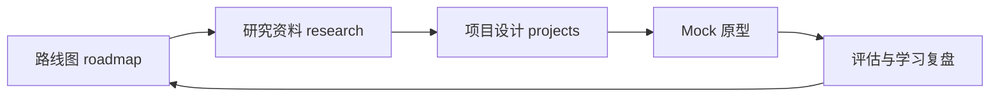

# 投资体系导航

## 体系目标

把分散的投资学习材料组织成一条可执行路径：先建立路线，再完成工具研究，最后进入项目实践。



纯文本流程：

```text
总体学习指南
  ↓
工具推荐与学习路线
  ↓
GitHub 开源项目研究
  ↓
企业级系统设计
  ↓
AI Investment Agent 实战
```

## 一、路线图入口

适合回答“我应该先学什么”。

- [完整版学习指南](roadmap/2026_AI投资研究系统_完整版学习指南.md)
- [开源工具推荐与学习路线](roadmap/2026_AI投资研究系统_开源工具推荐与学习路线.md)

## 二、研究入口

适合回答“有哪些工具，哪些值得深入”。

- [GitHub 开源项目大全](research/2026_AI投资研究系统_第三册_GitHub开源项目大全.md)

研究时建议记录：

- 项目解决的问题。
- 数据来源与许可证。
- 是否支持日本股票。
- 学习成本与维护状态。
- 是否适合接入 AI-Learn 或 Stock Agent。

## 三、未来项目入口

适合回答“怎样把研究变成可运行项目”。

- [企业级开发手册](projects/2026_AI投资研究系统_第二册_企业级开发手册.md)
- [AI Investment Agent 实战开发](projects/2026_AI投资研究系统_第四册_AI_Investment_Agent实战开发.md)

建议先做只读 Mock 原型，再逐步增加公开数据和评估能力。不要直接接入自动交易，也不要把真实账户凭据写入项目。

## 四、与当前项目的衔接

当前可把 `ai-lab/stock-agent` 作为最小实验项目：

1. 使用 Mock 数据验证输入到 Markdown 报告的流程。
2. 从 `research/` 选择一个公开数据工具做离线调研。
3. 从 `projects/` 提取模块设计，但不一次性实现全部功能。
4. 保留“只做研究辅助、不提供投资指令”的安全边界。

## 五、维护入口

- 完整分类清单：[INDEX.md](INDEX.md)
- 目录说明：[README.md](README.md)
