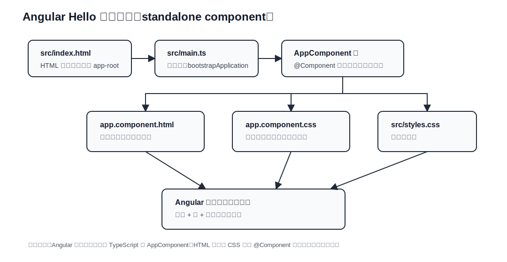

# Angular Hello 学习说明

## Angular 处理流程图（当前项目）

下面是 `angular_hello` 的当前处理流程图（静态 SVG，兼容 GitHub / IDEA Markdown 预览）：



### 当前文件分层说明

| 文件 / 位置 | 分层 | 主要功能 | 学习重点 |
| --- | --- | --- | --- |
| `src/index.html` | HTML 宿主层 | 提供 `<app-root></app-root>` 挂载点 | Angular 组件最终会渲染到宿主标签里 |
| `src/main.ts` | 应用入口层 | 调用 `bootstrapApplication(AppComponent)` 启动应用 | 理解 Angular 应用从哪里启动 |
| `src/app/app.component.ts` | 根组件类 / 元数据层 | 定义 `AppComponent` 类，并用 `@Component` 绑定 selector、模板、样式 | Angular 的类组件与装饰器写法 |
| `src/app/app.component.html` | 模板层 | 编写页面 HTML 结构 | 组件视图和组件类分离 |
| `src/app/app.component.css` | 组件样式层 | 编写当前组件的局部样式 | 样式跟随组件组织 |
| `src/styles.css` | 全局样式层 | 编写影响整个应用的基础样式 | 区分全局样式和组件样式 |
| `angular.json` | CLI 配置层 | 配置构建入口、样式、资源和开发服务器 | 理解 Angular CLI 如何构建项目 |

### 后续扩展分层建议

| 建议目录 / 文件 | 分层 | 适合放什么 |
| --- | --- | --- |
| `src/app/components/` | 通用组件层 | `ButtonComponent`、`CardComponent`、`HeaderComponent` 等可复用组件类 |
| `src/app/pages/` | 页面组件层 | `HomeComponent`、`AboutComponent`、`DemoComponent` 等页面级组件 |
| `src/app/services/` | 服务层 | API 请求、业务数据封装、跨组件共享逻辑 |
| `src/app/models/` | 类型模型层 | `User`、`Product`、`ApiResult` 等接口或类型 |
| `src/app/routes.ts` | 路由层 | 页面路径和组件映射 |

### 一句话理解

```text
index.html 提供 app-root -> main.ts 启动 Angular -> AppComponent 类绑定模板和样式 -> 浏览器渲染页面
```
