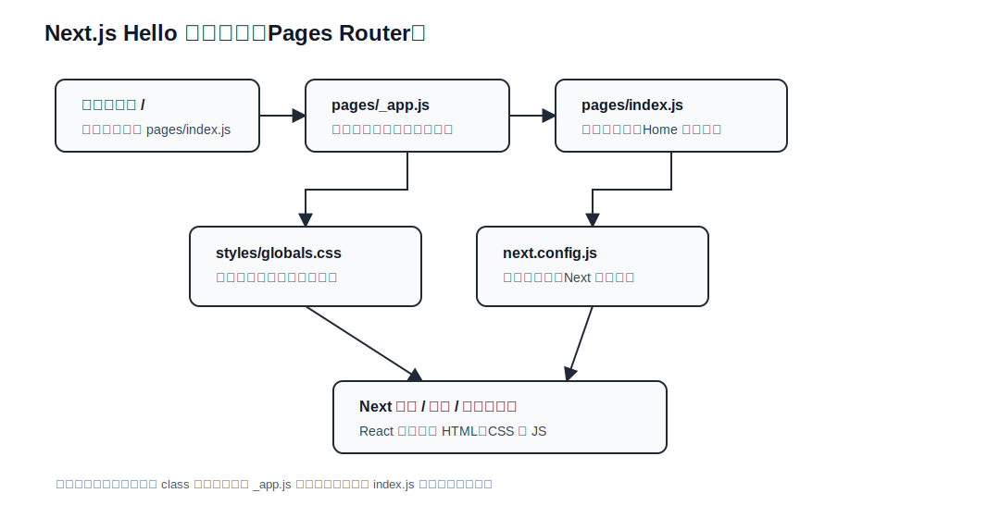

# Next.js Hello 学习说明

## Next.js 处理流程图（当前项目）

下面是 `next_hello` 的当前处理流程图（静态 SVG，兼容 GitHub / IDEA Markdown 预览）：



### 当前文件分层说明

| 文件 / 位置 | 分层 | 主要功能 | 学习重点 |
| --- | --- | --- | --- |
| `pages/index.js` | 页面路由层 | `/` 路径对应的页面组件，导出 `Home` 函数组件 | Pages Router 中文件即路由 |
| `pages/_app.js` | 应用包装层 | 包裹所有页面，并导入全局样式 | 全局布局、全局样式通常从这里进入 |
| `styles/globals.css` | 全局样式层 | 定义页面基础样式、布局和文字外观 | Next.js 全局 CSS 入口 |
| `next.config.js` | 框架配置层 | 配置 Next.js 行为 | 理解框架默认配置和扩展点 |
| `package.json` | 工程脚本层 | 定义 `dev`、`build`、`start` | 区分开发服务器、生产构建、生产启动 |

### 后续扩展分层建议

| 建议目录 / 文件 | 分层 | 适合放什么 |
| --- | --- | --- |
| `components/` | 通用组件层 | `Button`、`Card`、`Layout` 等可复用 React 组件 |
| `pages/about.js` | 页面路由层 | 新增 `/about` 页面 |
| `lib/` | 服务与工具层 | API 请求、数据转换、通用函数 |
| `styles/*.module.css` | 组件样式层 | 页面或组件专属样式 |
| `types/` | 类型层 | 迁移 TypeScript 后放共享类型定义 |

### 一句话理解

```text
浏览器访问 / -> Next 匹配 pages/index.js -> _app.js 包装页面并加载全局样式 -> 渲染 HTML、CSS、JS
```
