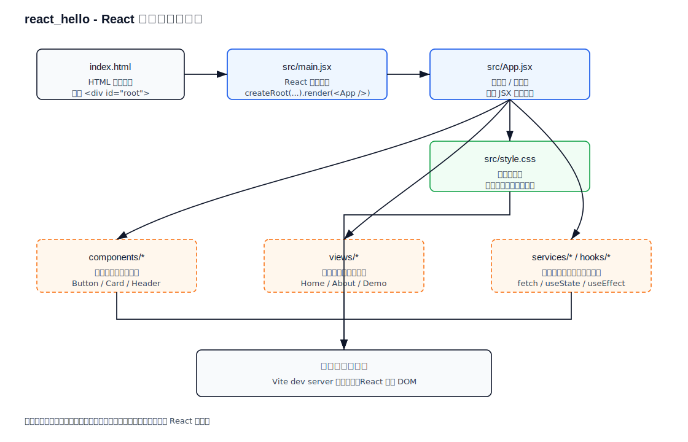

**学习路径与分步完善（react_hello）**

- **目标概述**: 通过实践把 `react_hello` 从入门示例逐步扩展为可用的学习项目，掌握项目结构、路由、状态管理、API 调用、测试与部署。

**步骤总览**
- **1. 运行并确认项目可用**: 在本地启动开发服务器并确认页面可访问。
  - 操作命令：
    ```bash
    cd web-projects/examples/react_hello
    npm install
    npm run dev
    ```
  - 若出现二进制依赖/平台不匹配错误：
    ```bash
    rm -rf node_modules package-lock.json
    npm install
    ```
  - 验证方法：浏览器打开 Vite 提示地址（例如 http://localhost:5173），看到页面渲染且无严重报错。

- **2. 阅读并记录项目结构与关键文件**
  - 目标：理解入口、路由、组件与静态资源分布。
  - 重点查看：`package.json`、`src/App.jsx`、`src/index.js`（或 `main.jsx`）、`src/components/`、`public/`。
  - 输出：在项目根或 docs 中写一段简短的目录说明（见本仓 `project-structure.md` 或本 `LEARN.md`）。

- **3. 为 `src/App.jsx` 添加中文注释并理解工作流程**
  - 目标：逐行注释关键函数、props 与 JSX 节点，形成笔记以便复查。
  - 操作：编辑 `src/App.jsx`，在函数体、重要变量与 JSX 上方添加中文说明。

- **4. 修复依赖并启动 dev server（必要时）**
  - 常见策略：删除 `node_modules` 与锁文件，确保 Node 版本兼容（使用 `nvm` 切换到 LTS），重装依赖。
  - 示例命令：
    ```bash
    nvm install --lts
    nvm use --lts
    npm ci
    npm run dev
    ```
  - 验证：无 `esbuild` / `rollup` 二进制错误，页面可正常热重载。

- **5. 添加路由并拆分视图（练习 `react-router`）**
  - 目标：把单页示例拆为多个路由页面（例如 Home、About、Demo）。
  - 操作：
    ```bash
    npm install react-router-dom
    ```
    在 `src` 下创建 `views/Home.jsx`、`views/About.jsx` 等，修改 `App.jsx` 使用 `BrowserRouter` 与 `Routes`。
  - 验证：点击导航能在不刷新页面下切换视图，URL 与视图匹配。

- **6. 引入状态管理（从 `useState` → `useReducer` → Context）**
  - 目标：掌握从局部状态到全局共享的进阶用法。
  - 练习：先用 `useState` 管理简单计数或表单，再将复杂逻辑迁移到 `useReducer`，最后以 `Context` 提供跨组件状态。

- **7. 模拟后端 API 并连接请求**
  - 目标：学会前端请求数据并处理加载/错误状态。
  - 可选工具：在前端使用 `msw`（Mock Service Worker）模拟 API，或在 `public/data.json` 提供假数据。
  - 示例：在组件中使用 `useEffect` + `fetch` 或 `axios` 请求并渲染结果。

- **8. （可选）迁移到 TypeScript，分步进行**
  - 目标：体验类型系统、提升可维护性。
  - 步骤：添加 `tsconfig.json`，把文件逐步从 `.jsx` 改为 `.tsx`，为 props、state 添加类型定义并修复类型错误。

- **9. 编写测试：单元与端到端**
  - 目标：引入 `Vitest` 做单元测试，引入 `Playwright` 或 `Cypress` 做 E2E。
  - 例子：为页面路由、主要组件写渲染断言与交互测试。

- **10. 打包、部署与性能优化**
  - 操作命令：
    ```bash
    npm run build
    npx serve dist
    ```
  - 验证：生产构建生成 `dist/`，静态服务器能正确托管并加载资源。

**每一步的验收标准（简要）**
- 本地能运行并访问项目（步骤1-4）
- 路由与导航工作正常（步骤5）
- 组件间共享状态可用且逻辑清晰（步骤6）
- 能成功从模拟或真实 API 获取并展示数据（步骤7）
- 项目能通过基础单元测试与至少一个 E2E 测试（步骤9）

**扩展任务与学习资源**
- 官方文档：React、React Router、Vite、ESBuild、Vitest。
- 推荐读物：React 官方教程、《深入浅出 React Hooks》、Vite 文档。

---

如需我现在开始其中一项（例如：直接为 `src/App.jsx` 添加中文逐行注释，或在本机运行并修复依赖），回复要执行的步骤名称，我会继续并把变更写回仓库。

---

## React 处理流程图（当前项目）

下面是 `react_hello` 的当前处理流程图（静态 SVG，兼容 GitHub / IDEA Markdown 预览）：



### 当前文件分层说明

| 文件 / 位置 | 分层 | 主要功能 | 学习重点 |
| --- | --- | --- | --- |
| `index.html` | HTML 宿主层 | 提供页面根节点 `<div id="root">`，Vite 从这里加载前端应用 | React 并不是直接替代 HTML，而是挂载到 HTML 根节点 |
| `src/main.jsx` | React 入口层 | 导入 `React`、`ReactDOM`、`App` 和全局样式，调用 `createRoot(...).render(...)` | 理解 React 应用从哪里启动 |
| `src/App.jsx` | 根组件 / 页面层 | 定义 `App` 函数组件，返回页面 JSX 结构 | 理解组件函数、JSX、页面结构 |
| `src/style.css` | 样式层 | 定义全局字体、背景、布局、卡片和文字样式 | 理解样式如何影响 JSX 渲染结果 |
| `package.json` | 工程配置层 | 定义 `dev`、`build` 等脚本和依赖 | 理解 npm 命令背后执行什么 |
| `vite.config.js` | 构建工具层 | 配置 Vite 和 React 插件 | 理解开发服务器、热更新、打包入口 |

### 后续扩展分层建议

| 建议目录 / 文件 | 分层 | 适合放什么 |
| --- | --- | --- |
| `src/components/` | 通用组件层 | `Button`、`Card`、`Header` 等可复用 UI |
| `src/views/` | 页面视图层 | `Home.jsx`、`About.jsx`、`Demo.jsx` 等路由页面 |
| `src/hooks/` | 状态与逻辑复用层 | `useCounter`、`useFetch`、`useForm` 等自定义 Hook |
| `src/services/` | API 访问层 | `fetch` / `axios` 请求封装 |
| `src/context/` | 全局状态层 | `ThemeContext`、`UserContext` 等跨组件共享状态 |

### 一句话理解

```text
index.html 提供挂载点 -> main.jsx 启动 React -> App.jsx 返回组件结构 -> style.css 控制外观 -> 浏览器渲染页面
```
