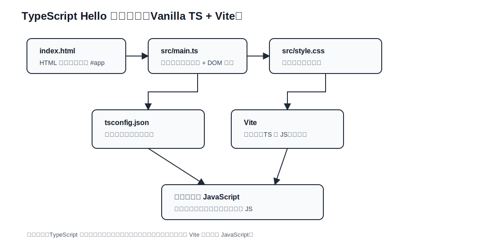

# TypeScript Hello 学习说明

## TypeScript 处理流程图（当前项目）

下面是 `typescript_hello` 的当前处理流程图（静态 SVG，兼容 GitHub / IDEA Markdown 预览）：



### 当前文件分层说明

| 文件 / 位置 | 分层 | 主要功能 | 学习重点 |
| --- | --- | --- | --- |
| `index.html` | HTML 宿主层 | 提供 `<div id="app"></div>` 挂载点 | 浏览器页面从 HTML 开始 |
| `src/main.ts` | TypeScript 入口层 | 定义 `Lesson` 类型、创建数据、渲染 DOM | 类型只在开发期检查，浏览器最终运行 JS |
| `src/style.css` | 样式层 | 定义页面布局和视觉样式 | 样式与逻辑分离 |
| `tsconfig.json` | 类型配置层 | 开启 `strict` 等类型检查规则 | 理解 TypeScript 编译规则 |
| `package.json` | 工程脚本层 | 定义 `dev`、`build`、`preview` | 理解开发、检查、构建的区别 |

### 后续扩展分层建议

| 建议目录 / 文件 | 分层 | 适合放什么 |
| --- | --- | --- |
| `src/types.ts` | 类型层 | `Lesson`、`User`、`ApiResult` 等共享类型 |
| `src/render.ts` | 视图渲染层 | DOM 创建、模板字符串、事件绑定 |
| `src/services/` | 数据服务层 | 请求 API、读取本地数据、转换数据 |
| `src/utils/` | 工具函数层 | 字符串、日期、数组等通用函数 |

### 一句话理解

```text
index.html 提供 #app -> main.ts 用类型约束数据并渲染 DOM -> Vite 转换 TypeScript -> 浏览器运行 JavaScript
```
