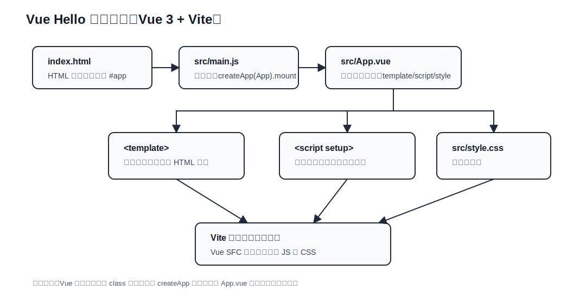

# Vue Hello 学习说明

## Vue 处理流程图（当前项目）

下面是 `vue_hello` 的当前处理流程图（静态 SVG，兼容 GitHub / IDEA Markdown 预览）：



### 当前文件分层说明

| 文件 / 位置 | 分层 | 主要功能 | 学习重点 |
| --- | --- | --- | --- |
| `index.html` | HTML 宿主层 | 提供 `<div id="app"></div>` 挂载点 | Vue 应用挂载到普通 HTML 节点 |
| `src/main.js` | Vue 入口层 | 调用 `createApp(App).mount('#app')` 启动应用 | 理解 Vue 从哪里启动 |
| `src/App.vue` | 单文件组件层 | 把 `template`、`script setup`、`style` 组织在一个组件文件里 | Vue SFC 的三段式结构 |
| `src/style.css` | 全局样式层 | 定义页面基础外观 | 区分全局样式和组件内样式 |
| `vite.config.js` | 构建配置层 | 配置 Vite、Vue 插件和路径别名 | 理解开发服务器和构建入口 |

### 后续扩展分层建议

| 建议目录 / 文件 | 分层 | 适合放什么 |
| --- | --- | --- |
| `src/components/` | 通用组件层 | `BaseButton.vue`、`InfoCard.vue` 等可复用组件 |
| `src/views/` | 页面视图层 | `HomeView.vue`、`AboutView.vue` 等页面组件 |
| `src/composables/` | 逻辑复用层 | `useCounter`、`useFetch`、`useForm` 等组合式函数 |
| `src/services/` | API 访问层 | `fetch` / `axios` 请求封装 |
| `src/stores/` | 状态层 | Pinia store 或简单共享状态 |

### 一句话理解

```text
index.html 提供 #app -> main.js 创建 Vue 应用 -> App.vue 定义页面结构和逻辑 -> style.css 控制外观 -> 浏览器渲染页面
```
